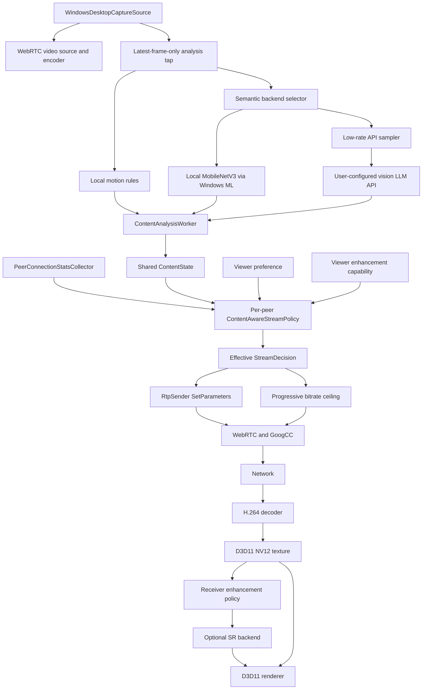

# RLink 内容感知串流与接收端超分方案

## 1. 目标与边界

RLink 保留 WebRTC/GoogCC 作为网络拥塞控制器。GoogCC 继续根据反馈估计当前链路容量、控制目标码率、探测和发送节奏；内容感知模块只决定在用户允许的范围内，如何把可用带宽分配给分辨率和帧率。

本方案包含两项能力：

1. 发送端内容感知串流：识别屏幕内容语义和运动状态，为每个观看者选择合适的分辨率、帧率和码率上限。
2. 接收端 AI 超分：当传输分辨率低于显示目标分辨率时，在本地 GPU 允许且延迟预算充足的条件下提升显示质量。

### 当前实现进度与历史记录（更新至 2026-10-05）

最新修改：画质取舍 k 默认改为 0.50，已有自定义配置保留。短时历史容量邀请也在首个原生探测簇输出后清除有限 upper，避免原生 `upper × 0.7` 续链阈值阻挡 70%～90% 区间的即时探测；原八秒窗口与八簇累计计数保留，原生探测至少静默一秒后才可再次邀请，ACK 暂停不重置期限或计数。此说明覆盖下方默认 0.20 和持续保留短时提示的历史记录。

上述修改后的实际 UDP 回归：NVENC 1080p/80、健康视频预算 24.883 Mbps、限速约 200 KB/s，持续限速 15 秒解除后预算 2.9 秒、FPS 3.501 秒恢复，末段 80 FPS；两秒波动 FPS 5.4 秒恢复，仍未通过五秒验收。新增关闭额外恢复邀请的原生 GoogCC 参考模式，只用于测试同一媒体路径；软件 640×360/120 的两秒限速对照 FPS 2.001 秒恢复，预算 4.401 秒恢复。各用例的分辨率、编码负载和健康预算不同，不能直接比较为单项修改的效果。完整对照、失败项和源码原因见架构问题记录第 6.0 节。

画质取舍系数范围为 0.00～1.00，两位小数、最新默认 0.50、动态应用。拥塞保护时 A>B>0，k=0 得到 C=A，k=1 得到 C=B；B=0 仍暂停。此范围覆盖下方历史记录，视频 bpp 的范围保持 0.03～0.50。此前默认 0.20 阶段的 Release 构建、端点公式/动态编码及主程序输入/保存重载回归通过，证据为 `build/quality-coefficient-zero-one-build.log`、`build/quality-coefficient-zero-one-core-test.log`、`build/quality-coefficient-zero-one-settings-test.log`。

2026-10-05 最终长期回归结果：NVENC 1080p/80、实际 UDP 限速约 200 KB/s，限速 15 秒后 FPS 约 6.1 秒恢复并稳定 80，限速 30 秒后约 4.3 秒恢复并稳定 80，无需重选目标 FPS。前者预算基线 24.883 Mbps、后者 6.767 Mbps，不能直接比较恢复速度；五秒性能验收尚未全部通过。原生 INFO 日志确实记录丢包预算状态拒绝探测，保留原生保护。0.5 秒提示检查尝试无收益，最终维持一秒。下方旧短时回归的 NVENC 暖机实际为 20 Mbps、恢复为 40 Mbps，已纠正夹具并在 `架构/问题记录/2026-10-05-屏幕串流码率保护与FPS恢复问题记录.md` 保留最终数据和失败项。

2026-10-05 长期限速恢复扩展（覆盖下方“持续弱网不再邀请任何额外探测”的旧限制）：短时健康历史提示保留八秒时限，簇计数上限改为八个，包含原生成功续链；每个 2.5 秒健康窗口重新记录实际预算，防止早期低预算永久占据历史。窗口结束但真实拥塞仍未恢复时，加入低预算单簇维护：当前健康接收反馈稳定 2.5 秒、距离所有原生探测簇与上轮结束至少三秒，才邀请一次围绕当前预算的原生验证。提示上界取当前稳定预算两倍并裁到用户视频上限；首簇输出后清提示，未输出则两秒到期，原生守卫和成功续链保留。过期高历史不会用作维护容量；恢复目标仅作本地停止判据。正常低流量无真实拥塞不触发，停止/路由/用户目标变化清理，无 ACK 时暂停。诊断改为“网络恢复探测”，仅在活动时显示“提示预算上界”。具体因果、失败记录和日志见 `架构/问题记录/2026-10-05-屏幕串流码率保护与FPS恢复问题记录.md`。

画质取舍系数输入与核心校验同步扩大到 0.00～1.00，两位小数、默认 0.20；不改变视频 bpp 的 0.03～0.50 范围。0.80 的公式、动态传递、预算/FPS 不变和编码器不重启回归通过。

2026-10-05 短时波动恢复修复（覆盖下方旧预算来源与参考学习记录）：画质保护的 B 改为 WebRTC `RateControlParameters.target_bitrate` 的视频目标分配，与原生 FrameDropper 的目标预算一致；`bitrate` 是 `EncoderBitrateAdjuster` 修正后的编码器分配，不再作为公式 B。单层编码器的字节消耗统计可能使该修正值降至目标分配的一半，继续拿它计算 C 会额外拉低恢复依据。调试页分别显示视频目标预算、编码修正值与视频带宽分配，避免把它们混为同一个量。相机、多层与可信码控等旁路仍传递其原始分配。

拥塞期间冻结未折扣画质参考 A，不再因取舍公式主动造成的高 QP 而每八帧继续提高参考值。正常网络下继续从合格帧学习；预算足以覆盖之前健康预算与实际单帧参考中的较小者时，立即退出保护。C 仍只传给编码器；零目标预算仍暂停，用户采集 FPS、RTP 上限、原生 FrameDropper 和 pacer 的预算不改变。包装层单独标记待应用的 SetRates，确保零目标也能覆盖之前的非零编码状态。

主屏连接增加有限的历史预算恢复提示：连续健康反馈验证过的实际 GoogCC 预算才作为历史依据；出现新鲜拥塞且预算低于健康历史的 90% 时，将历史上限与零下限交给原生 `OnNetworkStateEstimate`，让原生 ProbeController 在短时间内重新验证容量。原生通用网络状态入口在有效提示期间每秒检查探测，保持 15 ms、2 ms 最小包间隔的短探测和原生倍率、丢包、RTT、延迟及连接上限保护；这也允许原生批准的丢包恢复阶段探测，不再只等待 DelayBasedLimited 状态。提示不直接提高估计带宽、目标码率或 pacing 预算，也不重置 BWE。恢复提示仅在发送主屏时启用，按连接独立保存；摄像头、停止发送及路由变化不复用这份历史。

额外提示窗口最多八秒，提示期间累计输出四个原生探测簇后清除提示；持续限速不重复启动。清提示后不会再邀请每秒的网络状态探测，但已在途的原生探测及收到成功反馈后的正常续链继续受用户连接上限约束，不能把四次提示阈值误称为原生总探测次数上限。超过一秒无真实接收反馈时暂停提示，保留三十秒有效期内的健康历史、原窗口截止时间及已耗次数；反馈回来可恢复同一窗口，不重新计次或延长时间。实际恢复速度须由真实包传输与反馈回归验证。

本轮最终验证使用两个真实 PeerConnection、ICE/DTLS/H.264 RTP、原生传输反馈与 localhost UDP 排队限速器，限制实际发送为约 200 KB/s，解除后恢复正常容量；不注入网络预算、不点击 FPS、不重装启动 prior。软件 libx264 的 640×360/120 FPS 保护路径，限速一秒后 BWE/视频目标预算恢复约 1.8 秒；限速两秒后预算约 1.7 秒、FPS 约 2.0 秒恢复，尾部稳定 120 FPS。NVENC p4 的 1920×1080/80 FPS 保护路径、用户上限 24.8832 Mbps、正常链路 40 Mbps，限速两秒后预算约 4.3 秒、FPS 约 4.8 秒恢复，尾部稳定 80 FPS。恢复计时取连续三个 100 ms 统计点达到原正常窗的 90%，并另要求末三秒平均 FPS 达到用户目标的 95%；不是承诺任意网络都在这些时长内满帧。全部检查保留用户规格与采集频率、实际 k=0.20 公式、真实限速吞吐、新鲜反馈、恢复窗口和最终稳态，不以丢包作为拥塞的必要条件。

真实原生 ProbeController 虚拟时间回归另验证无提示时没有每秒常驻探测、丢包/高 RTT/延迟守卫不变、丢包恢复状态仍使用原生 1.5 倍限制、清提示后成功续链受到用户连接上限约束、失败超时后不无限重试；包装层的真实 EncoderBitrateAdjuster 耦合回归和零预算暂停回归通过。实际 NVENC/libx264 的注入预算编码检查继续通过，覆盖动态参数与每帧画质取舍。Release RLinkAPP、诊断界面及新主程序隐藏启动/主题布局检查通过，新产物为 `x64/Release/RLinkAPP.exe`。最终日志为 `build/short-outage-generic-probe-x264-1s.log`、`short-outage-generic-probe-x264-2s.log`、`short-outage-generic-probe-nvenc-1080p80-2s.log`、`short-outage-final-probe-unit.log`、`short-outage-quality-core-retest.log`、`short-outage-final-rtp-test.log`、`short-outage-nvenc-test.log`、`short-outage-x264-test.log`、`short-outage-diagnostics-ui.log`、`short-outage-final-client-build.log`、`short-outage-main-startup-stdout.log`。双机 NetLimiter 下的实际远端呈现及 AMD/Intel 硬件仍需对应设备验证，不能把本机回归当作这些设备的实测结果。

2026-10-05 网络波动取舍参数：新增设置“网络波动画质取舍系数” k，范围 0.00～1.00、两位小数、默认 0.20，保存后发布到当前各连接的原子控制状态，无需重连或重启编码器。GoogCC 已证明拥塞并处于保护周期、未折扣的画质参考 A 大于编码预算 B 时，名义编码速率 C = A − (A − B) × k；A 始终是原始参考，不能递归把前一轮 C 当成 A。A≤B 或未开启这条保护路径时透传 B，零预算继续暂停。k 越大，编码器分担的不足越多、更倾向保 FPS；越小，更倾向保持每帧画质。例 A=24.88 Mbps、B=6.89 Mbps、k=0.20，则 C=21.282 Mbps。此公式替代下方旧 15 FPS 软参考限幅，极低预算仍按用户公式取舍；不承诺最小实际 FPS。

C 只传给统一编码器包装层的下游 `SetRates`，实际网络预算 B、原生 FrameDropper、pacer、用户采集及 RTP 上限均不改。共同路径覆盖 OpenH264、FFmpeg/libx264、NVENC、AMD AMF、Intel QSV 与 Windows Media Foundation H.264；相机、多层编码和可信内置码控等原有旁路保持不变。驱动可能合并码率更新，传入 C 不等于立即以 C 发送或保证所有 GPU 相同 QP/FPS。诊断展示当前 k、参考 A、网络预算 B 和名义编码速率 C，设置与原视频 bpp 上限系数分别保存。

本次参数验证：纯公式、重复更新不递归折扣、范围限制、包装层下一帧动态应用且不重启编码器、多连接隔离、实际 RTP/source 执行及 localhost GoogCC 反馈均通过；设置界面的范围、输入校验、保存与提交信号、重新加载及布局截图检查通过。真实 NVENC 和 libx264 配合原生 FrameDropper 使用 8→2→8 Mbps 注入预算验证，默认 k=0.20 时弱网名义速率为 6.8 Mbps，稳定实际输出约 2 Mbps；预算恢复后首秒分别编码 113/114 帧，随后恢复 120 FPS。此测试验证注入预算后的编码与丢帧行为，不代表双机 NetLimiter 下 GoogCC 的带宽发现时间；AMD AMF、Intel QSV、Media Foundation 与 OpenH264 尚未做本次实机对照。日志为 `build/deficit-share-core-test.log`、`deficit-share-rtp-test.log`、`deficit-share-live-test.log`、`deficit-share-nvenc-test.log`、`deficit-share-x264-test.log`、`deficit-share-settings-test.log`。Release 客户端构建通过（`build/deficit-share-client-build.log`），主程序已更新至 `x64/Release/RLinkAPP.exe`。

2026-10-05 送帧抖动修复：平均 80 FPS 的采集时间戳只需每三帧有一帧提前 200 µs，旧每 sink 完整周期 slot 节流就会误丢帧，真实 source→sink 交付回归复现 53.3 FPS。此问题发生在编码器之前，不能用 GoogCC 预算不足解释。现改为 WebRTC `FramerateController` 的稳定相位与半周期容差；FPS 更新及时间倒退时重置，零 FPS 仍完全抑制，丢帧后更新区域/重复帧补偿不变。aggregate video adapter 仅保留空间约束，取消上游 FPS 二次节流；各 sink 独立执行自己的 FPS 上限，包括没有 requested-resolution 的旧式 sink。采集调度及 GoogCC 预算、探测均不改变。

回归使用相同抖动输入验证 30/60/80/100/120 FPS，修复后逐一达到对应目标；共享 20 FPS sink、动态下降与恢复分别验证，覆盖 DXGI/libwebrtc 两条交付路径及有无 requested-resolution。复现/修复日志为 `build/fps-jitter-before-test.log`、`fps-jitter-final-test.log`；真实 localhost RTP/GoogCC 回归为 `fps-jitter-live-test.log`。新增隐藏采集自测参数 `--desktop-capture-self-test-fps=80`，同时报告实际 sink FPS，避免仅凭采集交付计数宣称已验证逐连接发送帧率。用户现场重复点相同 FPS 会唤醒采集调度，可能改变旧错误节流的时间相位；普通参数应用不重新安装启动码率、不重启 BWE。预算慢与此次源端误丢帧的因果程度仍需双机反馈验证。

最终 Release 主程序构建通过（`build/fps-jitter-client-build.log`）。真实 DXGI 纹理自测中，目标 80 FPS、实际 dispatch 与 sink 均约 80.05 FPS，未发生额外代理丢帧；libwebrtc 实机回退在静态抑制下输入与 sink 均约 6.98 FPS，二者一致，不能要求正常静态抑制也满 80 FPS。两条路径停止及资源释放通过，日志为 `fps-jitter-native80-test.log`、`fps-jitter-lib80-test.log`。这验证真实采集→sink，未宣称测得用户双机解除限速后的端到端预算/FPS恢复时间。

2026-10-04 当前实现（覆盖下方应用层 FPS 控制器记录）：关闭内容感知时恢复并保持用户 RTP R/F/B 上限，不再运行旧 `AdaptiveScreenFrameRate` 控制器。采集保持用户目标 FPS；GoogCC、拥塞窗口丢帧与原生 `FrameDropper` 控制实际发送负载。编码器包装层在新鲜 GoogCC 延迟过载、拥塞窗口缩减或丢包证据出现后，保留原用户帧率下的每帧画质参考，使原生 FrameDropper 按真实编码字节临时丢帧。该参考只传给下游编码器，不改 GoogCC 预算、pacer、媒体/连接上限，也不添加第二个丢帧器。网络恢复后随预算恢复实际帧率，没有应用层逐档等待；真实带宽发现仍由 GoogCC 完成。

参考优先从正常网络下 QP ≤35 的连续非关键帧字节估计；尚无合格测量时使用编码器启动参考，并始终受用户视频上限约束。QP 只在已有网络证据的保护周期内调整参考，不能单独触发弱网。极低预算时按 15 FPS 的软交互参考限制画质保持强度，允许画质变差；这不是实际帧率保证或采集/RTP 上限。原生桶有过渡过程，不能保证首个采样窗立即严格等于预算。相机、多层编码、禁用原生 FrameDropper 的试验和可信内置码控编码器不启用这条路径。

动态 FPS/bpp 使用每连接原子配置。用户配置变化时更新下游编码器缓存，必要时单次重建并发关键帧；仅网络预算变化不会重建编码器或重置 BWE。关闭/开启内容感知与场景恢复事务互斥，开启后场景策略仍独占 effective R/F/B，包装层传递原始 GCC 分配。调试页显示网络预算、画质参考和名义编码码率，明确名义编码码率不是实际发送码率。

本轮验证日志：`build/native-quality-final-*.log`。纯策略、包装层动态配置/失败处理、实际 RTP 参数与 source、多连接隔离和真实 localhost GoogCC 反馈分别验证；真实 NVENC 与 x264 编码对照使用合成画面和 WebRTC 原生 FrameDropper，网络预算由夹具切换。它验证编码画质、丢帧与解除预算约束后的恢复，不代替双机 NetLimiter 下真实带宽发现、原生 DXGI 或 AMD/Intel 实机验收。

本轮结果：NVENC 原路径在 2 Mbps 下保持约 120 FPS、QP 约 45～48；保护路径稳定约 25～35 FPS、QP 约 41～43、输出约 2 Mbps。预算恢复至 8 Mbps 后，首秒约 115 FPS，下一秒 120 FPS。x264 ultrafast 同类验证通过，实际动态 60↔120 FPS 与 4↔8 Mbps 上限切换后均继续编码。这里的 FPS/QP 是同一合成画面的比较，不是所有内容的质量保证；NVENC 第一秒弱网过渡输出约 2.81 Mbps，随后由原生桶调节。实际 RTP/source 执行回归 181 项、隐藏设置界面 6 项通过；真实本机 GoogCC 反馈及编码器环境绑定通过。更新后的主程序真实 DXGI 采集自测为 `NATIVE_DXGI_TEXTURE`、约 60 FPS，活动初始化和停止释放通过；这只验证采集路径，仍不等同于 DXGI 双机弱网画质与带宽发现验收。Release 客户端构建通过，产物 `x64/Release/RLinkAPP.exe`；构建日志 `build/native-quality-client-build.log`。

下方为历史实现与当时的验证记录，关闭模式的现行控制权以上述原生丢帧实现为准。

2026-10-04 最新恢复调整（覆盖下方旧版逐档恢复记录）：关闭内容感知时保留旧控制器的下降规则、0.08 bpp 参考曲线与 85% 安全比例，恢复直接使用当前新鲜 GoogCC/BWE 预算选择可支持的最高 FPS，不再等待 5 个窗口、5 秒间隔或逐档提升，也不叠加旧恢复 15% 余量。每次仍受精确用户目标 FPS 限制，预算只支持部分恢复时不放开至原目标；成功恢复后同步平滑参考，避免旧的低容量 EMA 立即撤销新结果。活动未知、空闲、预算缺失、重复/乱序或超过 3 秒的统计不恢复。RTP FPS 更新保持用户分辨率、视频码率上限与连接参考上限；采集目标不变，开启内容感知仍由场景策略独占发送规格。

降 FPS 不重新计算探测上限：视频上限仍按用户原分辨率 × 用户目标 FPS × 设置 bpp 计算，连接参考为其 1.05 倍。当前配套 WebRTC 屏幕共享默认启用 ALR（发送量不足时）探测，默认低发送量探测间隔 5 秒，探测速率在当前估计基础上生成并受连接与媒体分配上限限制，不是持续按用户上限发填充。只保留原生探测，不增加应用层重启、强制高 FPS 或探测脉冲。源码依据为配套 WebRTC `rtc_base/experiments/alr_experiment.cc`、`video/video_send_stream_impl.cc` 与 `modules/congestion_controller/goog_cc/probe_controller.cc`。实际预算回升仍需有效传输反馈与成功探测，取消应用等待不等于网络恢复即时完成。

本次恢复回归：策略 18 项、真实 RTP 与 source 回归 170 项通过；覆盖低预算保持、部分预算单窗升到支持档、完整预算单窗恢复 120 FPS、精确非标准用户上限、过期统计拒绝和防低 EMA 误降。RTP 测试确认恢复不重启 BWE、不增加探测脉冲、不改变用户视频或连接上限。日志为 `build/gcc-follow-fps-policy-test.log`、`gcc-follow-fps-rtp-test.log`，Release 客户端构建日志为 `gcc-follow-fps-client-build.log`。传输预算输入为夹具，真实双机 ALR 探测与解除限速后的恢复速度仍待实测。

2026-10-04 最新控制权修正（优先于下方旧记录）：关闭内容感知时恢复用户原 RTP 分辨率、目标 FPS 和视频码率上限，随后使用原 `AdaptiveScreenFrameRate` 网络 FPS 控制器。它只调整发送 FPS，不修改用户采集 FPS、分辨率和视频码率上限；GoogCC 仍控制实际目标码率与发送节奏。开启内容感知时暂停该控制器，只有场景策略可以修改应用层规格，包括尚未取得分类的窗口。保留 `MAINTAIN_FRAMERATE_AND_RESOLUTION`，不另外启用 CPU FPS 适应，也不增加应用层探测流量。优先降 FPS 用于保护单帧质量，不能保证实际总码率高于网络预算。

2026-10-04 按用户要求恢复历史控制器（覆盖上一轮回退调优）：关闭内容感知的 `AdaptiveScreenFrameRate` 恢复 GitHub release `959a553` 的默认参数、档位与决策分支。容量先取 WebRTC `availableOutgoingBitrate`，缺失时取屏幕 outbound target；EMA 权重 0.25，安全比例 0.85。原参考需求按 0.08 bpp、2 Mbps 参考下限及原上界计算，独立于当前用户可配置 bpp；此参考下限只参与旧 FPS 决策，不恢复实际媒体的 4 Mbps 下限。启动等待 8 秒，下降确认 2 个窗口且距上次改变至少 2 秒，可直接降到支持档；恢复确认 5 个窗口、距上次改变至少 5 秒并要求 15% 余量，每次只升一档。档位恢复为 15/20/24/30/45/60/80/100/120，另保留精确用户目标。移除上一轮按用户上限缩放、相邻下降、三窗直达恢复和有效 cwnd 预算替代输入。场景开启时仍暂停旧控制器，采集调度、当前 bpp 设置、编码器和场景模块不在本次回退范围。

历史控制器恢复验证：网络/视频上限策略 17 项、真实 RTP 与 source 回归 167 项通过。覆盖原默认参数、8 秒启动等待、原 0.08 bpp 参考曲线、2 窗直接下降、5 窗逐档恢复（含 80 FPS）、上行估计优先与 target 回退，以及开启场景策略后停止旧控制器。日志为 `build/fps-original-release-policy-test.log`、`fps-original-release-rtp-test.log`；客户端构建日志为 `fps-original-release-client-build.log`。RTP 时序夹具提前设置等待起点以缩短自测，原等待时长由纯策略测试验证；限速与解除后的真实双机体验须由测试程序运行确认。

上一轮调优验证（已被本次历史控制器回退取代）：网络/视频上限策略 19 项、场景策略 157 项、真实 RTP 参数与 source 交付回归 167 项、隐藏界面 6 项通过。日志保留于 `build/fps-fallback-*`，不代表当前旧控制器的参数或恢复时序。

开启内容感知后的 FPS 正常与应急下降均最多走一个相邻档位（120、100、90、75、60、50、45、30、24、20、15；保留精确非标准用户值）。每一步重新确认新鲜窗口并按场景优先级选 R/F，不直接跳最低负载，网络恢复可中途停止下降。新增明确的用户原规格恢复：已有拥塞周期内，新鲜 Normal/Underuse、零窗口缩减、安全预算达到原用户视频上限的 95% 时，3 个窗口与至少 2 秒确认后恢复原 R/F；空间恢复 3 秒驻留与确认并行等待。参考需求高于用户 cap 或当前坏 QP 不永久锁住原用户规格，质量与模型可行性仍如实显示。恢复后预算充分且无新拥塞时保持原规格，避免在 GoogCC 稳定确认期间再次按参考曲线降档。诊断新增用户目标 FPS 和原规格恢复状态，明确参考画质仍待验证。

本次回归：策略 157 项、GoogCC 网络压力 47 项、真实 sender 参数与 source 交付回归 160 项全部通过；覆盖相邻 FPS 阶梯、关闭后恢复 120 FPS、0.03 bpp 下参考需求超过上限且坏 QP 时恢复原 120 FPS、恢复后保持，以及新鲜度/代次/参数锁保护。日志为 `build/scene-step-ContentAwareStreamPolicySelfTest.log`、`scene-step-GoogCcNetworkPressureSelfTest.log` 和 `scene-step-ContentAwareStreamExecutionSelfTest.log`。实际 localhost ICE/DTLS/H.264 传输确认真实 GoogCC target 与 packet feedback 可观察，见 `scene-step-GoogCcLiveTransportSelfTest.log`。RTP 参数回归的网络与分类仍为合成输入，尚未完成双机 NetLimiter 限速、解除后恢复速度及同设备体验 A/B 实测。

正式 Release 客户端已生成 `x64/Release/RLinkAPP.exe`，构建日志为 `build/scene-step-client-final-build.log`。隐藏诊断预览的流选择、用户上限/目标 FPS、确认进度、逐步降级画质说明、原规格恢复画质说明和布局截图六项检查通过，见 `scene-step-ui-test.log`；深色页面截图已检查，目标 FPS 与实际编码 FPS 分开显示。差异检查通过，未修改 WebRTC 上游源码或增加主动探测。

2026-10-04 响应时间调整：限速仍存在时，GoogCC 降低发送量后可能回到 normal/underuse，这只说明队列趋势稳定，不表示物理带宽恢复。诊断改称“当前负载已稳定，仍按受限预算运行”。场景降级确认采用 2 个新鲜完整窗、最短调整间隔 1 秒，明确网络降低规格不受恢复分辨率驻留阻挡；恢复采用 3 个可行窗且稳定至少 2 秒，分辨率恢复驻留 3 秒（混合场景分别为 3 秒与 4 秒）。相同目标 R/F 与动作类型下，以连续样本中较低的安全预算确认，预算变化超过 5% 不单独重置计数；预算必须一直满足候选需求，升级还需必要余量。不同目标、场景、过期/重复窗口与质量缺失仍受约束。新增“调整确认、连续确认窗口、内部确认剩余时间”诊断，区分等待可用预算和等待应用层确认；剩余时间不是网络恢复预测。

本轮补齐两个执行问题：所有候选的理论画质需求均超过实时预算时，明确拥塞周期允许应急降低至现有场景最低负载候选，保留画质与理论可行性未达标标记，不突破预算。屏幕源原先仅广播画面，没有消费 sink FPS 限制，因此参数显示 20 FPS 而实际编码仍为 60 FPS；现使用每 sink 独立交付限流，共享采集的另一条 60 FPS 连接不抬高慢连接 FPS。用户采集频率与语义采样不变，原生缓冲保持共享，丢帧后的桌面更新恢复完整信息；约束与输入尺寸统计继续传递。FPS-only 更新可能不重新初始化编码器，故不采用仅在 `InitEncode` 记录上限的方案。

本轮验证通过：策略 124 项、网络压力 47 项、执行与 source→sink 回归 148 项；执行回归使用真实 RTP 参数及合成统计，source 回归调用真实交付与 broadcaster 路径、输入时间及原生缓冲为测试构造。确认 560 Kbps 下应急写入较低 R/F/B、连续预算上涨不重置恢复窗口、共享 60/20 和动态慢连接 30 FPS、原生缓冲零 CPU 映射，以及启动/约束/统计/更新区域与移除 sink 行为。实际 localhost ICE/DTLS/H.264 RTP GoogCC 观察通过；真实原生 DXGI 采集为 `NATIVE_DXGI_TEXTURE`、约 60 FPS，libwebrtc/GDI 回退采集也通过。Release RLinkAPP 构建、隐藏诊断布局五项断言与差异检查通过，新文案截图已检查。日志为 `build/scene-timing-client-build.log`、`scene-timing-ContentAwareStreamPolicySelfTest.log`、`scene-timing-GoogCcNetworkPressureSelfTest.log`、`scene-timing-ContentAwareStreamExecutionSelfTest.log`、`scene-timing-GoogCcLiveTransportSelfTest.log`、`scene-timing-native-capture-test.log`、`scene-timing-libwebrtc-capture-test.log` 和 `scene-timing-ui-test.log`。双机 NetLimiter 场景实际降级/恢复耗时及 A/B 性能仍待实测，不能用这些回归宣称已测得用户现场恢复时长。

2026-10-04 用户 bpp 与自适应预算口径：用户视频总上限按用户原始目标宽×高×目标 FPS×设置中的 bpp 计算，最高 100 Mbps；场景自适应可分配预算为该总上限与 GoogCC 有效目标发送率的 95% 中较小的值。降低实际 R/F 不另设系数、不机械地缩小用户总上限。每个场景的参考需求系数仍只估算压缩质量需求，不是额外视频上限。诊断分别显示真实用户 bpp、用户视频总上限与候选发送上限，缺失值不伪装成默认值；诊断 fallback 不再把已降低的 RTP 码率额度当成用户总上限。

内容策略观察按每个连接的发送视频槽生成一项，接收方向的镜像策略记录和同槽重复 RTP 统计不重复生成条目；section key 保持连接/槽身份，RTP statsId 切换不会重置卡片展开状态。其他连接与视频槽独立显示。

本轮验证：Release RLinkAPP 构建通过；诊断预算回归验证用户总上限与较低 GCC 预算分别裁限，真实 localhost RTP 统计验证用户 bpp 与原始规格总上限字段。隐藏内容策略预览的去重、流选择、多个槽/连接、稳定 key、用户上限文案断言通过；生成的深色码率卡截图已检查。证据为 `build/policy-dedup-client-build.log`、`policy-user-bpp-diagnostics-test.log`、`policy-user-bpp-live-test.log` 和 `policy-dedup-ui-test.log`；200 KB/s 双机弱网体验仍待用户实测。

日期标注的旧实现和验收记录保留当时结果，不能作为当前门控规则；当前行为以本节最新说明及架构第 12.2 节为准。

2026-10-04 网络判断收敛：弱网资格只复用 GoogCC 已计算的状态。新鲜延迟 `overuse` 或新鲜 `TargetTransferRate.cwnd_reduce_ratio > 0` 开启本连接的拥塞与恢复周期；移除 `qualityLimitationReason == bandwidth` 必需门槛，不再以坏 QP、掉帧、丢包超过 2%、低带宽或理论参考需求触发规格下降。控制器包装透传所有输入/输出，通过内存 RTC 事件回调观察延迟状态，不改 GoogCC 算法、不创建日志文件、不增加主动探测。RTT、loss ratio、ALR 仅展示，不增加本地阈值；未公开 LossBasedState 与 RTT backoff 原因本轮未单独接入。完整机制以架构方案第 12.2.1 节为准。

输出、传输反馈和延迟状态分别记录年龄，默认 3 秒新鲜度，进程 tick 不能刷新 packet feedback 年龄。证据过期时保持恢复上下文并暂停新的场景调整。拥塞降速后 `normal` 只说明延迟稳定，不代表带宽已恢复；周期持续至实际原规格恢复（或未曾降 R/F）且新鲜 normal、零窗口缩减稳定至少 5 秒。良好网络保持用户 R/F/B；只有已开启的拥塞与恢复周期内调整规格，明确新鲜网络证据允许缺 QP 的可行降级，恢复升级仍需质量证据通过。所有执行受稳定场景、活动窗口、有效预算、候选确认、尺寸驻留、真实 RTP 成功和用户 R/F/B 范围约束，处理耗时只作诊断。

2026-10-04 实际接入修复：本 SDK 的 PeerConnectionFactory 只在 `WebRTC-Bwe-InjectedCongestionController` 开启时使用注入工厂。Runtime 使用局部 field-trial 视图开启此项，其余 trials 与 Environment 工具保持原值，不修改 WebRTC 源码或库。此前仅延迟日志可见而控制器预算/反馈全空，不能执行场景调整。另保留实际延迟 overuse、cwnd 缩减事件时间，防止状态在约 1 秒统计刷新前回到 normal/零缩减后漏判；仅消费仍新鲜且尚未消费的事件，须有真实新鲜反馈，路由变化清空。同一事件不反复重启恢复计时。

本轮新增真实连接验证：`GoogCcLiveTransportSelfTest` 使用正式 Runtime 和实际 localhost ICE/DTLS/H.264 RTP 传输，未注入控制器回调或合成统计。已确认实际 GCC target/effective target 为 272160 bps、反馈年龄 75 ms、接收解码 5 帧；控制器预算、真实传输反馈、延迟状态和未连接会话隔离断言均通过。`GoogCcTelemetrySelfTest` 验证局部注入开关保持其他 trials/环境工具不变、短过载事件保留与路由清理；网络压力和真实 RTP 参数回归通过。日志为 `build/gcc-live-transport-test.log`、`gcc-gate-telemetry-test.log`、`gcc-gate-pressure-test.log`、`gcc-gate-rtp-test.log`。真实本机连接补足此前工厂接入验证缺口，但不替代 NetLimiter 200 KB/s 下的双机体验验收。

本次接入修复的 Release 客户端构建、隐藏主题往返和诊断布局预览通过，产物为 `x64/Release/RLinkAPP.exe`；日志为 `build/gcc-gate-client-build.log`、`gcc-gate-theme-test.log`、`gcc-gate-ui-test.log`。诊断明确区分“仅延迟事件可见、控制器观察尚未接通”与完整新鲜网络判断。更新发送端程序后须重新建立连接，旧 Call 不会动态接入新的控制器工厂。

参考模式恢复增加“原规格实测恢复需求”：同 scene/route/用户 R/F 主动运动，QP 达标，编码/发送均达到用户 FPS 的 90%，连续至少 3 个完整窗且至少 2 秒验证后，记录这些合格窗口中实际 RTP 采样窗码率的最大值。媒体 `targetBitrate` 是额度，不代表实际成本，不进入该需求值。仅参考模型恢复用户原 R/F 时使用，匹配标定模型保持优先；不作为拥塞条件、不扩大预算，场景/路由/用户规格变化失效，恢复仍须质量通过和连续 3 窗/至少 2 秒确认（混合场景 3 秒，空间恢复驻留见第 5.5 节）。避免已证明可用的规格被较高理论曲线永久挡住，见架构方案第 12.2.2 节。

内容策略观察新增默认展开“GoogCC 网络判断”：适应状态、本轮触发依据、延迟状态、窗口缩减、GCC 预算与反馈年龄。RTT/丢包/ALR 放入折叠测量参考；码率卡补充原规格实测恢复需求。合成预览覆盖健康、overuse、低预算 normal 周期、反馈过期与未知状态。

本轮验证完成：Release RLinkAPP 构建成功；GoogCcNetworkPressureSelfTest、ContentAwareStreamPolicySelfTest、ContentAwarePolicyDiagnosticsSelfTest、GoogCcTelemetrySelfTest 与 ContentAwareStreamExecutionSelfTest 均通过。覆盖新鲜拥塞授权、反馈过期、路由重置、低预算 normal 保留恢复上下文、健康网络保持用户规格，以及实际 sender 参数降级与恢复原规格。桥接测试验证控制器输出、pacing、probe 和 ECN 原样透传，反馈向量保持原存储，无额外拷贝；并发快照检查通过。Qt 主题往返、合成诊断布局截图和 diff 检查通过，深浅色截图已检查。证据为 `build/gcc-pressure-test.log`、`gcc-policy-test.log`、`gcc-telemetry-verified-test.log`、`gcc-release-diagnostics-test.log`、`gcc-release-rtp-test.log`、`gcc-pressure-theme-test.log`、`gcc-pressure-ui-test.log` 和 `gcc-release-build.log`。RTP 测试使用真实 sender 参数、合成网络/场景/接收反馈；尚未完成双机 NetLimiter 弱网体验与同机 A/B 性能测量，不用预览或回归测试代替实测。

原生 DXGI 活动状态修复：真实桌面复现采集/送帧约 60 FPS 但 activity 长期为 STARTING，导致已取得 API 场景和真实 QP/接收反馈仍无法评估候选。原生路径现在复用固定帧率路径的活动发布，并在提交运动样本前更新状态，不改变采集调度或增加图像处理。修复后实际 NATIVE_DXGI_TEXTURE 自测为 ACTIVE、约 60 FPS，libwebrtc 回退自测通过；采集自测新增活动初始化断言，场景 RTP 回归 70 项通过。日志为 `build/native-activity-before-desktop.log`、`native-activity-after-native_dxgi.log`、`native-activity-after-libwebrtc.log`、`native-activity-execution-test.log`。当前连接实际自适应结果仍需重新连接后由“已应用”与实际发送统计核对，不能用采集自测代替双机验收。

本轮逐场景闭环修复：九类场景各自配置需求系数、参考 QP 阈值、空间下限、活动 FPS 目标、处理耗时参考和恢复驻留规则，参数表及实际字段见架构方案第 6.5.4 节。真实 QP 不达标时先在同 R/F 请求当前允许 B 增加 15%，以确认预算与用户视频上限过滤；只有已开启明确网络压力周期且预算不足时才按场景取舍 R/F，缩小规格不机械降低原 B。处理耗时不限制执行；缺 QP 不阻止明确新鲜网络证据下的可行降级，恢复升级仍要求质量证据通过。修复成功后等待新窗口验证，场景或修复类型变化不会复用旧确认计数。

诊断现在分别显示未知场景、等待采集窗口、网络/质量修复、处理耗时参考、模型不支持和实际 RTP 应用结果，不再把未知场景的 0 需求显示成“已估算 0 bps / 等待标定”。本地选项当前只有运动规则，没有细场景分类；完整按场景控制须取得远程 API 的有效稳定分类，Windows ML 分类尚未接入。规则结果不会伪装成某个场景。

视频码率上限现用 `pixels × 用户目标FPS × 用户填写的bpp`，仅保留 100 Mbps 技术上界，不设 4 Mbps 下限。设置直接输入 0.03～0.50，最多两位小数，默认 0.15；1080p30/60/120 默认视频上限分别为 9.33/18.66/37.32 Mbps。连接参考上限内部取视频上限的 1.05 倍（最高 105 Mbps），不是文件或粘贴的保证带宽。启动 prior 按 0.08 bpp 并裁到视频上限内，不设 2 Mbps 启动下限。发送端确认输入后动态更新现有直连与房间屏幕发送，在下一个 RTC 统计完成时处理（通常约 1 秒）；不重启采集、连接、分类或 BWE 启动 prior。已有弱网分辨率/FPS/码率分配保持，新的预算需重新收集证据。所有场景发送决定受用户视频上限限制，QP 修复不能越过该上限。摄像头保留原行为。左侧显示视频上限与屏幕 RTP 实测 MB/s，没有会话时明确标记 1080p60 示例。该显示不承诺实际网卡流量。需求驱动额外探测仍未实现。

本轮验证：策略 91 项、参考模型 212 项、宿主观察/诊断 17 项及 RTP 执行 70 项检查通过；联合上限覆盖九场景 × 30/60/120 FPS 的保持和恢复。RTP 测试读取真实 sender 参数，统计/分类/接收反馈输入仍为测试夹具，不作为双机或 AMD/Intel 硬件画质验收。Release 客户端构建、Qt 隐藏窗口主题往返与 diff 检查通过，日志位于 `build/*-scene-final-test.log`、`scene-contract-cap-recovery-build.log` 和 `scene-contract-ui-test.log`。

细场景观察和首版单步策略核心已实现：`ScreenScene` 支持代码/终端、文档、表格、网页/软件、图片/图形、CAD/图示、视频、游戏/三维与混合九类。测试版尚未上线，远程响应统一为 `scene + confidence`，不保留旧格式兼容；旧 `semantic` 字段和其他额外字段均拒绝。细场景变化需要连续响应确认，低置信度结果只展示，不替换当前采用场景。

分类结构已简化为两个返回字段；设置、调试显示和独立示例使用同一契约。自测明确拒绝三种旧粗类响应及所有粗细同时返回的响应，覆盖九种有效场景、置信度边界和非法响应。

`ContentAwareStreamPolicy` 位于独立 `media_intelligence_core`，不依赖 Qt、WebRTC、Windows 或推理后端。尺寸和 FPS 候选表可配置，单次最多 20×14 个候选，固定数组且不在评价中分配堆内存。返回尺寸、发送 FPS 上限、required/desired/sender max bitrate、可行性和原因；可注入经过编码器标定的质量需求模型。默认像素率模型未标定，禁止自动执行。

文本和细线画像优先保留分辨率；运动画像在稳定锚点允许的累计幅度内小幅缩小尺寸以保留既有 FPS，不降低分辨率来追逐新 FPS 峰值。可选会话状态提供新鲜样本迟滞、generation 重置、重复/乱序窗口过滤和执行确认；确认候选同时核对 R/F 和两个码率值，后续普通分辨率变化遵守驻留时间。处理能力证据只作诊断；明确新鲜网络证据下的可行降级不要求 QP 完整，但缺失 QP 不能视作画质达标，也不能授权恢复升级。

RLink 已在后台 WebRTC 统计完成时接入状态化评估与 RTP 执行器，不依赖诊断窗口是否打开。每连接视频预算为 `min(用户视频上限, GoogCC effective target × 0.95)`，不再二次扣除其他媒体或数据通道；实际发送码率不作为网络容量。用户请求与实际发送参数分别保存，合格且经连续窗口确认的决策在同一次 `SetParameters` 中提交分辨率、FPS 和视频码率上限，成功后才确认策略状态。原应用层网络 FPS 控制器不再调度，开启内容感知时仅场景执行器写入自动规格，不改变采集配置。

启停、换代、源尺寸或模型变化会作废旧候选；异步统计记录请求时的 epoch，旧回调不能影响新请求。关闭场景策略时恢复用户原尺寸、目标 FPS 和视频上限，由 WebRTC 原生拥塞控制决定实际码率和丢帧；停止发送时在同一 RTP 事务恢复用户规格，重新开启不遗留旧场景参数。统计回调不等待用户持有的发送参数锁，竞争时下个窗口重试，避免 signaling proxy 互锁。调试页区分用户目标、实际编码、候选和已应用参数，显示需求模型、画质证据、处理耗时参考、等待网络证据/候选确认、参数繁忙或失败原因。

2026-10-02 用户收敛：保留现有用户目标 FPS 与分辨率选择，不新增独立自动 FPS、双维 Auto/Manual 菜单或推荐确认弹窗。场景策略只能在用户所选 FPS 及以下联合调整分辨率、FPS 和视频预算；网络恢复也不突破或反写用户目标。发送 FPS 的临时调整不直接改采集配置，采集仍按用户请求及多人最高请求仲裁。RTP 执行链、真实 QP、编码窗口和按连接的接收反馈已接线。按用户选择，不要求所有显卡先实测：正式宿主默认允许 H.264 参考模型，在内容分析已开启、真实 QP 证据完整、网络预算可行和连续窗口确认后执行（处理耗时仅诊断）；质量或处理受限时只允许修复，正常升级仍要求指标通过。匹配的实测模型优先，参考曲线不能冒充实测；双机验证、实际画质标定和需求驱动的有界额外探测尚未完成。后续完成单连接闭环和多人联调，再接 Windows ML 与 NVIDIA VSR。本阶段不能证明真实网络画质或组件化前后的性能等价。

2026-10-02 参考模式：独立 `H264ReferenceQualityContext` 支持 FFmpeg NVENC/QSV/AMF/libx264 与 OpenH264，共用场景像素率曲线，不给不同厂商编造固定性能排名。码率需求为宽×高×FPS×场景 seed bpp×1.15；1.15 余量和逐场景平均 QP 阈值（24～30）均为可调整产品初值，不来自厂商画质测量。参考模型明确标记 `reference=true, calibrated=false`。独立策略默认仍禁止参考执行，宿主必须设置 `allowReferenceModel`；RLink 会话宿主默认允许，以已有内容感知开关控制是否实际评估。未知编码器、非 H.264、未知场景、缺失/过期指标保持观察，沿用网络安全控制。匹配的实测模型即使 QP 门槛失败也不能用更宽松参考阈值绕过；不匹配或场景未覆盖时才用参考。调试区分“模型已标定”和“参考模型”。

参考模式验证：参考组件 100 项、策略 73 项和诊断 11 项检查通过；真实 RTP 回归验证 QSV 参考标识、缺失/坏 QP 或处理反馈禁止执行、完整窗口确认后 1080p60→1080p45、用户上限不变、关闭恢复以及实测优先/AMF 参考回退。QSV/AMF 标签在执行器测试中为合成统计，不证明本机运行了对应硬件编码。连接上限联合检查覆盖九场景×30/60/120 FPS，在新鲜且充足网络预算和健康证据下保持用户规格，同时初始媒体/启动码率仍使用原公式。正式客户端 Release 构建及隐藏窗口启动/主题自测通过。日志为 `build/reference-model-test.log`、`reference-policy-test.log`、`reference-diagnostics-test.log`、`reference-execution-test.log`、`reference-capacity-test.log`、`reference-capacity-build.log`、`reference-ui-test.log`。AMD/Intel 真机编码效果与双机弱网验收尚未完成。

2026-10-02 证据链接入：编码器保留原生 QP，缺失时从 H.264 有界头部解析补齐；统计计数缺失、重置或无新帧时相应窗口保持不可用，不使用默认零值冒充测量。接收端通过无序、零重传 telemetry 发送 RCRF v1 元数据（最大 272 字节，约每秒一份），包含分享代际、最后成功应用的偏好序号、解码/丢帧计数和解码/处理均值；拥塞时丢弃，不排队重试，不发送图像。发送端按连接校验身份、分享和偏好，拒绝旧序号与超过 3 秒的反馈；参数变化后等待完整新窗口。反馈暂停恢复保持序号单调；失败的参数请求不更新已应用偏好，采集 FPS 也回滚。

新增独立 `CalibratedStreamQualityModel`：最多 128 条有证据标识的视觉质量测量，匹配 codec、编码器和质量档案，按相同场景/长宽比的已测规格保守覆盖，不外推。查询不分配堆内存；模型可通过宿主 `InProcessSessionEngineOptions::screenQualityCalibration` 注册。实测模式的 QP 门槛必须来自同一标定；参考模式使用显式标注的启发式阈值，两者均不保证逐帧感知质量。接收处理时延是 WebRTC 均值，尚不包含呈现队列或 P95。注册接口并不代表正式应用已有标定表。

2026-10-02 执行链接入验证：正式 `x64/Release/RLinkAPP.exe` Release 构建通过；策略核心 57 项、诊断适配器 11 项、真实 libwebrtc RTP 执行器 33 项检查通过，Qt 隐藏窗口启动与主题往返检查通过。执行器测试用专用测试模型和合成证据，实际读取 sender 参数核对文本 1920×1080/45 FPS 和运动 1760×990/60 FPS；包括真实参数拒绝后不虚报生效、关闭/换代/重启、过期回调及参数锁竞争。锁忙时场景与旧网络执行均立即返回，延后执行且不改变 RTP。日志为 `build/scene-execution-final-build.log`、`scene-execution-self-test.log`、`scene-execution-diagnostics-test.log`、`scene-execution-policy-test.log`、`scene-execution-ui-test.log`。

2026-10-02 证据链验证：MSVC Release 正式客户端构建、Qt 隐藏窗口启动/主题自测和扩展后的真实 RTP 执行器回归通过。H.264 QP/计数窗口 27 项检查通过，其中本机真实 NVENC 的 10 个编码帧均取得 QP 并进入遥测；反馈协议 61 项、标定模型 42 项、偏好反馈契约 42 项通过。真实双 libwebrtc 会话经本地 ICE 传输和解码视频，接收统计经 telemetry 被发送端接受，暂停恢复、重放/旧分享/旧偏好及分享重启检查通过。核心策略和诊断回归仍通过。日志见 `build/scene-evidence-final-build.log`、`scene-evidence-alignment-build.log`、`scene-calibrated-model-test.log`、`scene-feedback-preference-test.log`、`scene-evidence-execution-test.log`、`scene-feedback-pipeline-test.log`、`scene-evidence-ui-test.log`。真实双端管线不提供画质标定；执行器的校准表和编码指标仍是明确标记的测试数据。

先前视觉协议与内容分析 worker 自测、本机回环 API/DPAPI/JPEG 适配器及独立 [调用示例](../examples/content_aware_policy/README.md) 已通过，本轮没有重复验证未修改的视觉 API 路径。尚未进行双机弱网、真实编码器画质标定、组件化性能 A/B 或新状态文本的多 DPI 人工验收。

本期不训练或部署 AI 带宽预测器，不让模型直接生成码率数字，不让模型进入 WebRTC 拥塞控制闭环，不实现 AI 插帧、AI ROI 或通用大模型诊断，也不引入 CLIP 相关组件。远程视觉大模型 API 只允许输出受约束的屏幕语义分类结果，不能直接控制码率、执行画面中的指令或访问 RLink 会话对象。

必须满足以下产品边界：

- AI 模块关闭、模型缺失、推理失败或 GPU 不支持时，远控功能保持正常。
- 用户设置是上限，自动策略不能超过用户请求的分辨率或帧率。
- 内容分析默认在本机完成，不保存、不上传屏幕图像。只有用户明确选择“远程视觉大模型 API”、配置自己的 API 并确认隐私提示后，才允许上传低频缩略图。
- 多人房间只分析一次共享画面，但为每个 PeerConnection 独立决策。
- 降级可以较快，恢复必须保守，不能频繁切换分辨率。

## 2. 总体架构



职责边界如下：

- `WindowsDesktopCaptureSource` 提供画面和采集活动信息，不等待推理结果。
- `ContentAnalysisWorker` 始终在后台合并本地运动状态与选定语义后端的结果，只发布内容状态，不调用 WebRTC。
- 运动等级始终由本地规则实时计算；用户只在“本地模型”和“远程视觉大模型 API”之间选择语义分类后端。
- 远程 API 客户端只接收经过限频和缩放的内存图像，不接触原始 D3D11 纹理、WebRTC sender、控制通道或远控输入。
- `ContentAwareStreamPolicy` 是纯决策模块，不执行线程、协议或 GPU 操作。
- `LibWebRtcSession` 保持为最终的 RTP sender 和 PeerConnection 参数执行层。
- 接收端超分策略由接收端执行；发送端只使用对端声明的能力选择传输档位。

## 3. 状态模型

内容语义和运动状态必须分开。`TextUi` 可以高速滚动，`Video` 也可以暂停，不能用一个互斥枚举同时表达两类信息。

```cpp
enum class ScreenSemanticType : std::uint8_t {
    kUnknown,
    kTextUi,
    kMixedUi,
    kVideo,
};

enum class ScreenMotionLevel : std::uint8_t {
    kUnknown,
    kIdle,
    kLow,
    kMedium,
    kHigh,
};

struct ContentState {
    ScreenSemanticType semantic = ScreenSemanticType::kUnknown;
    ScreenMotionLevel motion = ScreenMotionLevel::kUnknown;

    float semanticConfidence = 0.0f;
    float motionScore = 0.0f;
    float changedAreaRatio = 0.0f;
    float textScore = 0.0f;
    float mixedUiScore = 0.0f;
    float videoScore = 0.0f;

    std::uint64_t sourceFrameId = 0;
    std::uint64_t timestampMs = 0;
    std::uint32_t inferenceTimeUs = 0;
    bool modelResultAvailable = false;
};
```

`ScreenContentActivity` 继续表示现有采集层的 Starting/Active/Idle 状态。策略输入时将它和 `ContentState` 合并，不复制另一套空闲状态机。

状态有效性默认规则：

- 本地模型结果超过 2000 ms 时过期。远程 API 保留同一会话内最近确认的场景，滚动、运动和结果年龄不清空分类；屏幕共享 generation 改变、配置失效或隐私关闭时清空。
- 低于 0.70 的语义置信度不触发类别切换。
- 本地模型的新语义连续出现 3 个有效样本后才被接受。
- 远程 API 置信度 ≥0.85 的新场景一次有效响应即可采用；0.70≤置信度<0.85 的新场景需要 2 个连续一致响应；低于 0.70 保留原场景。
- 上述确认规则统一适用于设置中的 0.5、1、2、5、10、20、30、60 秒间隔，不针对 5 秒作特殊处理。间隔控制请求节奏，置信度和连续结果控制场景采用；当前运行时在请求完成后等待所选间隔再允许下一次请求，因此实际切换等待还包含采样和 API 响应耗时，失败时还会退避。
- Idle 主要由现有采集活动状态决定，不依赖键鼠静止。
- High motion 需要画面变化证据；键鼠输入只用于提前提升交互优先级。

## 4. 发送端内容分析

### 4.1 帧接入点

分析器挂在 `WindowsDesktopCaptureSource` 的帧交付前后均可，但必须覆盖两条现有路径：

- DXGI native texture：`D3D11DesktopFrameBuffer`。
- libwebrtc/GDI 回退：`DesktopBgraFrameBuffer`。

推荐在完成帧交付判定后，将最新有效画面交给分析抽头。分析抽头持有自己的引用，不改变 WebRTC 帧生命周期，不阻塞 `DeliverFrame()` 或 `OnFrame()`。

### 4.2 Latest-frame-only 队列

分析队列容量固定为 1：

- 新帧到达时原子替换尚未开始分析的旧帧。
- 推理进行中继续接收新帧，但不排队。
- 工作线程空闲后直接取最新帧。
- 停止屏幕共享时取消任务并释放纹理引用。
- 每次屏幕共享 generation 变化时清空旧结果，防止旧画面状态泄漏到新会话。

默认分析频率为 3 Hz，可配置范围为 2～5 Hz。Idle 状态降低到 1 Hz；模型状态稳定且画面变化很小时，可以跳过重复推理。

`ContentAnalysisWorker` 使用一条独立的持久工作线程。线程只消费 latest-frame-only mailbox，不占用采集线程、WebRTC signaling/worker/network 线程或 Qt GUI 线程。本地模式下每个进程只通过 Windows ML 创建一个 `Ort::Session`，所有 MobileNetV3 推理都在该工作线程串行执行。远程模式下图像缩放、压缩、请求构造和响应解析也只能在分析运行时或专用网络回调线程完成，不能回到媒体线程。

### 4.3 输入预处理

第一版采用可靠、容易诊断的路径：

1. 将源帧按中心等比缩放并补边到模型输入尺寸。
2. DXGI 纹理先通过 D3D11 VideoProcessor 缩小到 224×224 BGRA。
3. 只回读缩小后的纹理，完成通道变换和归一化。
4. CPU 执行 ONNX 推理。

224×224 BGRA 每帧数据量较小，2～5 Hz 下不会把整张桌面纹理反复读回 CPU。待第一版收益得到验证后，再评估 DirectML 或其他 GPU execution provider；接口不绑定具体 provider。

CPU/GDI 路径直接从现有 BGRA 缓冲区缩放。预处理必须保持两条路径的颜色顺序、归一化和宽高比一致。

### 4.4 规则特征

规则层提供以下信号：

- `captureChangedFramesPerSecond`：变化发生频率。
- `changedAreaRatio`：最近窗口内 dirty/move 区域占屏幕面积的比例。
- `captureInputBoostActive`：近期存在用户交互。
- 低分辨率亮度帧差：补充无法取得可靠 dirty region 的回退路径。
- 连续变化时间：区分短暂窗口拖动和持续视频播放。

仅用变化帧数不能区分闪烁光标和全屏视频，因此 `changedAreaRatio` 是第一阶段必须新增的指标。原生 DXGI 路径从 dirty/move metadata 累积；其他采集路径用低分辨率帧差估计。

### 4.5 本地模型

正式模型以 MobileNetV3-Small 类轻量分类网络为基线：

- 输入：224×224 RGB。
- 输出：`TextUi`、`MixedUi`、`Video` 三类 logits，由客户端计算概率。
- 初始化：ImageNet 预训练权重。
- 训练：RLink 场景截图人工标注后微调。
- 导出：ONNX，模型与归一化参数一起版本化。
- 量化：先完成 FP32 正确性和基准，再评估 FP16/INT8；量化版本必须与 FP32 使用同一验证集比较。

第一版推理运行时确定为 Windows ML 2.x。Windows ML 提供并维护 ONNX Runtime，因此分类器仍使用其 C++ ONNX Runtime API 创建 `Ort::Session`，但不再由 RLink 单独下载和打包一套上游 ONNX Runtime。

RLink 是 Qt/CMake 原生 C++ 应用，首版采用 `Microsoft.Windows.AI.MachineLearning` 的 self-contained C/C++ 部署。构建必须固定经过验证的稳定包版本，不使用浮动版本；初始集成基线为 Windows ML 2.3.42（内含 ONNX Runtime 1.27.1）。self-contained 运行时随 RLink 安装包发布，不要求用户预装 Windows App SDK Runtime。

首版使用 Windows ML 内含的 CPU Execution Provider：

- 使用 FP32 模型和 FP32 输入张量，不启用 DirectML、CUDA 或 TensorRT Execution Provider。
- 输入布局固定为 NCHW `[1, 3, 224, 224]`，颜色顺序为 RGB。
- 默认使用 ImageNet mean `[0.485, 0.456, 0.406]` 和 std `[0.229, 0.224, 0.225]`；最终值仍由 `model.json` 声明并校验。
- 输出固定为 `[1, 3]` logits，客户端执行 softmax，并按 `TextUi`、`MixedUi`、`Video` 顺序解释。
- ONNX Runtime 使用顺序执行模式，`inter_op_num_threads=1`，`intra_op_num_threads` 默认 2 且允许根据 CPU 基准下调为 1。
- 模型加载、输入输出名称、维度、类别顺序和文件哈希任一校验失败时禁用模型，仅保留规则策略。

选择 CPU Execution Provider 是为了让发送端内容分类不依赖显卡厂商，也避免和 DXGI 采集、硬件编码及接收端 NVIDIA VSR 争用 GPU。完成 FP32 基线后才评估 Windows ML 内含的 DirectML EP、通过 Execution Provider Catalog 获取的厂商 EP 或 INT8；替换 provider 或模型精度不能改变 `IContentClassifier` 接口和策略输出语义。动态获取硬件优化 EP 只在 Windows 11 24H2 或更新系统启用，较旧系统继续使用 CPU EP。

#### 4.5.1 推理回退链

推理按以下顺序降级，降级只在初始化、硬件环境变化或连续失败后发生，不在每一帧反复重试：

1. 首版直接使用 Windows ML CPU EP。以后启用硬件 EP 时，厂商 EP 或 DirectML EP 初始化/执行失败后，在同一条分析工作线程重建 CPU EP session。
2. Windows ML 运行时缺失、初始化失败、模型缺失/损坏、张量契约不匹配或 CPU EP 连续推理失败时，禁用 `WindowsMlContentClassifier`，进入规则分析模式。
3. 规则分析只使用 changed area、帧差、采集活动和输入活动判断 `Idle/Low/Medium/High` 运动等级与交互提升，不尝试用启发式规则猜测 `TextUi/MixedUi/Video`；语义固定发布为 `kUnknown`。
4. `kUnknown` 进入策略层后沿用现有网络 FPS、用户分辨率上限、GoogCC 和 `ProgressiveBitrateCeiling` 行为，不执行内容驱动的分辨率或帧率切换。
5. 内容感知总开关关闭时完全恢复当前发布版行为。

同一会话内模型连续失败 3 次后熔断为规则分析模式；只有模型文件变化、Windows ML/EP 更新、硬件指纹变化或用户主动重新检测时才尝试恢复。推理超出分析周期时丢弃该结果，不阻塞采集和编码。诊断必须记录当前 provider、回退层级、首次失败原因、连续失败次数和最近一次恢复尝试结果。

不再额外打包独立上游 ONNX Runtime 作为 Windows ML 的回退，因为两者使用相同推理核心，双运行时会增加安装体积、ABI/版本冲突和维护成本，却不能为模型损坏或张量错误提供有效容错。

模型文件放在 `models/content/`，清单至少包含：

```text
model.onnx
model.json       # 版本、输入尺寸、均值方差、类别顺序、哈希
LICENSES.txt     # 模型与训练权重许可
```

运行时校验模型哈希、输入维度和类别数量。校验失败时禁用模型并保留规则策略。

### 4.6 远程视觉大模型 API

远程视觉大模型是可选的语义分类后端，不替代本地运动分析。选择远程模式后，`changedAreaRatio`、变化频率、Idle/Low/Medium/High 和交互提升仍在本机计算；API 只返回 `TextUi/MixedUi/Video` 及置信度。网络超时、API 限流或服务不可用不会阻塞采集、编码和输入控制。

第一版提供“OpenAI-compatible 多模态 API”适配器，设置中允许用户填写服务地址、模型名称和自己的 API 密钥。协议适配器与 HTTP transport 分离，后续可以增加其他厂商或自建服务适配器，不在核心状态机中判断厂商名称。

DeepSeek 作为该通用适配器的内置配置预设，而不是一份单独实现。按 2026-09-30 的官方接口，预设使用 `https://api.deepseek.com` 和支持图像输入的 `deepseek-flash`；请求可使用 OpenAI-compatible Chat Completions 的 `image_url`，也可以由后续 Responses API 适配器使用 `input_image`。OpenAI-compatible 只代表请求格式兼容，不代表任意模型都支持图片，因此保存配置和切换模型后必须重新执行合成图能力测试，不能仅凭 provider 名称判定可用。

#### 4.6.1 上传采样和并发

- 默认请求间隔 1 秒，可选 0.5、1、2、5、10、20、30、60 秒；本地运动规则仍按原来的 2～5 Hz 工作。请求串行执行，实际间隔还受响应耗时和失败退避影响；画面变化不清空已确认的语义场景，也不会绕过请求限频。所有间隔均使用相同的置信度确认规则。
- 同一 capture source 最多一个 API 请求在途。请求期间到达的新候选帧只保留最新一帧，不建立网络请求队列。
- 画面语义稳定且缩略图感知哈希未明显变化时跳过请求；大面积变化可以提前触发一次请求，但仍受最小间隔和并发上限约束。
- 上传图像在分析工作线程中按设置的最长边缩放并编码为 JPEG，默认最长边 1280 像素、质量 60；连接测试、截图测试和实际远控共用这组设置。正式远控通过 TurboJPEG 直接压缩 I420，编码结果只驻留内存，请求完成后立即释放，不写临时文件或缓存。
- 请求使用独立超时，默认 8 秒。超时结果或旧 generation 的响应直接丢弃，不能覆盖新会话状态。
- 429、5xx 和网络错误使用指数退避，不自动连续重传同一张屏幕图像。连续失败 3 次后熔断 5 分钟，用户点击“重新检测”可以提前恢复。

#### 4.6.2 请求与响应契约

系统提示只要求分类并明确要求忽略屏幕图像中的任何指令。响应必须是严格 JSON，第一版只接受：

```json
{
  "scene": "code_terminal",
  "confidence": 0.0
}
```

- `scene` 只能是 `code_terminal`、`document`、`spreadsheet`、`web_app`、`photo_graphics`、`cad_diagram`、`video`、`game_3d`、`mixed`，`confidence` 必须为 `[0, 1]` 内的有限数值；只接受这两个字段，旧 `semantic` 字段、缺字段、额外字段、非法 JSON、超长响应或不支持的类别都视为失败。
- 响应正文设置小型固定上限，不保存模型推理过程、自然语言解释或画面内容摘要。
- 大模型输出只进入与本地模型相同的语义平滑器，不能携带分辨率、FPS、码率、URL、命令或工具调用。
- 截图中的提示注入按不可信数据处理。客户端不执行模型返回文本，也不把它拼接进系统命令、日志路径或控制协议。

#### 4.6.3 密钥、地址和隐私

- API 密钥不写入 `QSettings`、日志、崩溃报告、diagnostics 或 DataChannel。Windows 首版使用当前用户作用域的 DPAPI secret store，设置中只保存凭据槽位 ID 和“已配置”状态。
- 默认要求 HTTPS。为支持本机自建模型，仅允许 `http://127.0.0.1`、`http://localhost` 和 IPv6 loopback；其他明文 HTTP 地址拒绝保存。
- Base URL 中的 user-info、查询参数和 fragment 不允许保存，防止密钥被误放入 URL。诊断最多显示 provider、主机名和模型名，不显示完整路径或请求头。
- 第一次切换到远程模式时必须明确提示“屏幕缩略图会发送到用户配置的第三方服务，并可能产生费用”，用户确认后才写入 consent revision。
- 设置页提供“暂停云端分析”和“清除 API 密钥”。屏幕共享期间远程分析生效时显示持续可见的状态提示，并累计本会话请求次数和上传字节数。
- “测试连接”使用程序内置的合成测试图，不上传当前桌面截图。只有测试成功且用户已确认隐私提示后，远程模式才进入 effective 状态。

#### 4.6.4 远程模式回退链

1. 用户选择远程模式且配置、测试和 consent 均有效时，使用远程视觉 API 提供语义结果。
2. API 未配置、鉴权失败、超时、限流、响应校验失败或进入熔断时，如果 `media/visionApiFallbackToLocal=true` 且本地模型可用，回退到 Windows ML 本地模型。
3. 本地模型也不可用时，仅保留本地规则运动状态，语义发布为 `kUnknown`，串流行为保持原有网络策略。
4. 本地模式绝不自动切换到远程 API；任何屏幕图像上传都必须来自用户主动选择的远程模式。
5. 模式切换会递增 analysis generation，清空在途请求和旧语义结果，不能让远程响应泄漏到新的本地会话。

远程结果的 30 秒有效期不是无条件缓存。屏幕共享切换、显示器切换、远程模式暂停，或本地规则检测到单次 `changedAreaRatio >= 0.35` 时立即将远程语义标为未知并等待新结果。

#### 4.6.5 独立组件边界

远程视觉能力实现为可单独构建和复用的 C++20 组件，RLink 只是它的一个宿主。组件源码可以暂存在本仓库共同开发，但其公开头文件、CMake target 和测试不能引用 RLink、Qt、WebRTC、`QSettings`、DPAPI 或会话类型。

- 公共输入是 `EncodedImageView`、端点配置和请求策略等普通值类型，公共输出是受约束的 `SemanticClassification`；接口不暴露 `QImage`、`QNetworkReply` 或 RLink 帧对象。
- `IHttpTransport`、`ISecretProvider`、`IExecutor`、`IClock` 和 `ILogger` 全部由宿主注入。组件不读取全局配置、不创建隐藏线程池、不使用全局单例，也不决定凭据如何持久化。
- OpenAI-compatible 模块只构造协议请求和校验协议响应；OpenAI、DeepSeek、自建网关等差异通过 `VisionApiEndpointConfig` 或独立协议 adapter 表达，核心运行时不出现厂商分支。
- RLink 的 Qt Network transport、DPAPI secret provider、后台 executor、设置映射和状态提示放在 RLink adapters/platform 层。其他项目可以换成 WinHTTP、libcurl、系统 keychain 或自己的调度器。
- 每个库提供 `install()`/`export()` 规则、命名空间化 CMake targets 和稳定的源码级公开头文件。仓库内提供一个不链接 RLink 的最小命令行示例，以内置合成图完成能力测试和一次分类。
- 单元测试使用 fake transport、fake clock 和内存 secret provider，覆盖请求构造、严格解析、超时、退避、取消和 generation；测试不访问真实厂商服务。

该拆分是库边界，不是进程边界。RLink 默认静态链接组件，缩略图编码结果通过借用内存传入，不引入 IPC、重复图片拷贝或内部 JSON 中转；外部 HTTP 请求所需的 JSON 只在具体协议 adapter 的发送边界生成。

### 4.7 数据集

数据集按实际编码语义定义，而不是软件名称：

- `TextUi`：代码、终端、文档、表格、设置页、网页正文等文字和锐利 UI 占主导的画面。
- `MixedUi`：UI、图片、图表、局部动画或多个窗口混合，无法由文字或视频单独代表。
- `Video`：自然图像或视频播放区域占主要视觉面积，存在连续纹理和时序变化。

采样必须覆盖浅色/深色、高 DPI、多显示器、不同语言、全屏/窗口、静止/滚动、浏览器视频控件、远程桌面嵌套等情况。训练、验证和测试应按会话或来源分组，避免相邻帧同时进入训练集和测试集造成数据泄漏。

默认客户端不收集数据。开发采集模式必须显式打开，画面只写入用户指定目录，并提供一键停止和删除入口。

## 5. 每连接策略控制器

### 5.1 输入与输出

每个 PeerConnection 持有独立策略状态：

```cpp
struct ContentAwarePolicyInput {
    ContentState content;
    ScreenContentActivity captureActivity;
    std::uint64_t availableOutgoingBitrateBps = 0;
    std::uint64_t targetBitrateBps = 0;
    double roundTripTimeMs = 0.0;
    double lossPercent = 0.0;

    std::uint32_t sourceWidth = 0;
    std::uint32_t sourceHeight = 0;
    ScreenStreamPolicyRequest userRequest;
    VideoEnhancementCapability receiverCapability;
    std::uint64_t timestampMs = 0;
};

struct StreamDecision {
    std::uint32_t effectiveWidth = 0;
    std::uint32_t effectiveHeight = 0;
    std::uint32_t effectiveFrameRate = 0;
    std::uint64_t maxBitrateBps = 0;

    bool receiverMayUseSuperResolution = false;
    std::uint32_t intendedDisplayWidth = 0;
    std::uint32_t intendedDisplayHeight = 0;
    std::string reason;
};
```

用户请求、策略目标和实际生效参数必须分别保存。诊断页面同时展示三者，AI 或网络策略不能覆写用户偏好。

### 5.2 候选档位

策略从有限档位中选择，不连续生成任意尺寸：

- 分辨率：原始/用户上限、1440p、1080p、720p；保持源画面宽高比并取偶数尺寸。
- 帧率：用户上限、60、45、30、20、15 FPS；不超过用户上限和会话能力上限。
- 静止画面仍由采集层抑制到心跳帧，不专门创建 1 FPS 编码档位。

当前候选集合与每场景优先级以架构方案第 6.2、6.5 节为准，上述列表是最初候选示例。`ResolveScreenStreamPolicy()` 按用户尺寸、目标 FPS 和视频系数计算视频上限（默认 0.15），连接参考上限为其 1.05 倍；1080p30 默认分别约为 9.33 / 9.80 Mbps。启动参考按 0.08 bpp 计算并裁到视频上限内，不设置固定最低码率。场景确认后只能在用户视频上限与新鲜 GoogCC 有效目标发送率的 95% 之内分配码率，不反写用户目标 FPS 或缩小连接参考上限。GoogCC 保留最终分配、节奏和探测控制权；本轮只观察其状态与输出，没有增加需求驱动的主动探测。

### 5.3 内容效用

对可行候选按内容权重排序：

| 语义/运动 | 分辨率倾向 | 帧率倾向 | SR 倾向 |
|---|---:|---:|---|
| TextUi + Idle/Low | 很高 | 低 | 默认关闭 |
| TextUi + Medium/High | 高 | 中 | 谨慎 |
| MixedUi | 中 | 中 | 允许 |
| Video + Low/Medium | 中 | 高 | 接收端支持时允许 |
| 任意语义 + High | 较低 | 很高 | 取决于延迟预算 |
| Unknown | 沿用现有网络 FPS 策略 | 沿用现有网络 FPS 策略 | 关闭 |

策略不是固定使用“5 Mbps 对应某个分辨率”，而是根据源尺寸、用户上限、候选像素率和当前容量动态判断。

### 5.4 决策步骤

1. 读取本连接 GoogCC 延迟状态、窗口缩减比例与控制器输出，确认第 12.2.1 节规定的网络压力周期；未知或过期证据不授权新调整。
2. 使用新鲜 GoogCC 有效预算乘 0.95 并裁到用户视频上限；不以媒体 target、实测流量或理论需求自行判断拥塞。
3. 根据源尺寸、用户上限和对端能力生成候选档位。
4. 根据质量需求模型筛选预算可行候选，处理耗时仅作诊断。
5. 网络压力周期内按稳定语义场景的 R/F/B 优先级选择候选；运动只描述采集活动，不改变场景。
6. 无候选可行时保持网络安全控制并明确受限；良好网络保持用户 R/F/B。缺 QP 不阻止明确新鲜网络证据下的可行降级，但恢复升级仍需 QP 通过，最多回到用户规格。
7. 通过滞回状态机决定是否应用。
8. 只有决策实际变化时调用 WebRTC 执行层。

### 5.5 滞回与恢复

2026-10-04：预算低于所有候选参考画质需求时，明确的 GoogCC 拥塞周期允许确认并应用现有场景候选中的最低负载降级。该分支名为 `emergency_network_reduction`，保留参考需求和未达标标记，额度不超过实时预算；只降不升，不能扩大候选空间下限，恢复仍执行正常预算与 QP 门槛。

发送 FPS 上限与用户采集 FPS 分开：采集仍按用户目标运行，画面交付遵循 WebRTC 的 sink 帧率限制，不能只写 RTP 参数而持续编码用户全帧率。帧率节流不要求对原生 GPU 缓冲做 CPU 缩放或回读。

内容类别滞回和网络档位滞回分开维护：

- 内容切换：置信度 ≥0.85 的新场景单次采用；0.70～0.85 两次一致结果确认，低于 0.70 保留旧场景。
- 网络降级：连续 2 个新鲜完整窗口，最短降级间隔 1 秒；明确网络降级不受分辨率恢复驻留阻挡。
- 网络恢复：连续 3 个有余量窗口，至少 2 秒；混合场景至少 3 秒。预算变化但同一目标持续可行时不重置确认。
- 分辨率提升要求容量达到候选门槛的 1.15 倍。
- 恢复分辨率前驻留默认 3 秒，混合场景 4 秒，与稳定确认并行等待；帧率恢复不额外等待空间驻留。
- 同一档位内只调整码率上限时，不重置内容状态。
- 内容改变但最优档位不变时，不调用 `SetParameters()`。

策略应扩展现有 `AdaptiveScreenFrameRateState` 思路，增加有效分辨率状态。不要每次内容采样都调用当前 `SetVideoSlotEncodingPolicy()`，因为该入口会更新 configured 值并重置自适应 FPS。

### 5.6 与 WebRTC 的关系

应用决策时保持现有约束：

- `RtpSender::SetParameters()` 设置 effective FPS、分辨率和本流码率上限。
- `PeerConnection::SetBitrate()` 只更新允许的全局最大值。
- `ProgressiveBitrateCeiling` 继续负责渐进提升和失败冷却。
- GoogCC 可以选择任何低于上限的目标码率。
- 不调用带宽估计重置，不根据模型结果修改 pacing、probe 或反馈算法。

## 6. 接收端 NVIDIA RTX Video 超分

第一版真实超分后端确定为 NVIDIA RTX Video SDK 1.1.0 的 NGX Video Super Resolution（VSR）DX11 接口。这里的“模型”不是 RLink 自行打包和加载的 ONNX 文件；VSR 的 AI 特征由 NVIDIA NGX Runtime 和显卡驱动提供并更新。RLink 只负责能力探测、纹理转换、质量等级、调用调度和失败回退。

首版默认使用 `NVSDK_NGX_VSR_Quality_Medium`（质量等级 2）。等级 1～4 保留为开发诊断选项，公开设置暂不暴露动态质量切换；等级 0 是 bicubic，只用于诊断和基线对比。

### 6.1 插入位置

当前硬解路径已经形成：

```text
H.264 decoder
  -> D3D11NativeFrameBuffer (NV12 texture + subresource)
  -> D3D11VideoSurface::PresentTexture()
  -> D3D11 VideoProcessor
  -> swap chain
```

SR 插入在 native decoder texture 和最终 VideoProcessor/交换链之间。软件解码路径第一版不启用 SR，避免先做 CPU 图像上传和额外拷贝。

NVIDIA VSR 的 DX11 输入和输出是 RGB SDR 纹理，不能直接接收当前解码器产生的 NV12。因此启用 VSR 后的具体链路确定为：

```text
H.264 decoder
  -> D3D11NativeFrameBuffer（NV12，传输尺寸）
  -> D3D11 VideoProcessor（NV12 -> RGBA，保持传输尺寸）
  -> NVIDIA NGX VSR（RGBA -> RGBA，显示目标尺寸）
  -> 光标叠加
  -> swap chain
```

旁路链路继续使用现有的 NV12 -> VideoProcessor -> swap chain，不为不支持 NVIDIA VSR 的设备增加额外 RGB 中间纹理。

### 6.2 后端接口

后端接口必须包含纹理所属设备、子资源、格式、色彩和同步信息：

```cpp
struct SuperResolutionRequest {
    ID3D11Device* device = nullptr;
    ID3D11DeviceContext* context = nullptr;
    ID3D11Texture2D* input = nullptr;
    UINT inputSubresource = 0;
    DXGI_FORMAT inputFormat = DXGI_FORMAT_UNKNOWN;
    std::uint32_t inputWidth = 0;
    std::uint32_t inputHeight = 0;
    std::uint32_t outputWidth = 0;
    std::uint32_t outputHeight = 0;
    VideoColorSpace colorSpace;
};

struct SuperResolutionResult {
    Microsoft::WRL::ComPtr<ID3D11Texture2D> output;
    UINT outputSubresource = 0;
    std::uint32_t processingTimeUs = 0;
    bool succeeded = false;
    std::string error;
};

class IAiSuperResolutionBackend {
public:
    virtual ~IAiSuperResolutionBackend() = default;
    virtual VideoEnhancementCapability Probe() = 0;
    virtual SuperResolutionResult Process(
        const SuperResolutionRequest& request) = 0;
    virtual void Reset() = 0;
};
```

实现顺序：

1. `NullSuperResolutionBackend`：永远旁路，用于完整打通生命周期和诊断。
2. `NvidiaRtxVsrBackend`：使用 `third_party/vsr` 中的 NVIDIA RTX Video SDK 1.1.0 和 NGX VSR DX11 接口。
3. NVIDIA 后端达到发布门槛后，再评估非 NVIDIA GPU 的通用 Windows 后端。

接口不使用厂商字符串做业务判断；厂商和实现名称只进入诊断。

`NvidiaRtxVsrBackend` 不直接复用示例 `rtx_video_api_dx11_impl.cpp` 中的进程级全局单例，而是按 RLink 生命周期封装 NGX feature：

- 使用接收端渲染所用的同一个 `ID3D11Device` 初始化 NGX。
- 通过 `NVSDK_NGX_Parameter_VSR_Available` 探测能力，失败时返回不支持并旁路。
- 首版输入和输出中间纹理统一使用 SDK 指南推荐的 `DXGI_FORMAT_R8G8B8A8_UNORM`。
- 输出纹理使用显示目标尺寸，并带 `D3D11_BIND_UNORDERED_ACCESS`；增强结果再进入光标合成和交换链提交。
- 使用输入和输出 rect 支持任意显示目标尺寸，不把策略限制为固定 2 倍倍率。
- 设备变化、窗口输出尺寸变化或 D3D11 device reset 时释放并重建 feature 与纹理池。

### 6.3 线程与同步

VSR 的初始化、`EvaluateFeature` 和释放都在现有 `RemoteDesktopCanvas::NativePresentationLoop()` 创建的 `RemoteC D3D11 Present` 工作线程执行，不进入 Qt GUI 线程，也不另建第二条共享 immediate-context 的 GPU 线程。

NGX API 本身不是线程安全的，因此同一进程内所有 NGX 调用必须串行化。首版只有一个活动接收画面时由 presentation worker 的线程归属自然保证；实现仍保留进程级互斥，防止未来多窗口或多接收会话并发调用。presentation mailbox 继续只保留最新帧：VSR 处理期间到达的新帧覆盖尚未开始的旧帧，不积压推理任务。

### 6.4 接收端启用条件

同时满足以下条件才启用：

- 用户允许 AI 画质增强。
- 操作系统为 Windows 10 20H1 64-bit 或更新版本，GPU 为 NVIDIA RTX，驱动版本不低于 R550.58。
- `nvngx_vsr.dll` 和 NGX Core Runtime 可用，并且 `NVSDK_NGX_Parameter_VSR_Available` 返回支持。
- 传输分辨率小于当前显示目标分辨率。
- 当前解码输出是后端支持的 D3D11 native texture。
- 缩放比例位于后端支持范围内。
- 输出尺寸和帧率不超过后端能力。
- 最近推理耗时不超过当前帧预算。
- 没有连续失败、设备移除或显存压力错误。

TextUi 默认优先保持传输分辨率；只有网络无法维持最低可用帧率时才允许通过降低分辨率启用 SR。Video 可以更积极使用 SR。

设置页探测只决定用户能否选择该功能，会话开始时仍必须使用实际解码和渲染设备再次执行 `Probe()`。设置缓存、硬件环境或驱动发生变化后，只要运行时条件有一项不满足，`effective` 状态就必须为关闭，并立即走原始显示路径。

### 6.5 运行时保护

- SR 连续失败 3 次后对当前会话旁路，保留原始纹理显示。
- GPU 处理时间连续超过帧预算的 50% 时自动旁路并进入冷却。
- D3D11 device removed/reset 时释放全部 SR 资源，跟随渲染器重建。
- 每次只允许一帧 SR 在途，新帧到达时丢弃尚未开始的旧帧。
- SR 不能延迟光标绘制；远程光标继续在增强后的画面上叠加。

### 6.6 构建、打包与许可

- RLink 使用 `/MD`，Release 链接 `third_party/vsr/lib/Windows/x64/nvsdk_ngx_d.lib`，Debug 链接 `nvsdk_ngx_d_dbg.lib`。
- 开发包使用 `bin/Windows/x64/dev/nvngx_vsr.dll`；正式包只分发 `bin/Windows/x64/rel/nvngx_vsr.dll`，不携带未使用的 `nvngx_truehdr.dll`。
- `third_party/vsr` 作为可选本地 SDK 根目录接入，关闭 NVIDIA VSR 构建选项时不要求该目录存在。
- 不把完整 SDK、示例和开发工具作为 RLink 公共源码的一部分提交；构建只从本地 SDK 根目录引用必要头文件和链接库。
- 分发时保留 NVIDIA 版权声明、SDK 许可证和产品中的 NVIDIA/NGX 归属说明；商业发布前按许可证要求通知 NVIDIA。
- 运行时 DLL 缺失、驱动不支持或许可构建选项关闭时，能力协商报告不支持，现有显示路径保持可用。

## 7. 能力协商

在现有 `control-reliable` DataChannel 和 `ScreenShareControlProtocol` 中增加向后兼容的新消息类型。不要改变版本 1 旧消息的解析语义。

```cpp
enum class VideoEnhancementBackendKind : std::uint8_t {
    kNone,
    kGenericGpu,
    kVendorSpecific,
};

struct VideoEnhancementCapability {
    std::string roomId;
    std::string receiverDeviceId;
    std::uint64_t capabilityRevision = 0;
    bool superResolutionSupported = false;
    VideoEnhancementBackendKind backend =
        VideoEnhancementBackendKind::kNone;
    std::uint16_t maximumScalePermille = 1000;
    std::uint32_t maximumOutputWidth = 0;
    std::uint32_t maximumOutputHeight = 0;
    std::uint32_t maximumPixelsPerSecond = 0;
    std::uint32_t supportedInputFormats = 0;
    std::string implementationName;
};
```

比例使用整数千分比，避免二进制协议中的浮点兼容问题。能力消息在以下时机发送：

- DataChannel 打开后。
- 解码器或渲染设备改变后。
- 用户启用/关闭 AI 画质增强后。
- 后端因持续失败被禁用后。

发送端对每个观看者保存最后一个 revision。能力缺失、过期或解析失败时按“不支持 SR”处理。

发送端可以在 `ScreenStreamPreferenceApplied` 的后续新消息中报告 effective 传输尺寸、预期显示尺寸和 SR eligibility，但接收端始终拥有最终启用权。

## 8. 诊断与可观测性

扩展 `SessionDiagnostics`，不要建立独立的第二套诊断通道。

发送端字段：

- analyzer enabled/mode/backend/model version/model hash。
- semantic type/confidence、motion level/score、changed area ratio。
- 推理最近/平均/P95 耗时、跳过帧数、替换帧数、结果年龄。
- 远程 API effective 状态、provider、模型名、结果有效期、请求在途状态、请求/成功/失败/限流/熔断次数、上传字节数和最近/P95 响应时间。
- 远程 API 错误只记录分类后的错误码和 HTTP 状态类别，不记录 API 密钥、请求头、完整 URL、上传图像或响应正文。
- 用户请求、策略目标、实际发送宽高/FPS。
- policy profile、reason、稳定样本数、驻留/冷却剩余时间。
- capacity、候选所需码率、应用的码率上限。
- policy switch count 和最近切换时间。

接收端字段：

- SR supported/enabled/backend。
- 输入/输出尺寸和缩放比例。
- SR 最近/平均/P95 GPU 时间。
- processed/bypassed/failed frames。
- bypass reason 和 cooldown。

诊断页面第一阶段必须支持 shadow mode：显示策略“本来会选择”的结果，但不改变 sender 参数。这是判断模型和策略是否值得启用的主要证据。

## 9. 配置与开关

建议增加以下设置，并提供安全默认值：

- `media/contentAwareStreamingEnabled=false`
- `media/contentAnalyzerEnabled=false`
- `media/contentAnalyzerMode=local`，可选 `local` 或 `vision_api`
- `media/contentAnalyzerRateHz=3`
- `media/contentPolicyShadowMode=true`
- `media/visionApiProvider=openai_compatible`，可选通用配置或 `deepseek` 等内置预设
- `media/visionApiBaseUrl=`
- `media/visionApiModel=`
- `media/visionApiCredentialId=`，只保存 DPAPI 凭据槽位 ID，不保存密钥
- `media/visionApiRequestIntervalSeconds=1`
- `media/visionApiFallbackToLocal=true`
- `media/visionApiConsentRevision=0`
- `media/aiSuperResolutionEnabled=false`
- `media/nvidiaRtxVsrQuality=2`
- `media/aiModelPath=`，为空时使用打包模型

发布过程采用 feature flag：开发版允许打开，公开版本默认关闭，完成 A/B 验证后再调整默认值。

### 9.1 内容感知设置

内容感知入口放在“设置 -> 远程桌面”的发送端画面设置区域：

- 总开关：`内容感知串流`，默认关闭。
- 方式选择：`本地轻量模型` 或 `远程视觉大模型 API`，默认本地模型。
- 本地模式显示当前 Windows ML/provider、模型版本、检测结果和“重新检测”。
- 远程模式显示 provider、Base URL、模型名、API 密钥输入、请求间隔、“测试连接”和“清除密钥”。DeepSeek 预设自动填入官方 Base URL 和当前默认视觉模型，但用户仍可修改模型；密钥输入框只用于写入 secret store，重新打开设置页时不回填明文。
- 远程模式旁持续显示上传说明、第三方费用说明和最近一次连接测试状态。未确认当前 consent revision 时不能启用。
- 设置值分为 `requested mode` 和 `effective backend`。例如用户请求远程模式但 API 熔断并回退本地时，界面显示“远程 API（已回退到本地模型）”，不能把回退伪装成远程仍在运行。
- 模式、地址、模型或密钥发生变化时立即递增配置 revision，使旧测试结果和旧请求失效；新配置测试成功后才能成为 effective。

设置页不能提供“忽略证书错误”。非 loopback 地址必须通过正常 TLS 证书校验。远程模式关闭或总开关关闭后，立即取消可取消的请求、清空待上传缩略图并停止网络活动。

### 9.2 超分设置入口与能力门控

超分入口放在“设置 -> 远程桌面”的接收端显示设置区域，位于视频解码器及本机解码检测之后：

- 开关名称：`NVIDIA RTX 视频超分`。
- 辅助说明：`在本机使用 NVIDIA RTX Video 提升低分辨率远程画面的显示质量。`
- 默认关闭；仅在能力探测通过时允许操作。
- 设置值表示用户请求，运行时另行维护 supported、requested 和 effective 三个状态，不能把“用户打开”直接等同于“正在生效”。

设置页状态规则：

| 探测状态 | 开关状态 | 状态说明 |
|---|---|---|
| 正在探测 | 关闭且禁用 | 正在检测 NVIDIA RTX Video 支持 |
| 满足要求 | 可操作，默认关闭 | 当前设备支持 NVIDIA RTX 视频超分 |
| 非 NVIDIA RTX GPU | 关闭且禁用 | 需要 NVIDIA RTX GPU |
| 驱动版本过低 | 关闭且禁用 | 需要 R550.58 或更新驱动 |
| NGX Runtime 或 `nvngx_vsr.dll` 缺失 | 关闭且禁用 | 当前安装缺少 NVIDIA RTX Video 运行组件 |
| NGX 报告 VSR 不可用 | 关闭且禁用 | NVIDIA RTX Video 在当前设备上不可用 |
| 当前构建未包含后端 | 关闭且禁用 | 当前版本未包含 NVIDIA RTX Video 支持 |

`NvidiaRtxVsrCapabilityProbe` 按当前硬件指纹缓存结果。GPU、驱动版本、SDK DLL 或构建版本变化时缓存失效并重新检测；设置页提供“重新检测”入口。探测应在后台执行，不能阻塞 Qt GUI 线程。

只有探测通过后，设置页才允许把 `media/aiSuperResolutionEnabled` 写为 `true`。探测失败或硬件环境变化为不支持时，设置页显示关闭且禁用，并将该设置纠正为 `false`。会话启动和 D3D11 device reset 后再次校验，防止手工修改配置绕过能力门控。

## 10. 代码与构建结构

本功能按“可复用核心 + 平台后端 + RLink 适配”拆分，不能把 Qt、WebRTC、会话对象和厂商 SDK 混在同一个库中：

```text
src/media_intelligence/
  core/
    ContentState.h
    ImageTensorView.h
    IContentClassifier.h
    EncodedImageView.h
    IRemoteSemanticClassifier.h
    SemanticClassification.h
    ContentAwareStreamPolicy.h/.cpp
  runtime/
    ContentAnalysisWorker.h/.cpp
    ContentAnalysisRuntime.h/.cpp
  backends/windows_ml/
    WindowsMlContentClassifier.h/.cpp
  remote/
    IHttpTransport.h
    ISecretProvider.h
    IExecutor.h
    IClock.h
    ILogger.h
    VisionApiTypes.h
    VisionApiRuntime.h/.cpp
  backends/openai_compatible/
    OpenAiCompatibleVisionClassifier.h/.cpp
  d3d11/
    ID3D11SuperResolutionBackend.h
    NullD3D11SuperResolutionBackend.h/.cpp
    D3D11SuperResolutionRuntime.h/.cpp
  backends/nvidia_rtx_vsr/
    NvidiaRtxVsrBackend.h/.cpp

src/apps/remote/adapters/
  RLinkContentAnalysisAdapter.h/.cpp
  QtVisionApiHttpTransport.h/.cpp
  RLinkVisionApiExecutor.h/.cpp

src/platform/win/
  DpapiContentAnalyzerSecretStore.h/.cpp

src/apps/controller/adapters/
  RLinkSuperResolutionAdapter.h/.cpp

src/protocol/
  VideoEnhancementProtocol.h/.cpp

models/content/
  model.onnx
  model.json
  LICENSES.txt

examples/vision_api_classifier/
  CMakeLists.txt
  main.cpp
```

依赖方向：

```text
media_intelligence_core
        <- media_intelligence_runtime
        <- media_intelligence_windows_ml
        <- media_intelligence_remote
        <- media_intelligence_openai_compatible

media_intelligence_d3d11
        <- media_intelligence_nvidia_rtx_vsr

media_intelligence_* <- RLink adapters
RLink adapters <- rlink_session_engine / RLinkAPP renderer
```

职责和依赖规则：

- `media_intelligence_core` 只包含标准 C++20 数据结构、纯策略和接口，不依赖 Qt、WebRTC、COM、D3D11、Windows ML 或 NVIDIA SDK。
- `media_intelligence_runtime` 负责 latest-frame-only 调度、generation、过期和熔断，不知道房间、PeerConnection、设置页或具体模型后端。
- `media_intelligence_windows_ml` 只把标准 CPU tensor 送入 Windows ML；它不知道画面来自 DXGI、GDI、文件还是摄像头。
- `media_intelligence_remote` 定义异步语义请求、单请求在途、超时、退避和熔断，并通过注入的 transport、secret provider、executor、clock 和 logger 运行；它不知道 Qt Widgets、WebRTC、操作系统凭据 API 或 RLink 会话。
- `media_intelligence_openai_compatible` 只负责 OpenAI-compatible 多模态请求构造和严格响应解析。DeepSeek 是端点/模型预设，复用相同协议实现。API 密钥只在发送边界短暂取得，不进入分类器状态和诊断快照。
- `QtVisionApiHttpTransport` 是 RLink 的 Qt Network 适配器；其他使用者可以注入自己的 HTTP 实现，核心组件不强制依赖 Qt。
- `DpapiContentAnalyzerSecretStore` 负责当前 Windows 用户作用域的 API 密钥保存、读取和删除，不与登录令牌或 RLink 账户凭据共用命名空间。
- `media_intelligence_d3d11` 是面向任意 Windows D3D11 应用的零拷贝增强接口。D3D11 类型只允许出现在这一层及其厂商后端，不污染平台无关核心。
- `media_intelligence_nvidia_rtx_vsr` 只实现 D3D11 超分接口，不引用 Qt、WebRTC、RLink 设置或协议类型。
- RLink adapters 负责把采集帧、QSettings、诊断、DataChannel 和 renderer 映射到通用接口；业务对象不能反向进入可复用库。
- 后端通过显式 factory/constructor 注入；核心代码不使用厂商字符串、全局单例或隐藏 service locator 选择实现。
- 每个静态库提供独立 CMake target、公开头文件集合和最小依赖，并通过 CMake install/export 产生可供其他工程 `find_package()` 的命名空间 targets。

第一版保持源码级 C++ API，不承诺跨编译器 DLL ABI。未来需要第三方动态插件时，在现有 C++ 接口外增加版本化 C ABI；不直接暴露 STL、COM 智能指针或异常跨 DLL 边界。

### 10.1 性能契约

性能要求属于接口契约，而不是实现完成后的补救项：

- 功能关闭时不创建 Windows ML session、不加载模型或 VSR DLL、不读取 API 密钥、不启动分析线程或网络请求，媒体热路径只保留一次可预测的开关判断。
- 帧接入只执行引用持有和容量为 1 的 mailbox 原子替换；禁止在采集、编码、WebRTC 和 Qt GUI 线程进行缩放、回读、推理、等待 GPU 或磁盘访问。
- 所有队列必须有固定上限。内容分析容量固定为 1，接收端显示继续只保留最新帧；不允许通过堆积任务换取吞吐量。
- Windows ML session、输入 tensor、224×224 staging/readback 资源在启动或尺寸变化时创建并复用；稳定运行期间不做逐帧堆分配。
- 远程模式的缩放、JPEG 编码、JSON 和网络 I/O 全部位于低频分析任务外层；媒体热路径只提交引用和时间戳。最多一个请求在途、一个待处理最新样本，禁止积压截图或响应。
- D3D11 SR 输入、输出和中间纹理使用小型纹理池；只有设备或输出尺寸变化时重建，不逐帧创建纹理、view 或 NGX feature。
- `ContentState` 以不可变快照发布，读侧无锁或只做原子 shared-state 交换；持锁期间不调用宿主回调、Windows ML、NGX 或 WebRTC。
- 策略层是无 I/O 的纯计算，输入输出为值类型；同一份内容状态可供任意数量观看者复用，不能为每个 PeerConnection 重复推理。
- 诊断在边界处累计计数和时间戳，不在逐帧路径格式化字符串、写文件或刷新 UI。
- 后端失败后快速熔断，冷却期不重复初始化；恢复只能由明确的环境变化、用户重试或会话重建触发。

阶段 0 必须记录功能关闭基线。后续每个阶段都验证 capture/encoded/sent/presented FPS、CPU/GPU、显存、工作集、P95 帧间隔和端到端延迟；若关闭功能后的基线出现可测退化，或启用后超过已定义预算，该阶段不能合入下一阶段。

### 10.2 组件化零损耗约束

“独立组件”表示源码、依赖和 CMake target 独立，不表示独立进程或远程服务。RLink 的默认集成必须与直接把实现写进应用内部具有相同的数据路径：

- Release 默认构建为静态库并链接进最终可执行文件，不使用 IPC、RPC、共享内存消息、JSON、Protobuf 或帧序列化跨越组件边界。
- Release 对相关 targets 开启 MSVC whole-program/link-time optimization（CMake `INTERPROCEDURAL_OPTIMIZATION_RELEASE`，对应 `/GL` 和 `/LTCG`），允许编译器内联适配层和消除无用分支。
- 接口传递 `std::span`、值类型描述符和借用的 D3D11 资源引用；调用期间由宿主持有生命周期，不因为组件边界复制完整帧或创建第二份 CPU 图像。
- 虚调用或 factory 选择只能发生在每次分析任务或每次 SR 提交的外层，不能出现在像素循环、tensor 元素循环或 GPU resource loop 内。
- Windows ML 后端直接绑定运行时预分配的 tensor buffer；RLink adapter 不创建第二份归一化输入。
- NVIDIA VSR 后端直接使用接收端同一个 `ID3D11Device`、immediate context 和纹理池；组件边界不允许增加 D3D11 跨设备共享、CPU readback、额外 `CopyResource` 或格式往返。
- 为复用而增加的通用接口不能替换 D3D11 专用快速路径。平台无关策略与平台专用零拷贝接口并存，调用方按能力选择。
- 动态插件和版本化 C ABI 属于未来可选扩展；不得成为 RLink 默认媒体热路径。

远程视觉 API 的 HTTP/JPEG/JSON 是用户主动选择的外部后端协议，不是 RLink 内部组件通信方式。它只出现在低频分析任务中，内部媒体和策略边界仍使用值类型、借用资源和内存快照，不通过 JSON 序列化画面或状态。

必须建立“内嵌参考实现”和“组件化实现”的同机 A/B 基准，使用相同模型、输入帧、D3D11 device、VSR 质量和编译优化。组件化版本满足以下条件才可接入：

1. GPU copy、Map/Unmap、纹理创建和颜色转换次数与内嵌参考实现完全一致。
2. 稳态采集、分析提交、编码和显示路径的逐帧堆分配次数与参考实现一致，目标均为 0。
3. 仅计算 adapter、接口分发和状态发布的额外 CPU 成本，P95 不超过 10 微秒。
4. 在足够样本下，capture/encoded/sent/presented FPS、P95 帧间隔、端到端延迟、CPU/GPU 占用和显存峰值没有统计显著退化；任何超过测量噪声的退化都必须定位并消除，不能用“组件化开销”解释后放行。
5. 关闭功能时，生成路径不进入组件工作线程或后端，媒体资源数量与当前稳定版本一致。

性能测试同时保留计数型断言和时间型指标。计数型断言保证没有隐藏拷贝、分配或排队；时间型指标验证编译器、调度和锁竞争没有造成实际退化。只有两类检查都通过，才视为组件化无性能损耗。

模型和运行库通过 CMake 可选项接入：

```text
RLINK_ENABLE_CONTENT_ANALYZER
RLINK_ENABLE_REMOTE_VISION_API
RLINK_ENABLE_AI_SUPER_RESOLUTION
RLINK_ENABLE_NVIDIA_RTX_VSR
RLINK_WINDOWS_ML_ROOT
RLINK_NVIDIA_RTX_VIDEO_SDK_ROOT
```

关闭选项时仍编译接口、规则策略和 Null backend，产品功能完整降级。

## 11. 分阶段实施

### 阶段 0：基线冻结

目标：形成可比较的现有表现。

- 固定弱网配置和代表性场景。
- 保存现有 capture/encoded/sent/presented、码率、RTT、loss、QP、freeze、端到端延迟。
- 建立 TextUi、MixedUi、Video、窗口拖动、快速滚动、静止画面测试脚本。

完成标准：同一台发送端、接收端和网络条件下可以重复取得基线。

### 阶段 1：规则状态和观察链路

目标：不引入模型、不改变媒体参数，先验证线程和数据路径。

- 增加 `ContentState`、帧 ID、过期机制。
- 增加 changed area ratio 和运动等级。
- 完成 latest-frame-only worker、停止和 generation 重置。
- 将状态接入 diagnostics 和 CSV。

完成标准：连续运行 30 分钟不阻塞采集；工作线程落后时不会积压旧帧；关闭模块后行为与基线一致。

### 阶段 2A：语义后端选择与远程视觉 API shadow mode

目标：先用用户自己的视觉 API 验证语义分类和策略价值，同时建立本地/远程共用的后端边界。

- 增加 `IRemoteSemanticClassifier`、transport/secret/executor/clock/logger 注入接口、OpenAI-compatible 适配器和 RLink 的 Qt Network/DPAPI adapters。
- 增加 DeepSeek 配置预设，默认使用当前官方视觉模型，并对每个端点/模型组合执行合成图能力测试。
- 提供 CMake install/export 和不链接 RLink/Qt/WebRTC 的最小命令行示例，验证其他 C++20 工程可以独立使用远程视觉组件。
- 完成低频缩略图采样、单请求在途、严格 JSON 响应校验、generation 丢弃、退避和熔断。
- 增加 DPAPI API 密钥存储、HTTPS/loopback 地址校验、consent revision 和合成图连接测试。
- 在设置页实现本地模型/远程 API 方式选择，并显示 requested/effective backend 和回退原因。
- 实现候选档位、效用函数和滞回状态机。
- diagnostics 同时显示当前参数和 shadow decision。
- 远程语义结果只进入 shadow policy，不修改 sender 参数。

完成标准：API 慢响应、乱序响应、鉴权失败、429、5xx、断网和非法 JSON 均不会阻塞采集或污染新会话；未取得明确 consent 时网络请求数必须为 0；diagnostics 能展示远程分类结果和 shadow decision；独立示例只链接导出的通用组件即可对 OpenAI-compatible/DeepSeek 配置完成合成图测试。

当前实现进度：通用 C++20 组件、OpenAI-compatible 协议、严格响应解析、latest-only 运行时、退避与熔断、CMake install/export、独立示例、Qt Network transport、DPAPI secret store、设置页、合成图连接测试和真实桌面帧 shadow 接入已经完成。真实帧在采集线程只转交引用，后台按设置的最长边缩放，并以设置的质量通过 TurboJPEG 从 I420 直接编码；默认最长边 1280 像素、质量 60。调试信息中的独立视觉分析性能页面显示最近一次实际远控的缩放转换耗时、JPEG 编码耗时和 JPEG 大小。远程分类采用 0.70 置信度门槛，≥0.85 的新场景单次采用，中等置信度两次连续一致结果切换；同一会话保留最近确认的场景，不因运动、滚动或 30 秒结果年龄清空，并保持会话 generation 隔离。总开关、方式、consent 或配置 revision 失效后，宿主适配层会取消在途请求并停止上传。当前仍需补充完整 shadow policy 决策、requested/effective 状态提示以及请求 P95 延迟等远程诊断字段。

### 阶段 2B：本地轻量模型

目标：在同一语义接口下补齐离线、低延迟、零上传的默认后端。

- 接入 self-contained Windows ML、CPU EP 和模型清单校验。
- 完成训练、验证、测试数据划分和混淆矩阵。
- 输出稳定后的 semantic state，并复用阶段 2A 的平滑、过期和 shadow policy。
- 完成远程 API 失败时到本地模型的可选回退；本地模式仍禁止自动上传。

完成标准：测试集总体准确率、各类别召回率和切换稳定性达到预定门槛；推理 P95 不影响采集线程；模型缺失/损坏能自动回退；本地与远程模式可在新 generation 中安全切换。

### 阶段 3：发送策略闭环

目标：只控制 FPS、分辨率和既有码率上限。

- 扩展 requested/target/effective 状态。
- 将策略结果接入每个 `LibWebRtcSession`。
- 保留 GoogCC 和 ProgressiveBitrateCeiling。
- 增加策略开关和 A/B 日志。

完成标准：同带宽 TextUi 清晰度改善，Video 流畅度改善；分辨率切换无持续黑屏；每分钟策略切换次数受控；关闭功能即可恢复原行为。

### 阶段 4：SR 协议和 Null backend

目标：先打通能力和生命周期，不进行真实增强。

- 增加能力消息编解码和 direct/room 分发。
- 完成 capability revision、过期和旧版本回退。
- 将 Null backend 接入 native presentation path。
- 展示 SR eligibility 和旁路原因。

完成标准：新旧客户端互通；多人房间各观看者能力互不覆盖；渲染路径无性能回退。

### 阶段 5：NVIDIA RTX Video VSR 后端

目标：在支持的 GPU 上完成本地增强。

- 实现并探测 `NvidiaRtxVsrBackend`，首版默认质量等级 2。
- 完成 NV12 -> BGRA、NGX VSR、输出纹理复用和 device reset。
- 在现有 D3D11 presentation worker 上串行调用 NGX，不阻塞 Qt GUI 线程。
- 接入 GPU 时间预算、失败熔断和冷却。
- 进行 TextUi/Video 分场景质量评估。

完成标准：SR 开启后的端到端延迟增量、P95 GPU 耗时、画质收益和失败回退均满足发布门槛。

## 12. 验证矩阵

### 12.1 功能

- 语义切换：IDE、网页正文、混合页面、全屏视频及来回切换。
- 运动切换：静止、打字、小范围动画、滚动、窗口拖动、全屏运动。
- 网络切换：稳定高带宽、阶跃下降、缓慢恢复、丢包、RTT 上升、统计缺失。
- 用户设置：720p/1080p/1440p/original 与 30/60/120 FPS 上限。
- 会话类型：direct、双人 room、多人 room。
- 生命周期：开始/停止共享、切换显示器、重连、接收端加入/离开。
- 故障：模型丢失、模型损坏、推理超时、D3D device reset、SR 后端失败。
- 远程 API：未配置、错误密钥、HTTPS 证书失败、连接超时、429、5xx、非法/超长 JSON、慢响应跨 generation 返回、熔断后恢复。
- API 兼容：OpenAI-compatible 自定义端点和 DeepSeek 预设分别通过合成图测试；不支持图像的模型必须在能力测试中被拒绝并给出明确原因。
- 隐私：默认和本地模式零上传；远程模式 consent、暂停、清除密钥、模式切换和停止共享后不再产生请求。
- 兼容：新发送端对旧接收端、旧发送端对新接收端。

### 12.2 指标

TextUi：

- 接收分辨率、QP、文字区域边缘保持。
- 固定截图 OCR 置信度或字符识别率。
- 操作延迟和滚动时丢帧。

Video/High motion：

- encoded/sent/presented FPS。
- freeze count/duration、P95 帧间隔。
- 端到端接收管线延迟和码率。

策略稳定性：

- 每分钟语义切换数和档位切换数。
- 降级响应时间和恢复时间。
- 分辨率变更后的黑屏、关键帧和 PLI 情况。

模型和 SR：

- 推理平均/P95/最大耗时。
- CPU/GPU 占用和显存增量。
- replaced/skipped frames。
- SR 成功率、旁路率和熔断次数。

远程视觉 API：

- 请求/成功/失败/限流/熔断次数、上传字节数和重复画面跳过率。
- 请求平均/P95/最大响应时间、结果年龄和失效到重新分类时间。
- 单请求在途和容量为 1 的待处理样本断言，网络变慢时不得出现截图积压。
- 本地模式、未确认 consent、暂停状态和共享停止后的网络请求数必须为 0。

### 12.3 初始发布门槛

- 内容分析不能阻塞采集或 WebRTC 线程。
- 功能关闭时不加载 AI/SR 运行库、不创建额外工作线程，现有媒体路径无可测性能退化。
- 稳态热路径没有逐帧堆分配、纹理创建或无界队列增长。
- 结果过期、异常或无置信度时保持原有策略。
- 远程 API 不可用时按设置回退本地模型或规则；本地模式绝不自动上传。
- 策略开启后不得增加持续性冻结或明显提高输入延迟。
- 正常网络下不能因为内容误判长期降低用户请求的画质。
- SR 后端失败时下一帧可以直接旁路显示。
- direct/room 新旧版本互通测试全部通过。

具体准确率、延迟和质量阈值在阶段 0 基线完成后写入测试配置，避免脱离实际硬件预设数字。

## 13. 风险与控制

| 风险 | 控制措施 |
|---|---|
| 模型误判导致画质反复变化 | 置信度、连续样本、驻留时间、有限档位、shadow mode |
| 多观看者重复推理 | 分析器按 capture source 共享，policy 按 PeerConnection 独立 |
| 频繁 `SetParameters()` 重置适配状态 | requested/target/effective 分离，仅在档位变化时执行 |
| 截图隐私 | 默认本地且零上传；远程模式显式选择和 consent；低频缩略图仅驻留内存；持续状态提示和一键暂停 |
| API 密钥泄漏 | 当前用户 DPAPI secret store；QSettings、日志、诊断、URL 和协议中不保存密钥 |
| API 费用或限流 | 默认 1 秒间隔、重复画面跳过、单请求在途、请求计数、429 退避和熔断 |
| 远程响应慢或乱序 | generation、超时、旧响应丢弃、本地运动独立运行、可选本地回退 |
| 画面提示注入或非结构化输出 | 固定分类提示、严格 JSON schema、响应大小上限、不执行任何返回文本或工具调用 |
| Windows ML 自包含运行库增大安装包 | CMake 可选依赖、模型压缩、发布前统计真实增量 |
| SR 增加延迟或争用解码 GPU | GPU 时间预算、单帧在途、熔断、冷却、快速旁路 |
| 厂商 API 绑定 | 通用接口、能力枚举、厂商名只用于诊断 |
| 过度抽象引入纹理拷贝和动态分配 | 平台无关策略与 D3D11 零拷贝接口分层，资源池复用，热路径基准作为合入门槛 |
| 协议版本不兼容 | 新消息类型、旧消息语义不变、能力缺失按不支持处理 |

## 14. 最终完成定义

2026-10-03 调整：连接参考 FPS 跟随用户目标 FPS，不再固定 120，自适应临时发送 FPS 不反写用户目标或连接参考。高置信度（≥0.85）新场景允许单次采用，0.70～0.85 仍须两次一致确认，低置信度保留旧场景。QP 只评价压缩质量，不判定弱网，也不必等超标才介入；最新网络授权以本文件开头和架构第 12.2.1 节为准。验证入口为 `ScreenStreamPolicySelfTest`、`VisionApiAdaptersSelfTest` 和真实 RTP 的 `ContentAwareStreamExecutionSelfTest`；实际探测流量和双机切换延迟仍需运行测量。

2026-10-03 后续调整（覆盖上述固定 0.30）：连接参考 bpp 改为发送端“远程桌面”设置中的数字输入，范围 0.03～0.50、最多两位小数，默认 0.20。宿主通过线程安全 provider 注入会话，只有应用新的用户屏幕规格时读取，不在采集或编码热路径读取 QSettings；保存本身不修改当前 RTP。较低值会裁剪媒体与启动上限，直连与房间回执返回实际应用的媒体上限。参数及实际 RTP 回归入口仍为前述 self-test，设置输入校验、持久化与布局检查入口为 `RLinkAPP --screen-bpp-settings-self-test`，使用临时 INI 隔离用户配置。小尺寸或较低 FPS 下仍遵守原有 4 Mbps 连接参考下限，例如 1080p60 填 0.03 的结果为 4 Mbps，而非低于该下限的 3.73 Mbps。

本次验证：Release 客户端构建、0.03～0.50 全部百分位参数回归、真实 RTP 媒体/启动/连接上限检查、下一次用户规格更新才应用设置、摄像头隔离、Qt 越界/多余小数校验和持久化重载、主题往返自检均通过。主窗口深浅色布局截图已检查。证据为 `build/custom-bpp-policy-test.log`、`custom-bpp-rtp-test.log`、`custom-bpp-settings-test.log`、`custom-bpp-theme-test.log` 和 `screen-bpp-settings*.png`。真实双机网络探测流量与弱网体验尚未测量。

2026-10-03 界面简化：连接上限系数使用与相邻设置相同的标题、说明和控件列，说明改为“数值越低，带宽上限越低、更省流量，但画面可能稍模糊；不担心流量时，可适当提高”。数字框左侧显示随填写值变化的“上限约 X MB/s”，单位为十进制 MB。有发送屏幕统计时使用用户目标尺寸与 FPS，多路按每个连接合计并排除同一连接的重复 SSRC；没有发送统计时明确标记“1080p60 示例”。该显示是连接上限估算，不是承诺的实际流量，不计音频、文件和重传开销。仅设置页可见时沿用现有诊断刷新更新规格，不增加采集/编码路径工作。Release 构建、范围/持久化/换算/多路/最低上限检查和主题往返自检通过，深浅色截图已检查；日志为 `build/bpp-traffic-settings-test.log`、`bpp-traffic-theme-test.log`。

2026-10-02 本轮修正：静止/运动和画面变化比例不再清空大模型场景，同会话保留最近稳定分类，配置/隐私/会话重置仍清空。场景 R/F 降级新增真实网络压力门槛；健康当前规格不再被参考 bpp 曲线降级，恢复仍受用户上限与连续健康窗口约束。小幅（最多 5%）预算波动可确认同一规格，并采用连续样本中的较低安全预算，明显变化仍重新确认。验证日志为 `build/network-pressure-policy-test.log`、`build/network-pressure-diagnostics-test.log`、`build/network-pressure-rtp-test.log` 和 `build/network-pressure-vision-test.log`；真实 RTP 测试使用合成网络证据，双机 IDE 滚动/限速/恢复仍需实测。详细行为以架构方案第 12.2 节为准。

该功能只有在以下条件全部满足时才算完成：

1. 内容分析、每连接策略、WebRTC 执行和接收端增强边界清晰，没有跨线程直接调用。
2. AI 全部关闭或故障时，RLink 行为与当前稳定版本一致。
3. 相同弱网条件下，TextUi 的可读性和 Video 的流畅度分别获得可复现改善。
4. 策略切换、编码重配置和 SR 没有引入不可接受的冻结或输入延迟。
5. 新旧客户端、direct/room、多观看者和 GPU/CPU 回退路径全部通过验证。
6. diagnostics 能解释每次决策使用的内容状态、网络容量、用户上限、对端能力和回退原因。
7. 核心、Windows ML 后端和 D3D11/VSR 后端可分别构建；核心测试不链接 Qt、WebRTC、Windows ML 或 NVIDIA SDK。
8. 使用不链接 RLink、Qt、WebRTC 的最小示例验证本地分类、远程视觉 API 和 D3D11 增强组件可以被其他 Windows C++20/CMake 工程通过导出 targets 复用。
9. 组件化实现与同算法内嵌参考实现通过零额外拷贝/分配断言和同机 A/B 性能门槛，不能因模块边界产生可测性能损耗。
10. 本地模型与远程视觉 API 可以在设置中选择；远程模式的 consent、密钥保护、请求限频、状态提示、失败回退和零上传断言全部通过验证。

2026-10-03 视频上限方案收敛：设置与核心 API 改用视频码率上限语义（持久化键 `media/screenVideoBitrateBppHundredths`）。旧连接系数配置不沿用为新视频系数，默认 0.15。动态输入发布到现有会话，RTC 操作留在统计完成线程，避免 Qt 等待会话锁中的 WebRTC 调用；发送参数锁忙时下次统计重试。连接上限内部为视频的 105%，场景可分配更少但不得超过用户视频上限。

本轮验证完成：Release RLinkAPP 构建成功；ScreenStreamPolicySelfTest 与 ContentAwareStreamExecutionSelfTest 退出码均为 0，覆盖全部百分位输入、无固定下限、105% 连接余量、真实 RTP 动态升降、既有弱网 R/F 保留、场景拒绝超出视频上限，以及下次启动 prior 元数据裁限且不重装当前 BWE。隐藏设置页自测验证默认 0.15、范围/持久化/重载、视频 MB/s 上限与实时 RTP 采样分开展示、多连接合计及深浅色布局；截图已人工检查。日志为 `build/final-video-ceiling-policy.log`、`final-video-ceiling-rtp.log`、`final-video-ceiling-settings.log`。双机实际网卡流量与弱网体验尚未验证。

2026-10-04 执行门控修正（覆盖此前处理证据前提）：场景策略仅在用户选择的分辨率、目标 FPS 和视频码率上限内工作；确认网络压力后按场景降低 R/F 并分配 B，恢复最多回到用户规格。编码/解码/接收处理耗时、80% 帧时间参考和模型 processingFeasible 仅作诊断，不再筛除候选、不再要求处理反馈完整、不单独触发规格下降或阻止网络恢复。质量证据、有效预算、统计新鲜度、generation/sequence、活动状态、连续窗口确认和用户范围仍约束执行。网络正常时不会因处理偏高而改变 R/F/B；坏 QP 的有限码率修复保留。诊断卡明确标记“处理耗时参考（不参与执行门控）”，偏高或缺失不等于执行失败。

本轮验证：Release RLinkAPP 编译成功；ContentAwareStreamPolicySelfTest 和 ContentAwareStreamExecutionSelfTest 退出码均为 0，覆盖耗时缺失/超出帧时间参考时的真实 RTP 弱网降级、健康网络保持用户规格，以及恢复候选不超过用户 R/F/B 上限。Qt 主题往返自测通过。证据为 `build/weaknet-processing-policy.log`、`weaknet-processing-rtp.log`、`weaknet-processing-theme.log`；RTP 测试使用合成网络统计，真实双机弱网体验尚未验证。

2026-10-04 视频预算口径更新：执行器和诊断 fallback 共用 `ContentAwareVideoBudgetBps`，预算为 `min(用户视频上限, availableOutgoingBitrate × 0.95)`。不再二次扣除其他媒体或 DataChannel 流量，也不再次扣减连接参考上限；连接上限和 GoogCC 仍独立控制实际发送。健康保持时参考需求可以高于已有期望码率，此时参考曲线不触发规格降级；弱网可执行候选须满足参考需求不高于分配预算。

本轮验证：核心策略、诊断口径和真实 RTP 执行三项自测均通过，覆盖 95% 计算、用户视频上限、整数边界、其他媒体流量不二次扣减、健康保持和确认后参数应用。Release RLinkAPP 编译成功。日志为 `build/video-budget-95-policy.log`、`video-budget-95-diagnostics.log`、`video-budget-95-rtp.log`；双机真实网络体验尚未验证。
