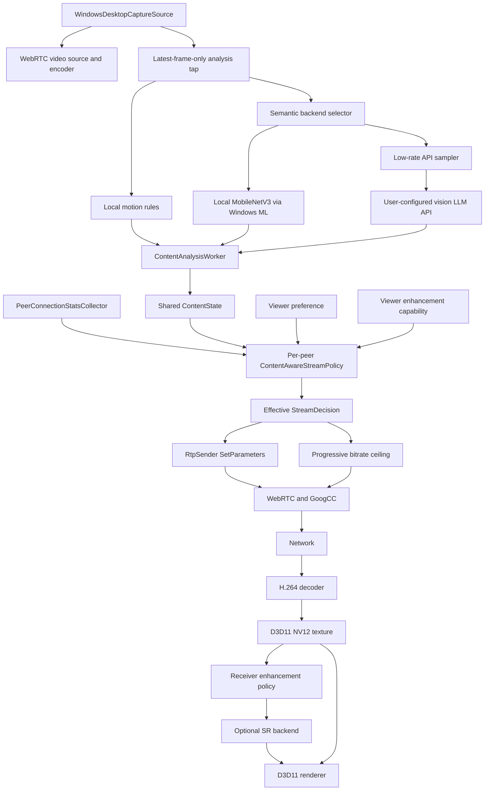

# RLink 内容感知串流与接收端超分方案

## 1. 目标与边界

RLink 保留 WebRTC/GoogCC 作为网络拥塞控制器。GoogCC 继续根据反馈估计当前链路容量、控制目标码率、探测和发送节奏；内容感知模块只决定在用户允许的范围内，如何把可用带宽分配给分辨率和帧率。

本方案包含两项能力：

1. 发送端内容感知串流：识别屏幕内容语义和运动状态，为每个观看者选择合适的分辨率、帧率和码率上限。
2. 接收端 AI 超分：当传输分辨率低于显示目标分辨率时，在本地 GPU 允许且延迟预算充足的条件下提升显示质量。

本期不训练或部署 AI 带宽预测器，不让模型直接生成码率数字，不让模型进入 WebRTC 拥塞控制闭环，不实现 AI 插帧、AI ROI 或通用大模型诊断，也不引入 CLIP 相关组件。远程视觉大模型 API 只允许输出受约束的屏幕语义分类结果，不能直接控制码率、执行画面中的指令或访问 RLink 会话对象。

必须满足以下产品边界：

- AI 模块关闭、模型缺失、推理失败或 GPU 不支持时，远控功能保持正常。
- 用户设置是上限，自动策略不能超过用户请求的分辨率或帧率。
- 内容分析默认在本机完成，不保存、不上传屏幕图像。只有用户明确选择“远程视觉大模型 API”、配置自己的 API 并确认隐私提示后，才允许上传低频缩略图。
- 多人房间只分析一次共享画面，但为每个 PeerConnection 独立决策。
- 降级可以较快，恢复必须保守，不能频繁切换分辨率。

## 2. 总体架构



职责边界如下：

- `WindowsDesktopCaptureSource` 提供画面和采集活动信息，不等待推理结果。
- `ContentAnalysisWorker` 始终在后台合并本地运动状态与选定语义后端的结果，只发布内容状态，不调用 WebRTC。
- 运动等级始终由本地规则实时计算；用户只在“本地模型”和“远程视觉大模型 API”之间选择语义分类后端。
- 远程 API 客户端只接收经过限频和缩放的内存图像，不接触原始 D3D11 纹理、WebRTC sender、控制通道或远控输入。
- `ContentAwareStreamPolicy` 是纯决策模块，不执行线程、协议或 GPU 操作。
- `LibWebRtcSession` 保持为最终的 RTP sender 和 PeerConnection 参数执行层。
- 接收端超分策略由接收端执行；发送端只使用对端声明的能力选择传输档位。

## 3. 状态模型

内容语义和运动状态必须分开。`TextUi` 可以高速滚动，`Video` 也可以暂停，不能用一个互斥枚举同时表达两类信息。

```cpp
enum class ScreenSemanticType : std::uint8_t {
    kUnknown,
    kTextUi,
    kMixedUi,
    kVideo,
};

enum class ScreenMotionLevel : std::uint8_t {
    kUnknown,
    kIdle,
    kLow,
    kMedium,
    kHigh,
};

struct ContentState {
    ScreenSemanticType semantic = ScreenSemanticType::kUnknown;
    ScreenMotionLevel motion = ScreenMotionLevel::kUnknown;

    float semanticConfidence = 0.0f;
    float motionScore = 0.0f;
    float changedAreaRatio = 0.0f;
    float textScore = 0.0f;
    float mixedUiScore = 0.0f;
    float videoScore = 0.0f;

    std::uint64_t sourceFrameId = 0;
    std::uint64_t timestampMs = 0;
    std::uint32_t inferenceTimeUs = 0;
    bool modelResultAvailable = false;
};
```

`ScreenContentActivity` 继续表示现有采集层的 Starting/Active/Idle 状态。策略输入时将它和 `ContentState` 合并，不复制另一套空闲状态机。

状态有效性默认规则：

- 本地模型结果超过 2000 ms 时过期。远程 API 结果最长保留 30 秒，但发生大面积变化、屏幕共享 generation 改变或用户切换后端时立即失效。
- 低于 0.70 的语义置信度不触发类别切换。
- 本地模型的新语义连续出现 3 个有效样本后才被接受。
- 远程 API 默认请求间隔较长，类别切换使用 2 个连续有效响应；当前类别为 `kUnknown` 时允许一个置信度不低于 0.85 的响应建立初始状态。
- Idle 主要由现有采集活动状态决定，不依赖键鼠静止。
- High motion 需要画面变化证据；键鼠输入只用于提前提升交互优先级。

## 4. 发送端内容分析

### 4.1 帧接入点

分析器挂在 `WindowsDesktopCaptureSource` 的帧交付前后均可，但必须覆盖两条现有路径：

- DXGI native texture：`D3D11DesktopFrameBuffer`。
- libwebrtc/GDI 回退：`DesktopBgraFrameBuffer`。

推荐在完成帧交付判定后，将最新有效画面交给分析抽头。分析抽头持有自己的引用，不改变 WebRTC 帧生命周期，不阻塞 `DeliverFrame()` 或 `OnFrame()`。

### 4.2 Latest-frame-only 队列

分析队列容量固定为 1：

- 新帧到达时原子替换尚未开始分析的旧帧。
- 推理进行中继续接收新帧，但不排队。
- 工作线程空闲后直接取最新帧。
- 停止屏幕共享时取消任务并释放纹理引用。
- 每次屏幕共享 generation 变化时清空旧结果，防止旧画面状态泄漏到新会话。

默认分析频率为 3 Hz，可配置范围为 2～5 Hz。Idle 状态降低到 1 Hz；模型状态稳定且画面变化很小时，可以跳过重复推理。

`ContentAnalysisWorker` 使用一条独立的持久工作线程。线程只消费 latest-frame-only mailbox，不占用采集线程、WebRTC signaling/worker/network 线程或 Qt GUI 线程。本地模式下每个进程只通过 Windows ML 创建一个 `Ort::Session`，所有 MobileNetV3 推理都在该工作线程串行执行。远程模式下图像缩放、压缩、请求构造和响应解析也只能在分析运行时或专用网络回调线程完成，不能回到媒体线程。

### 4.3 输入预处理

第一版采用可靠、容易诊断的路径：

1. 将源帧按中心等比缩放并补边到模型输入尺寸。
2. DXGI 纹理先通过 D3D11 VideoProcessor 缩小到 224×224 BGRA。
3. 只回读缩小后的纹理，完成通道变换和归一化。
4. CPU 执行 ONNX 推理。

224×224 BGRA 每帧数据量较小，2～5 Hz 下不会把整张桌面纹理反复读回 CPU。待第一版收益得到验证后，再评估 DirectML 或其他 GPU execution provider；接口不绑定具体 provider。

CPU/GDI 路径直接从现有 BGRA 缓冲区缩放。预处理必须保持两条路径的颜色顺序、归一化和宽高比一致。

### 4.4 规则特征

规则层提供以下信号：

- `captureChangedFramesPerSecond`：变化发生频率。
- `changedAreaRatio`：最近窗口内 dirty/move 区域占屏幕面积的比例。
- `captureInputBoostActive`：近期存在用户交互。
- 低分辨率亮度帧差：补充无法取得可靠 dirty region 的回退路径。
- 连续变化时间：区分短暂窗口拖动和持续视频播放。

仅用变化帧数不能区分闪烁光标和全屏视频，因此 `changedAreaRatio` 是第一阶段必须新增的指标。原生 DXGI 路径从 dirty/move metadata 累积；其他采集路径用低分辨率帧差估计。

### 4.5 本地模型

正式模型以 MobileNetV3-Small 类轻量分类网络为基线：

- 输入：224×224 RGB。
- 输出：`TextUi`、`MixedUi`、`Video` 三类 logits，由客户端计算概率。
- 初始化：ImageNet 预训练权重。
- 训练：RLink 场景截图人工标注后微调。
- 导出：ONNX，模型与归一化参数一起版本化。
- 量化：先完成 FP32 正确性和基准，再评估 FP16/INT8；量化版本必须与 FP32 使用同一验证集比较。

第一版推理运行时确定为 Windows ML 2.x。Windows ML 提供并维护 ONNX Runtime，因此分类器仍使用其 C++ ONNX Runtime API 创建 `Ort::Session`，但不再由 RLink 单独下载和打包一套上游 ONNX Runtime。

RLink 是 Qt/CMake 原生 C++ 应用，首版采用 `Microsoft.Windows.AI.MachineLearning` 的 self-contained C/C++ 部署。构建必须固定经过验证的稳定包版本，不使用浮动版本；初始集成基线为 Windows ML 2.3.42（内含 ONNX Runtime 1.27.1）。self-contained 运行时随 RLink 安装包发布，不要求用户预装 Windows App SDK Runtime。

首版使用 Windows ML 内含的 CPU Execution Provider：

- 使用 FP32 模型和 FP32 输入张量，不启用 DirectML、CUDA 或 TensorRT Execution Provider。
- 输入布局固定为 NCHW `[1, 3, 224, 224]`，颜色顺序为 RGB。
- 默认使用 ImageNet mean `[0.485, 0.456, 0.406]` 和 std `[0.229, 0.224, 0.225]`；最终值仍由 `model.json` 声明并校验。
- 输出固定为 `[1, 3]` logits，客户端执行 softmax，并按 `TextUi`、`MixedUi`、`Video` 顺序解释。
- ONNX Runtime 使用顺序执行模式，`inter_op_num_threads=1`，`intra_op_num_threads` 默认 2 且允许根据 CPU 基准下调为 1。
- 模型加载、输入输出名称、维度、类别顺序和文件哈希任一校验失败时禁用模型，仅保留规则策略。

选择 CPU Execution Provider 是为了让发送端内容分类不依赖显卡厂商，也避免和 DXGI 采集、硬件编码及接收端 NVIDIA VSR 争用 GPU。完成 FP32 基线后才评估 Windows ML 内含的 DirectML EP、通过 Execution Provider Catalog 获取的厂商 EP 或 INT8；替换 provider 或模型精度不能改变 `IContentClassifier` 接口和策略输出语义。动态获取硬件优化 EP 只在 Windows 11 24H2 或更新系统启用，较旧系统继续使用 CPU EP。

#### 4.5.1 推理回退链

推理按以下顺序降级，降级只在初始化、硬件环境变化或连续失败后发生，不在每一帧反复重试：

1. 首版直接使用 Windows ML CPU EP。以后启用硬件 EP 时，厂商 EP 或 DirectML EP 初始化/执行失败后，在同一条分析工作线程重建 CPU EP session。
2. Windows ML 运行时缺失、初始化失败、模型缺失/损坏、张量契约不匹配或 CPU EP 连续推理失败时，禁用 `WindowsMlContentClassifier`，进入规则分析模式。
3. 规则分析只使用 changed area、帧差、采集活动和输入活动判断 `Idle/Low/Medium/High` 运动等级与交互提升，不尝试用启发式规则猜测 `TextUi/MixedUi/Video`；语义固定发布为 `kUnknown`。
4. `kUnknown` 进入策略层后沿用现有网络 FPS、用户分辨率上限、GoogCC 和 `ProgressiveBitrateCeiling` 行为，不执行内容驱动的分辨率或帧率切换。
5. 内容感知总开关关闭时完全恢复当前发布版行为。

同一会话内模型连续失败 3 次后熔断为规则分析模式；只有模型文件变化、Windows ML/EP 更新、硬件指纹变化或用户主动重新检测时才尝试恢复。推理超出分析周期时丢弃该结果，不阻塞采集和编码。诊断必须记录当前 provider、回退层级、首次失败原因、连续失败次数和最近一次恢复尝试结果。

不再额外打包独立上游 ONNX Runtime 作为 Windows ML 的回退，因为两者使用相同推理核心，双运行时会增加安装体积、ABI/版本冲突和维护成本，却不能为模型损坏或张量错误提供有效容错。

模型文件放在 `models/content/`，清单至少包含：

```text
model.onnx
model.json       # 版本、输入尺寸、均值方差、类别顺序、哈希
LICENSES.txt     # 模型与训练权重许可
```

运行时校验模型哈希、输入维度和类别数量。校验失败时禁用模型并保留规则策略。

### 4.6 远程视觉大模型 API

远程视觉大模型是可选的语义分类后端，不替代本地运动分析。选择远程模式后，`changedAreaRatio`、变化频率、Idle/Low/Medium/High 和交互提升仍在本机计算；API 只返回 `TextUi/MixedUi/Video` 及置信度。网络超时、API 限流或服务不可用不会阻塞采集、编码和输入控制。

第一版提供“OpenAI-compatible 多模态 API”适配器，设置中允许用户填写服务地址、模型名称和自己的 API 密钥。协议适配器与 HTTP transport 分离，后续可以增加其他厂商或自建服务适配器，不在核心状态机中判断厂商名称。

DeepSeek 作为该通用适配器的内置配置预设，而不是一份单独实现。按 2026-09-30 的官方接口，预设使用 `https://api.deepseek.com` 和支持图像输入的 `deepseek-flash`；请求可使用 OpenAI-compatible Chat Completions 的 `image_url`，也可以由后续 Responses API 适配器使用 `input_image`。OpenAI-compatible 只代表请求格式兼容，不代表任意模型都支持图片，因此保存配置和切换模型后必须重新执行合成图能力测试，不能仅凭 provider 名称判定可用。

#### 4.6.1 上传采样和并发

- 默认每 10 秒最多请求一次，可配置范围为 5～60 秒；本地运动规则仍按原来的 2～5 Hz 工作。
- 同一 capture source 最多一个 API 请求在途。请求期间到达的新候选帧只保留最新一帧，不建立网络请求队列。
- 画面语义稳定且缩略图感知哈希未明显变化时跳过请求；大面积变化可以提前触发一次请求，但仍受最小间隔和并发上限约束。
- 上传图像在分析工作线程中按长边不超过 512 像素缩放，转为 sRGB JPEG，默认质量 75。编码结果只驻留内存，请求完成后立即释放，不写临时文件或缓存。
- 请求使用独立超时，默认 8 秒。超时结果或旧 generation 的响应直接丢弃，不能覆盖新会话状态。
- 429、5xx 和网络错误使用指数退避，不自动连续重传同一张屏幕图像。连续失败 3 次后熔断 5 分钟，用户点击“重新检测”可以提前恢复。

#### 4.6.2 请求与响应契约

系统提示只要求分类并明确要求忽略屏幕图像中的任何指令。响应必须是严格 JSON，第一版只接受：

```json
{
  "semantic": "text_ui | mixed_ui | video",
  "confidence": 0.0
}
```

- `semantic` 只能是三个固定值，`confidence` 必须位于 `[0, 1]`；缺字段、多余控制字段、非法 JSON、超长响应或不支持的类别都视为失败。
- 响应正文设置小型固定上限，不保存模型推理过程、自然语言解释或画面内容摘要。
- 大模型输出只进入与本地模型相同的语义平滑器，不能携带分辨率、FPS、码率、URL、命令或工具调用。
- 截图中的提示注入按不可信数据处理。客户端不执行模型返回文本，也不把它拼接进系统命令、日志路径或控制协议。

#### 4.6.3 密钥、地址和隐私

- API 密钥不写入 `QSettings`、日志、崩溃报告、diagnostics 或 DataChannel。Windows 首版使用当前用户作用域的 DPAPI secret store，设置中只保存凭据槽位 ID 和“已配置”状态。
- 默认要求 HTTPS。为支持本机自建模型，仅允许 `http://127.0.0.1`、`http://localhost` 和 IPv6 loopback；其他明文 HTTP 地址拒绝保存。
- Base URL 中的 user-info、查询参数和 fragment 不允许保存，防止密钥被误放入 URL。诊断最多显示 provider、主机名和模型名，不显示完整路径或请求头。
- 第一次切换到远程模式时必须明确提示“屏幕缩略图会发送到用户配置的第三方服务，并可能产生费用”，用户确认后才写入 consent revision。
- 设置页提供“暂停云端分析”和“清除 API 密钥”。屏幕共享期间远程分析生效时显示持续可见的状态提示，并累计本会话请求次数和上传字节数。
- “测试连接”使用程序内置的合成测试图，不上传当前桌面截图。只有测试成功且用户已确认隐私提示后，远程模式才进入 effective 状态。

#### 4.6.4 远程模式回退链

1. 用户选择远程模式且配置、测试和 consent 均有效时，使用远程视觉 API 提供语义结果。
2. API 未配置、鉴权失败、超时、限流、响应校验失败或进入熔断时，如果 `media/visionApiFallbackToLocal=true` 且本地模型可用，回退到 Windows ML 本地模型。
3. 本地模型也不可用时，仅保留本地规则运动状态，语义发布为 `kUnknown`，串流行为保持原有网络策略。
4. 本地模式绝不自动切换到远程 API；任何屏幕图像上传都必须来自用户主动选择的远程模式。
5. 模式切换会递增 analysis generation，清空在途请求和旧语义结果，不能让远程响应泄漏到新的本地会话。

远程结果的 30 秒有效期不是无条件缓存。屏幕共享切换、显示器切换、远程模式暂停，或本地规则检测到单次 `changedAreaRatio >= 0.35` 时立即将远程语义标为未知并等待新结果。

#### 4.6.5 独立组件边界

远程视觉能力实现为可单独构建和复用的 C++20 组件，RLink 只是它的一个宿主。组件源码可以暂存在本仓库共同开发，但其公开头文件、CMake target 和测试不能引用 RLink、Qt、WebRTC、`QSettings`、DPAPI 或会话类型。

- 公共输入是 `EncodedImageView`、端点配置和请求策略等普通值类型，公共输出是受约束的 `SemanticClassification`；接口不暴露 `QImage`、`QNetworkReply` 或 RLink 帧对象。
- `IHttpTransport`、`ISecretProvider`、`IExecutor`、`IClock` 和 `ILogger` 全部由宿主注入。组件不读取全局配置、不创建隐藏线程池、不使用全局单例，也不决定凭据如何持久化。
- OpenAI-compatible 模块只构造协议请求和校验协议响应；OpenAI、DeepSeek、自建网关等差异通过 `VisionApiEndpointConfig` 或独立协议 adapter 表达，核心运行时不出现厂商分支。
- RLink 的 Qt Network transport、DPAPI secret provider、后台 executor、设置映射和状态提示放在 RLink adapters/platform 层。其他项目可以换成 WinHTTP、libcurl、系统 keychain 或自己的调度器。
- 每个库提供 `install()`/`export()` 规则、命名空间化 CMake targets 和稳定的源码级公开头文件。仓库内提供一个不链接 RLink 的最小命令行示例，以内置合成图完成能力测试和一次分类。
- 单元测试使用 fake transport、fake clock 和内存 secret provider，覆盖请求构造、严格解析、超时、退避、取消和 generation；测试不访问真实厂商服务。

该拆分是库边界，不是进程边界。RLink 默认静态链接组件，缩略图编码结果通过借用内存传入，不引入 IPC、重复图片拷贝或内部 JSON 中转；外部 HTTP 请求所需的 JSON 只在具体协议 adapter 的发送边界生成。

### 4.7 数据集

数据集按实际编码语义定义，而不是软件名称：

- `TextUi`：代码、终端、文档、表格、设置页、网页正文等文字和锐利 UI 占主导的画面。
- `MixedUi`：UI、图片、图表、局部动画或多个窗口混合，无法由文字或视频单独代表。
- `Video`：自然图像或视频播放区域占主要视觉面积，存在连续纹理和时序变化。

采样必须覆盖浅色/深色、高 DPI、多显示器、不同语言、全屏/窗口、静止/滚动、浏览器视频控件、远程桌面嵌套等情况。训练、验证和测试应按会话或来源分组，避免相邻帧同时进入训练集和测试集造成数据泄漏。

默认客户端不收集数据。开发采集模式必须显式打开，画面只写入用户指定目录，并提供一键停止和删除入口。

## 5. 每连接策略控制器

### 5.1 输入与输出

每个 PeerConnection 持有独立策略状态：

```cpp
struct ContentAwarePolicyInput {
    ContentState content;
    ScreenContentActivity captureActivity;
    std::uint64_t availableOutgoingBitrateBps = 0;
    std::uint64_t targetBitrateBps = 0;
    double roundTripTimeMs = 0.0;
    double lossPercent = 0.0;

    std::uint32_t sourceWidth = 0;
    std::uint32_t sourceHeight = 0;
    ScreenStreamPolicyRequest userRequest;
    VideoEnhancementCapability receiverCapability;
    std::uint64_t timestampMs = 0;
};

struct StreamDecision {
    std::uint32_t effectiveWidth = 0;
    std::uint32_t effectiveHeight = 0;
    std::uint32_t effectiveFrameRate = 0;
    std::uint64_t maxBitrateBps = 0;

    bool receiverMayUseSuperResolution = false;
    std::uint32_t intendedDisplayWidth = 0;
    std::uint32_t intendedDisplayHeight = 0;
    std::string reason;
};
```

用户请求、策略目标和实际生效参数必须分别保存。诊断页面同时展示三者，AI 或网络策略不能覆写用户偏好。

### 5.2 候选档位

策略从有限档位中选择，不连续生成任意尺寸：

- 分辨率：原始/用户上限、1440p、1080p、720p；保持源画面宽高比并取偶数尺寸。
- 帧率：用户上限、60、45、30、20、15 FPS；不超过用户上限和会话能力上限。
- 静止画面仍由采集层抑制到心跳帧，不专门创建 1 FPS 编码档位。

候选档位先交给 `ResolveScreenStreamPolicy()` 计算 start/max bitrate。第一版使用现有 start bitrate 作为可持续性门槛，使用 max bitrate 作为 sender 和 PeerConnection 上限，不改变 GoogCC 的目标码率计算。

### 5.3 内容效用

对可行候选按内容权重排序：

| 语义/运动 | 分辨率倾向 | 帧率倾向 | SR 倾向 |
|---|---:|---:|---|
| TextUi + Idle/Low | 很高 | 低 | 默认关闭 |
| TextUi + Medium/High | 高 | 中 | 谨慎 |
| MixedUi | 中 | 中 | 允许 |
| Video + Low/Medium | 中 | 高 | 接收端支持时允许 |
| 任意语义 + High | 较低 | 很高 | 取决于延迟预算 |
| Unknown | 沿用现有网络 FPS 策略 | 沿用现有网络 FPS 策略 | 关闭 |

策略不是固定使用“5 Mbps 对应某个分辨率”，而是根据源尺寸、用户上限、候选像素率和当前容量动态判断。

### 5.4 决策步骤

1. 取 `availableOutgoingBitrateBps`；缺失时使用 `targetBitrateBps`；两者都缺失时保持现状。
2. 对容量做现有 EMA 平滑，并乘安全系数。
3. 根据源尺寸、用户上限和对端能力生成候选档位。
4. 删除 start bitrate 超过安全容量的候选。
5. 使用语义和运动权重选择效用最高的档位。
6. 无候选可行时选择最低安全档位，但不低于产品规定的最小可用分辨率和 15 FPS。
7. 通过滞回状态机决定是否应用。
8. 只有决策实际变化时调用 WebRTC 执行层。

### 5.5 滞回与恢复

内容类别滞回和网络档位滞回分开维护：

- 内容切换：置信度至少 0.70，连续 3 个样本确认。
- 网络降级：连续 2 个不足样本，可沿用现有 2 秒最短降级间隔。
- 网络恢复：连续 5 个有余量样本，至少等待 5 秒。
- 分辨率提升要求容量达到候选门槛的 1.15 倍。
- 分辨率变化后默认驻留至少 8 秒，严重拥塞时允许提前降级。
- 同一档位内只调整码率上限时，不重置内容状态。
- 内容改变但最优档位不变时，不调用 `SetParameters()`。

策略应扩展现有 `AdaptiveScreenFrameRateState` 思路，增加有效分辨率状态。不要每次内容采样都调用当前 `SetVideoSlotEncodingPolicy()`，因为该入口会更新 configured 值并重置自适应 FPS。

### 5.6 与 WebRTC 的关系

应用决策时保持现有约束：

- `RtpSender::SetParameters()` 设置 effective FPS、分辨率和本流码率上限。
- `PeerConnection::SetBitrate()` 只更新允许的全局最大值。
- `ProgressiveBitrateCeiling` 继续负责渐进提升和失败冷却。
- GoogCC 可以选择任何低于上限的目标码率。
- 不调用带宽估计重置，不根据模型结果修改 pacing、probe 或反馈算法。

## 6. 接收端 NVIDIA RTX Video 超分

第一版真实超分后端确定为 NVIDIA RTX Video SDK 1.1.0 的 NGX Video Super Resolution（VSR）DX11 接口。这里的“模型”不是 RLink 自行打包和加载的 ONNX 文件；VSR 的 AI 特征由 NVIDIA NGX Runtime 和显卡驱动提供并更新。RLink 只负责能力探测、纹理转换、质量等级、调用调度和失败回退。

首版默认使用 `NVSDK_NGX_VSR_Quality_Medium`（质量等级 2）。等级 1～4 保留为开发诊断选项，公开设置暂不暴露动态质量切换；等级 0 是 bicubic，只用于诊断和基线对比。

### 6.1 插入位置

当前硬解路径已经形成：

```text
H.264 decoder
  -> D3D11NativeFrameBuffer (NV12 texture + subresource)
  -> D3D11VideoSurface::PresentTexture()
  -> D3D11 VideoProcessor
  -> swap chain
```

SR 插入在 native decoder texture 和最终 VideoProcessor/交换链之间。软件解码路径第一版不启用 SR，避免先做 CPU 图像上传和额外拷贝。

NVIDIA VSR 的 DX11 输入和输出是 RGB SDR 纹理，不能直接接收当前解码器产生的 NV12。因此启用 VSR 后的具体链路确定为：

```text
H.264 decoder
  -> D3D11NativeFrameBuffer（NV12，传输尺寸）
  -> D3D11 VideoProcessor（NV12 -> RGBA，保持传输尺寸）
  -> NVIDIA NGX VSR（RGBA -> RGBA，显示目标尺寸）
  -> 光标叠加
  -> swap chain
```

旁路链路继续使用现有的 NV12 -> VideoProcessor -> swap chain，不为不支持 NVIDIA VSR 的设备增加额外 RGB 中间纹理。

### 6.2 后端接口

后端接口必须包含纹理所属设备、子资源、格式、色彩和同步信息：

```cpp
struct SuperResolutionRequest {
    ID3D11Device* device = nullptr;
    ID3D11DeviceContext* context = nullptr;
    ID3D11Texture2D* input = nullptr;
    UINT inputSubresource = 0;
    DXGI_FORMAT inputFormat = DXGI_FORMAT_UNKNOWN;
    std::uint32_t inputWidth = 0;
    std::uint32_t inputHeight = 0;
    std::uint32_t outputWidth = 0;
    std::uint32_t outputHeight = 0;
    VideoColorSpace colorSpace;
};

struct SuperResolutionResult {
    Microsoft::WRL::ComPtr<ID3D11Texture2D> output;
    UINT outputSubresource = 0;
    std::uint32_t processingTimeUs = 0;
    bool succeeded = false;
    std::string error;
};

class IAiSuperResolutionBackend {
public:
    virtual ~IAiSuperResolutionBackend() = default;
    virtual VideoEnhancementCapability Probe() = 0;
    virtual SuperResolutionResult Process(
        const SuperResolutionRequest& request) = 0;
    virtual void Reset() = 0;
};
```

实现顺序：

1. `NullSuperResolutionBackend`：永远旁路，用于完整打通生命周期和诊断。
2. `NvidiaRtxVsrBackend`：使用 `third_party/vsr` 中的 NVIDIA RTX Video SDK 1.1.0 和 NGX VSR DX11 接口。
3. NVIDIA 后端达到发布门槛后，再评估非 NVIDIA GPU 的通用 Windows 后端。

接口不使用厂商字符串做业务判断；厂商和实现名称只进入诊断。

`NvidiaRtxVsrBackend` 不直接复用示例 `rtx_video_api_dx11_impl.cpp` 中的进程级全局单例，而是按 RLink 生命周期封装 NGX feature：

- 使用接收端渲染所用的同一个 `ID3D11Device` 初始化 NGX。
- 通过 `NVSDK_NGX_Parameter_VSR_Available` 探测能力，失败时返回不支持并旁路。
- 首版输入和输出中间纹理统一使用 SDK 指南推荐的 `DXGI_FORMAT_R8G8B8A8_UNORM`。
- 输出纹理使用显示目标尺寸，并带 `D3D11_BIND_UNORDERED_ACCESS`；增强结果再进入光标合成和交换链提交。
- 使用输入和输出 rect 支持任意显示目标尺寸，不把策略限制为固定 2 倍倍率。
- 设备变化、窗口输出尺寸变化或 D3D11 device reset 时释放并重建 feature 与纹理池。

### 6.3 线程与同步

VSR 的初始化、`EvaluateFeature` 和释放都在现有 `RemoteDesktopCanvas::NativePresentationLoop()` 创建的 `RemoteC D3D11 Present` 工作线程执行，不进入 Qt GUI 线程，也不另建第二条共享 immediate-context 的 GPU 线程。

NGX API 本身不是线程安全的，因此同一进程内所有 NGX 调用必须串行化。首版只有一个活动接收画面时由 presentation worker 的线程归属自然保证；实现仍保留进程级互斥，防止未来多窗口或多接收会话并发调用。presentation mailbox 继续只保留最新帧：VSR 处理期间到达的新帧覆盖尚未开始的旧帧，不积压推理任务。

### 6.4 接收端启用条件

同时满足以下条件才启用：

- 用户允许 AI 画质增强。
- 操作系统为 Windows 10 20H1 64-bit 或更新版本，GPU 为 NVIDIA RTX，驱动版本不低于 R550.58。
- `nvngx_vsr.dll` 和 NGX Core Runtime 可用，并且 `NVSDK_NGX_Parameter_VSR_Available` 返回支持。
- 传输分辨率小于当前显示目标分辨率。
- 当前解码输出是后端支持的 D3D11 native texture。
- 缩放比例位于后端支持范围内。
- 输出尺寸和帧率不超过后端能力。
- 最近推理耗时不超过当前帧预算。
- 没有连续失败、设备移除或显存压力错误。

TextUi 默认优先保持传输分辨率；只有网络无法维持最低可用帧率时才允许通过降低分辨率启用 SR。Video 可以更积极使用 SR。

设置页探测只决定用户能否选择该功能，会话开始时仍必须使用实际解码和渲染设备再次执行 `Probe()`。设置缓存、硬件环境或驱动发生变化后，只要运行时条件有一项不满足，`effective` 状态就必须为关闭，并立即走原始显示路径。

### 6.5 运行时保护

- SR 连续失败 3 次后对当前会话旁路，保留原始纹理显示。
- GPU 处理时间连续超过帧预算的 50% 时自动旁路并进入冷却。
- D3D11 device removed/reset 时释放全部 SR 资源，跟随渲染器重建。
- 每次只允许一帧 SR 在途，新帧到达时丢弃尚未开始的旧帧。
- SR 不能延迟光标绘制；远程光标继续在增强后的画面上叠加。

### 6.6 构建、打包与许可

- RLink 使用 `/MD`，Release 链接 `third_party/vsr/lib/Windows/x64/nvsdk_ngx_d.lib`，Debug 链接 `nvsdk_ngx_d_dbg.lib`。
- 开发包使用 `bin/Windows/x64/dev/nvngx_vsr.dll`；正式包只分发 `bin/Windows/x64/rel/nvngx_vsr.dll`，不携带未使用的 `nvngx_truehdr.dll`。
- `third_party/vsr` 作为可选本地 SDK 根目录接入，关闭 NVIDIA VSR 构建选项时不要求该目录存在。
- 不把完整 SDK、示例和开发工具作为 RLink 公共源码的一部分提交；构建只从本地 SDK 根目录引用必要头文件和链接库。
- 分发时保留 NVIDIA 版权声明、SDK 许可证和产品中的 NVIDIA/NGX 归属说明；商业发布前按许可证要求通知 NVIDIA。
- 运行时 DLL 缺失、驱动不支持或许可构建选项关闭时，能力协商报告不支持，现有显示路径保持可用。

## 7. 能力协商

在现有 `control-reliable` DataChannel 和 `ScreenShareControlProtocol` 中增加向后兼容的新消息类型。不要改变版本 1 旧消息的解析语义。

```cpp
enum class VideoEnhancementBackendKind : std::uint8_t {
    kNone,
    kGenericGpu,
    kVendorSpecific,
};

struct VideoEnhancementCapability {
    std::string roomId;
    std::string receiverDeviceId;
    std::uint64_t capabilityRevision = 0;
    bool superResolutionSupported = false;
    VideoEnhancementBackendKind backend =
        VideoEnhancementBackendKind::kNone;
    std::uint16_t maximumScalePermille = 1000;
    std::uint32_t maximumOutputWidth = 0;
    std::uint32_t maximumOutputHeight = 0;
    std::uint32_t maximumPixelsPerSecond = 0;
    std::uint32_t supportedInputFormats = 0;
    std::string implementationName;
};
```

比例使用整数千分比，避免二进制协议中的浮点兼容问题。能力消息在以下时机发送：

- DataChannel 打开后。
- 解码器或渲染设备改变后。
- 用户启用/关闭 AI 画质增强后。
- 后端因持续失败被禁用后。

发送端对每个观看者保存最后一个 revision。能力缺失、过期或解析失败时按“不支持 SR”处理。

发送端可以在 `ScreenStreamPreferenceApplied` 的后续新消息中报告 effective 传输尺寸、预期显示尺寸和 SR eligibility，但接收端始终拥有最终启用权。

## 8. 诊断与可观测性

扩展 `SessionDiagnostics`，不要建立独立的第二套诊断通道。

发送端字段：

- analyzer enabled/mode/backend/model version/model hash。
- semantic type/confidence、motion level/score、changed area ratio。
- 推理最近/平均/P95 耗时、跳过帧数、替换帧数、结果年龄。
- 远程 API effective 状态、provider、模型名、结果有效期、请求在途状态、请求/成功/失败/限流/熔断次数、上传字节数和最近/P95 响应时间。
- 远程 API 错误只记录分类后的错误码和 HTTP 状态类别，不记录 API 密钥、请求头、完整 URL、上传图像或响应正文。
- 用户请求、策略目标、实际发送宽高/FPS。
- policy profile、reason、稳定样本数、驻留/冷却剩余时间。
- capacity、候选所需码率、应用的码率上限。
- policy switch count 和最近切换时间。

接收端字段：

- SR supported/enabled/backend。
- 输入/输出尺寸和缩放比例。
- SR 最近/平均/P95 GPU 时间。
- processed/bypassed/failed frames。
- bypass reason 和 cooldown。

诊断页面第一阶段必须支持 shadow mode：显示策略“本来会选择”的结果，但不改变 sender 参数。这是判断模型和策略是否值得启用的主要证据。

## 9. 配置与开关

建议增加以下设置，并提供安全默认值：

- `media/contentAwareStreamingEnabled=false`
- `media/contentAnalyzerEnabled=false`
- `media/contentAnalyzerMode=local`，可选 `local` 或 `vision_api`
- `media/contentAnalyzerRateHz=3`
- `media/contentPolicyShadowMode=true`
- `media/visionApiProvider=openai_compatible`，可选通用配置或 `deepseek` 等内置预设
- `media/visionApiBaseUrl=`
- `media/visionApiModel=`
- `media/visionApiCredentialId=`，只保存 DPAPI 凭据槽位 ID，不保存密钥
- `media/visionApiRequestIntervalSeconds=10`
- `media/visionApiFallbackToLocal=true`
- `media/visionApiConsentRevision=0`
- `media/aiSuperResolutionEnabled=false`
- `media/nvidiaRtxVsrQuality=2`
- `media/aiModelPath=`，为空时使用打包模型

发布过程采用 feature flag：开发版允许打开，公开版本默认关闭，完成 A/B 验证后再调整默认值。

### 9.1 内容感知设置

内容感知入口放在“设置 -> 远程桌面”的发送端画面设置区域：

- 总开关：`内容感知串流`，默认关闭。
- 方式选择：`本地轻量模型` 或 `远程视觉大模型 API`，默认本地模型。
- 本地模式显示当前 Windows ML/provider、模型版本、检测结果和“重新检测”。
- 远程模式显示 provider、Base URL、模型名、API 密钥输入、请求间隔、“测试连接”和“清除密钥”。DeepSeek 预设自动填入官方 Base URL 和当前默认视觉模型，但用户仍可修改模型；密钥输入框只用于写入 secret store，重新打开设置页时不回填明文。
- 远程模式旁持续显示上传说明、第三方费用说明和最近一次连接测试状态。未确认当前 consent revision 时不能启用。
- 设置值分为 `requested mode` 和 `effective backend`。例如用户请求远程模式但 API 熔断并回退本地时，界面显示“远程 API（已回退到本地模型）”，不能把回退伪装成远程仍在运行。
- 模式、地址、模型或密钥发生变化时立即递增配置 revision，使旧测试结果和旧请求失效；新配置测试成功后才能成为 effective。

设置页不能提供“忽略证书错误”。非 loopback 地址必须通过正常 TLS 证书校验。远程模式关闭或总开关关闭后，立即取消可取消的请求、清空待上传缩略图并停止网络活动。

### 9.2 超分设置入口与能力门控

超分入口放在“设置 -> 远程桌面”的接收端显示设置区域，位于视频解码器及本机解码检测之后：

- 开关名称：`NVIDIA RTX 视频超分`。
- 辅助说明：`在本机使用 NVIDIA RTX Video 提升低分辨率远程画面的显示质量。`
- 默认关闭；仅在能力探测通过时允许操作。
- 设置值表示用户请求，运行时另行维护 supported、requested 和 effective 三个状态，不能把“用户打开”直接等同于“正在生效”。

设置页状态规则：

| 探测状态 | 开关状态 | 状态说明 |
|---|---|---|
| 正在探测 | 关闭且禁用 | 正在检测 NVIDIA RTX Video 支持 |
| 满足要求 | 可操作，默认关闭 | 当前设备支持 NVIDIA RTX 视频超分 |
| 非 NVIDIA RTX GPU | 关闭且禁用 | 需要 NVIDIA RTX GPU |
| 驱动版本过低 | 关闭且禁用 | 需要 R550.58 或更新驱动 |
| NGX Runtime 或 `nvngx_vsr.dll` 缺失 | 关闭且禁用 | 当前安装缺少 NVIDIA RTX Video 运行组件 |
| NGX 报告 VSR 不可用 | 关闭且禁用 | NVIDIA RTX Video 在当前设备上不可用 |
| 当前构建未包含后端 | 关闭且禁用 | 当前版本未包含 NVIDIA RTX Video 支持 |

`NvidiaRtxVsrCapabilityProbe` 按当前硬件指纹缓存结果。GPU、驱动版本、SDK DLL 或构建版本变化时缓存失效并重新检测；设置页提供“重新检测”入口。探测应在后台执行，不能阻塞 Qt GUI 线程。

只有探测通过后，设置页才允许把 `media/aiSuperResolutionEnabled` 写为 `true`。探测失败或硬件环境变化为不支持时，设置页显示关闭且禁用，并将该设置纠正为 `false`。会话启动和 D3D11 device reset 后再次校验，防止手工修改配置绕过能力门控。

## 10. 代码与构建结构

本功能按“可复用核心 + 平台后端 + RLink 适配”拆分，不能把 Qt、WebRTC、会话对象和厂商 SDK 混在同一个库中：

```text
src/media_intelligence/
  core/
    ContentState.h
    ImageTensorView.h
    IContentClassifier.h
    EncodedImageView.h
    IRemoteSemanticClassifier.h
    SemanticClassification.h
    ContentAwareStreamPolicy.h/.cpp
  runtime/
    ContentAnalysisWorker.h/.cpp
    ContentAnalysisRuntime.h/.cpp
  backends/windows_ml/
    WindowsMlContentClassifier.h/.cpp
  remote/
    IHttpTransport.h
    ISecretProvider.h
    IExecutor.h
    IClock.h
    ILogger.h
    VisionApiTypes.h
    VisionApiRuntime.h/.cpp
  backends/openai_compatible/
    OpenAiCompatibleVisionClassifier.h/.cpp
  d3d11/
    ID3D11SuperResolutionBackend.h
    NullD3D11SuperResolutionBackend.h/.cpp
    D3D11SuperResolutionRuntime.h/.cpp
  backends/nvidia_rtx_vsr/
    NvidiaRtxVsrBackend.h/.cpp

src/apps/remote/adapters/
  RLinkContentAnalysisAdapter.h/.cpp
  QtVisionApiHttpTransport.h/.cpp
  RLinkVisionApiExecutor.h/.cpp

src/platform/win/
  DpapiContentAnalyzerSecretStore.h/.cpp

src/apps/controller/adapters/
  RLinkSuperResolutionAdapter.h/.cpp

src/protocol/
  VideoEnhancementProtocol.h/.cpp

models/content/
  model.onnx
  model.json
  LICENSES.txt

examples/vision_api_classifier/
  CMakeLists.txt
  main.cpp
```

依赖方向：

```text
media_intelligence_core
        <- media_intelligence_runtime
        <- media_intelligence_windows_ml
        <- media_intelligence_remote
        <- media_intelligence_openai_compatible

media_intelligence_d3d11
        <- media_intelligence_nvidia_rtx_vsr

media_intelligence_* <- RLink adapters
RLink adapters <- rlink_session_engine / RLinkAPP renderer
```

职责和依赖规则：

- `media_intelligence_core` 只包含标准 C++20 数据结构、纯策略和接口，不依赖 Qt、WebRTC、COM、D3D11、Windows ML 或 NVIDIA SDK。
- `media_intelligence_runtime` 负责 latest-frame-only 调度、generation、过期和熔断，不知道房间、PeerConnection、设置页或具体模型后端。
- `media_intelligence_windows_ml` 只把标准 CPU tensor 送入 Windows ML；它不知道画面来自 DXGI、GDI、文件还是摄像头。
- `media_intelligence_remote` 定义异步语义请求、单请求在途、超时、退避和熔断，并通过注入的 transport、secret provider、executor、clock 和 logger 运行；它不知道 Qt Widgets、WebRTC、操作系统凭据 API 或 RLink 会话。
- `media_intelligence_openai_compatible` 只负责 OpenAI-compatible 多模态请求构造和严格响应解析。DeepSeek 是端点/模型预设，复用相同协议实现。API 密钥只在发送边界短暂取得，不进入分类器状态和诊断快照。
- `QtVisionApiHttpTransport` 是 RLink 的 Qt Network 适配器；其他使用者可以注入自己的 HTTP 实现，核心组件不强制依赖 Qt。
- `DpapiContentAnalyzerSecretStore` 负责当前 Windows 用户作用域的 API 密钥保存、读取和删除，不与登录令牌或 RLink 账户凭据共用命名空间。
- `media_intelligence_d3d11` 是面向任意 Windows D3D11 应用的零拷贝增强接口。D3D11 类型只允许出现在这一层及其厂商后端，不污染平台无关核心。
- `media_intelligence_nvidia_rtx_vsr` 只实现 D3D11 超分接口，不引用 Qt、WebRTC、RLink 设置或协议类型。
- RLink adapters 负责把采集帧、QSettings、诊断、DataChannel 和 renderer 映射到通用接口；业务对象不能反向进入可复用库。
- 后端通过显式 factory/constructor 注入；核心代码不使用厂商字符串、全局单例或隐藏 service locator 选择实现。
- 每个静态库提供独立 CMake target、公开头文件集合和最小依赖，并通过 CMake install/export 产生可供其他工程 `find_package()` 的命名空间 targets。

第一版保持源码级 C++ API，不承诺跨编译器 DLL ABI。未来需要第三方动态插件时，在现有 C++ 接口外增加版本化 C ABI；不直接暴露 STL、COM 智能指针或异常跨 DLL 边界。

### 10.1 性能契约

性能要求属于接口契约，而不是实现完成后的补救项：

- 功能关闭时不创建 Windows ML session、不加载模型或 VSR DLL、不读取 API 密钥、不启动分析线程或网络请求，媒体热路径只保留一次可预测的开关判断。
- 帧接入只执行引用持有和容量为 1 的 mailbox 原子替换；禁止在采集、编码、WebRTC 和 Qt GUI 线程进行缩放、回读、推理、等待 GPU 或磁盘访问。
- 所有队列必须有固定上限。内容分析容量固定为 1，接收端显示继续只保留最新帧；不允许通过堆积任务换取吞吐量。
- Windows ML session、输入 tensor、224×224 staging/readback 资源在启动或尺寸变化时创建并复用；稳定运行期间不做逐帧堆分配。
- 远程模式的缩放、JPEG 编码、JSON 和网络 I/O 全部位于低频分析任务外层；媒体热路径只提交引用和时间戳。最多一个请求在途、一个待处理最新样本，禁止积压截图或响应。
- D3D11 SR 输入、输出和中间纹理使用小型纹理池；只有设备或输出尺寸变化时重建，不逐帧创建纹理、view 或 NGX feature。
- `ContentState` 以不可变快照发布，读侧无锁或只做原子 shared-state 交换；持锁期间不调用宿主回调、Windows ML、NGX 或 WebRTC。
- 策略层是无 I/O 的纯计算，输入输出为值类型；同一份内容状态可供任意数量观看者复用，不能为每个 PeerConnection 重复推理。
- 诊断在边界处累计计数和时间戳，不在逐帧路径格式化字符串、写文件或刷新 UI。
- 后端失败后快速熔断，冷却期不重复初始化；恢复只能由明确的环境变化、用户重试或会话重建触发。

阶段 0 必须记录功能关闭基线。后续每个阶段都验证 capture/encoded/sent/presented FPS、CPU/GPU、显存、工作集、P95 帧间隔和端到端延迟；若关闭功能后的基线出现可测退化，或启用后超过已定义预算，该阶段不能合入下一阶段。

### 10.2 组件化零损耗约束

“独立组件”表示源码、依赖和 CMake target 独立，不表示独立进程或远程服务。RLink 的默认集成必须与直接把实现写进应用内部具有相同的数据路径：

- Release 默认构建为静态库并链接进最终可执行文件，不使用 IPC、RPC、共享内存消息、JSON、Protobuf 或帧序列化跨越组件边界。
- Release 对相关 targets 开启 MSVC whole-program/link-time optimization（CMake `INTERPROCEDURAL_OPTIMIZATION_RELEASE`，对应 `/GL` 和 `/LTCG`），允许编译器内联适配层和消除无用分支。
- 接口传递 `std::span`、值类型描述符和借用的 D3D11 资源引用；调用期间由宿主持有生命周期，不因为组件边界复制完整帧或创建第二份 CPU 图像。
- 虚调用或 factory 选择只能发生在每次分析任务或每次 SR 提交的外层，不能出现在像素循环、tensor 元素循环或 GPU resource loop 内。
- Windows ML 后端直接绑定运行时预分配的 tensor buffer；RLink adapter 不创建第二份归一化输入。
- NVIDIA VSR 后端直接使用接收端同一个 `ID3D11Device`、immediate context 和纹理池；组件边界不允许增加 D3D11 跨设备共享、CPU readback、额外 `CopyResource` 或格式往返。
- 为复用而增加的通用接口不能替换 D3D11 专用快速路径。平台无关策略与平台专用零拷贝接口并存，调用方按能力选择。
- 动态插件和版本化 C ABI 属于未来可选扩展；不得成为 RLink 默认媒体热路径。

远程视觉 API 的 HTTP/JPEG/JSON 是用户主动选择的外部后端协议，不是 RLink 内部组件通信方式。它只出现在低频分析任务中，内部媒体和策略边界仍使用值类型、借用资源和内存快照，不通过 JSON 序列化画面或状态。

必须建立“内嵌参考实现”和“组件化实现”的同机 A/B 基准，使用相同模型、输入帧、D3D11 device、VSR 质量和编译优化。组件化版本满足以下条件才可接入：

1. GPU copy、Map/Unmap、纹理创建和颜色转换次数与内嵌参考实现完全一致。
2. 稳态采集、分析提交、编码和显示路径的逐帧堆分配次数与参考实现一致，目标均为 0。
3. 仅计算 adapter、接口分发和状态发布的额外 CPU 成本，P95 不超过 10 微秒。
4. 在足够样本下，capture/encoded/sent/presented FPS、P95 帧间隔、端到端延迟、CPU/GPU 占用和显存峰值没有统计显著退化；任何超过测量噪声的退化都必须定位并消除，不能用“组件化开销”解释后放行。
5. 关闭功能时，生成路径不进入组件工作线程或后端，媒体资源数量与当前稳定版本一致。

性能测试同时保留计数型断言和时间型指标。计数型断言保证没有隐藏拷贝、分配或排队；时间型指标验证编译器、调度和锁竞争没有造成实际退化。只有两类检查都通过，才视为组件化无性能损耗。

模型和运行库通过 CMake 可选项接入：

```text
RLINK_ENABLE_CONTENT_ANALYZER
RLINK_ENABLE_REMOTE_VISION_API
RLINK_ENABLE_AI_SUPER_RESOLUTION
RLINK_ENABLE_NVIDIA_RTX_VSR
RLINK_WINDOWS_ML_ROOT
RLINK_NVIDIA_RTX_VIDEO_SDK_ROOT
```

关闭选项时仍编译接口、规则策略和 Null backend，产品功能完整降级。

## 11. 分阶段实施

### 阶段 0：基线冻结

目标：形成可比较的现有表现。

- 固定弱网配置和代表性场景。
- 保存现有 capture/encoded/sent/presented、码率、RTT、loss、QP、freeze、端到端延迟。
- 建立 TextUi、MixedUi、Video、窗口拖动、快速滚动、静止画面测试脚本。

完成标准：同一台发送端、接收端和网络条件下可以重复取得基线。

### 阶段 1：规则状态和观察链路

目标：不引入模型、不改变媒体参数，先验证线程和数据路径。

- 增加 `ContentState`、帧 ID、过期机制。
- 增加 changed area ratio 和运动等级。
- 完成 latest-frame-only worker、停止和 generation 重置。
- 将状态接入 diagnostics 和 CSV。

完成标准：连续运行 30 分钟不阻塞采集；工作线程落后时不会积压旧帧；关闭模块后行为与基线一致。

### 阶段 2A：语义后端选择与远程视觉 API shadow mode

目标：先用用户自己的视觉 API 验证语义分类和策略价值，同时建立本地/远程共用的后端边界。

- 增加 `IRemoteSemanticClassifier`、transport/secret/executor/clock/logger 注入接口、OpenAI-compatible 适配器和 RLink 的 Qt Network/DPAPI adapters。
- 增加 DeepSeek 配置预设，默认使用当前官方视觉模型，并对每个端点/模型组合执行合成图能力测试。
- 提供 CMake install/export 和不链接 RLink/Qt/WebRTC 的最小命令行示例，验证其他 C++20 工程可以独立使用远程视觉组件。
- 完成低频缩略图采样、单请求在途、严格 JSON 响应校验、generation 丢弃、退避和熔断。
- 增加 DPAPI API 密钥存储、HTTPS/loopback 地址校验、consent revision 和合成图连接测试。
- 在设置页实现本地模型/远程 API 方式选择，并显示 requested/effective backend 和回退原因。
- 实现候选档位、效用函数和滞回状态机。
- diagnostics 同时显示当前参数和 shadow decision。
- 远程语义结果只进入 shadow policy，不修改 sender 参数。

完成标准：API 慢响应、乱序响应、鉴权失败、429、5xx、断网和非法 JSON 均不会阻塞采集或污染新会话；未取得明确 consent 时网络请求数必须为 0；diagnostics 能展示远程分类结果和 shadow decision；独立示例只链接导出的通用组件即可对 OpenAI-compatible/DeepSeek 配置完成合成图测试。

### 阶段 2B：本地轻量模型

目标：在同一语义接口下补齐离线、低延迟、零上传的默认后端。

- 接入 self-contained Windows ML、CPU EP 和模型清单校验。
- 完成训练、验证、测试数据划分和混淆矩阵。
- 输出稳定后的 semantic state，并复用阶段 2A 的平滑、过期和 shadow policy。
- 完成远程 API 失败时到本地模型的可选回退；本地模式仍禁止自动上传。

完成标准：测试集总体准确率、各类别召回率和切换稳定性达到预定门槛；推理 P95 不影响采集线程；模型缺失/损坏能自动回退；本地与远程模式可在新 generation 中安全切换。

### 阶段 3：发送策略闭环

目标：只控制 FPS、分辨率和既有码率上限。

- 扩展 requested/target/effective 状态。
- 将策略结果接入每个 `LibWebRtcSession`。
- 保留 GoogCC 和 ProgressiveBitrateCeiling。
- 增加策略开关和 A/B 日志。

完成标准：同带宽 TextUi 清晰度改善，Video 流畅度改善；分辨率切换无持续黑屏；每分钟策略切换次数受控；关闭功能即可恢复原行为。

### 阶段 4：SR 协议和 Null backend

目标：先打通能力和生命周期，不进行真实增强。

- 增加能力消息编解码和 direct/room 分发。
- 完成 capability revision、过期和旧版本回退。
- 将 Null backend 接入 native presentation path。
- 展示 SR eligibility 和旁路原因。

完成标准：新旧客户端互通；多人房间各观看者能力互不覆盖；渲染路径无性能回退。

### 阶段 5：NVIDIA RTX Video VSR 后端

目标：在支持的 GPU 上完成本地增强。

- 实现并探测 `NvidiaRtxVsrBackend`，首版默认质量等级 2。
- 完成 NV12 -> BGRA、NGX VSR、输出纹理复用和 device reset。
- 在现有 D3D11 presentation worker 上串行调用 NGX，不阻塞 Qt GUI 线程。
- 接入 GPU 时间预算、失败熔断和冷却。
- 进行 TextUi/Video 分场景质量评估。

完成标准：SR 开启后的端到端延迟增量、P95 GPU 耗时、画质收益和失败回退均满足发布门槛。

## 12. 验证矩阵

### 12.1 功能

- 语义切换：IDE、网页正文、混合页面、全屏视频及来回切换。
- 运动切换：静止、打字、小范围动画、滚动、窗口拖动、全屏运动。
- 网络切换：稳定高带宽、阶跃下降、缓慢恢复、丢包、RTT 上升、统计缺失。
- 用户设置：720p/1080p/1440p/original 与 30/60/120 FPS 上限。
- 会话类型：direct、双人 room、多人 room。
- 生命周期：开始/停止共享、切换显示器、重连、接收端加入/离开。
- 故障：模型丢失、模型损坏、推理超时、D3D device reset、SR 后端失败。
- 远程 API：未配置、错误密钥、HTTPS 证书失败、连接超时、429、5xx、非法/超长 JSON、慢响应跨 generation 返回、熔断后恢复。
- API 兼容：OpenAI-compatible 自定义端点和 DeepSeek 预设分别通过合成图测试；不支持图像的模型必须在能力测试中被拒绝并给出明确原因。
- 隐私：默认和本地模式零上传；远程模式 consent、暂停、清除密钥、模式切换和停止共享后不再产生请求。
- 兼容：新发送端对旧接收端、旧发送端对新接收端。

### 12.2 指标

TextUi：

- 接收分辨率、QP、文字区域边缘保持。
- 固定截图 OCR 置信度或字符识别率。
- 操作延迟和滚动时丢帧。

Video/High motion：

- encoded/sent/presented FPS。
- freeze count/duration、P95 帧间隔。
- 端到端接收管线延迟和码率。

策略稳定性：

- 每分钟语义切换数和档位切换数。
- 降级响应时间和恢复时间。
- 分辨率变更后的黑屏、关键帧和 PLI 情况。

模型和 SR：

- 推理平均/P95/最大耗时。
- CPU/GPU 占用和显存增量。
- replaced/skipped frames。
- SR 成功率、旁路率和熔断次数。

远程视觉 API：

- 请求/成功/失败/限流/熔断次数、上传字节数和重复画面跳过率。
- 请求平均/P95/最大响应时间、结果年龄和失效到重新分类时间。
- 单请求在途和容量为 1 的待处理样本断言，网络变慢时不得出现截图积压。
- 本地模式、未确认 consent、暂停状态和共享停止后的网络请求数必须为 0。

### 12.3 初始发布门槛

- 内容分析不能阻塞采集或 WebRTC 线程。
- 功能关闭时不加载 AI/SR 运行库、不创建额外工作线程，现有媒体路径无可测性能退化。
- 稳态热路径没有逐帧堆分配、纹理创建或无界队列增长。
- 结果过期、异常或无置信度时保持原有策略。
- 远程 API 不可用时按设置回退本地模型或规则；本地模式绝不自动上传。
- 策略开启后不得增加持续性冻结或明显提高输入延迟。
- 正常网络下不能因为内容误判长期降低用户请求的画质。
- SR 后端失败时下一帧可以直接旁路显示。
- direct/room 新旧版本互通测试全部通过。

具体准确率、延迟和质量阈值在阶段 0 基线完成后写入测试配置，避免脱离实际硬件预设数字。

## 13. 风险与控制

| 风险 | 控制措施 |
|---|---|
| 模型误判导致画质反复变化 | 置信度、连续样本、驻留时间、有限档位、shadow mode |
| 多观看者重复推理 | 分析器按 capture source 共享，policy 按 PeerConnection 独立 |
| 频繁 `SetParameters()` 重置适配状态 | requested/target/effective 分离，仅在档位变化时执行 |
| 截图隐私 | 默认本地且零上传；远程模式显式选择和 consent；低频缩略图仅驻留内存；持续状态提示和一键暂停 |
| API 密钥泄漏 | 当前用户 DPAPI secret store；QSettings、日志、诊断、URL 和协议中不保存密钥 |
| API 费用或限流 | 默认 10 秒间隔、重复画面跳过、单请求在途、请求计数、429 退避和熔断 |
| 远程响应慢或乱序 | generation、超时、旧响应丢弃、本地运动独立运行、可选本地回退 |
| 画面提示注入或非结构化输出 | 固定分类提示、严格 JSON schema、响应大小上限、不执行任何返回文本或工具调用 |
| Windows ML 自包含运行库增大安装包 | CMake 可选依赖、模型压缩、发布前统计真实增量 |
| SR 增加延迟或争用解码 GPU | GPU 时间预算、单帧在途、熔断、冷却、快速旁路 |
| 厂商 API 绑定 | 通用接口、能力枚举、厂商名只用于诊断 |
| 过度抽象引入纹理拷贝和动态分配 | 平台无关策略与 D3D11 零拷贝接口分层，资源池复用，热路径基准作为合入门槛 |
| 协议版本不兼容 | 新消息类型、旧消息语义不变、能力缺失按不支持处理 |

## 14. 最终完成定义

该功能只有在以下条件全部满足时才算完成：

1. 内容分析、每连接策略、WebRTC 执行和接收端增强边界清晰，没有跨线程直接调用。
2. AI 全部关闭或故障时，RLink 行为与当前稳定版本一致。
3. 相同弱网条件下，TextUi 的可读性和 Video 的流畅度分别获得可复现改善。
4. 策略切换、编码重配置和 SR 没有引入不可接受的冻结或输入延迟。
5. 新旧客户端、direct/room、多观看者和 GPU/CPU 回退路径全部通过验证。
6. diagnostics 能解释每次决策使用的内容状态、网络容量、用户上限、对端能力和回退原因。
7. 核心、Windows ML 后端和 D3D11/VSR 后端可分别构建；核心测试不链接 Qt、WebRTC、Windows ML 或 NVIDIA SDK。
8. 使用不链接 RLink、Qt、WebRTC 的最小示例验证本地分类、远程视觉 API 和 D3D11 增强组件可以被其他 Windows C++20/CMake 工程通过导出 targets 复用。
9. 组件化实现与同算法内嵌参考实现通过零额外拷贝/分配断言和同机 A/B 性能门槛，不能因模块边界产生可测性能损耗。
10. 本地模型与远程视觉 API 可以在设置中选择；远程模式的 consent、密钥保护、请求限频、状态提示、失败回退和零上传断言全部通过验证。
