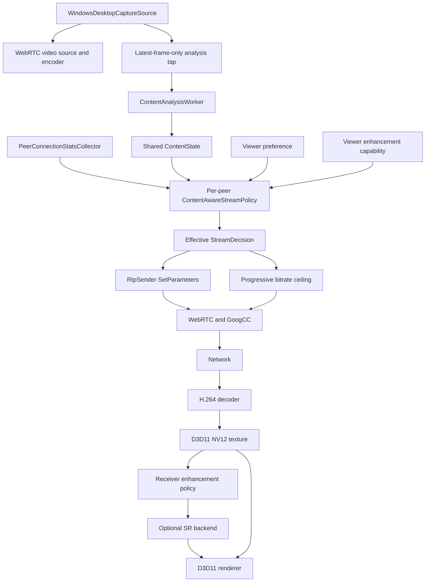

# RLink 内容感知串流与接收端超分方案

## 1. 目标与边界

RLink 保留 WebRTC/GoogCC 作为网络拥塞控制器。GoogCC 继续根据反馈估计当前链路容量、控制目标码率、探测和发送节奏；内容感知模块只决定在用户允许的范围内，如何把可用带宽分配给分辨率和帧率。

本方案包含两项能力：

1. 发送端内容感知串流：识别屏幕内容语义和运动状态，为每个观看者选择合适的分辨率、帧率和码率上限。
2. 接收端 AI 超分：当传输分辨率低于显示目标分辨率时，在本地 GPU 允许且延迟预算充足的条件下提升显示质量。

本期不训练或部署 AI 带宽预测器，不让模型直接生成码率数字，不让模型进入 WebRTC 拥塞控制闭环，不实现 AI 插帧、AI ROI 或大模型诊断，也不引入 CLIP 相关组件。

必须满足以下产品边界：

- AI 模块关闭、模型缺失、推理失败或 GPU 不支持时，远控功能保持正常。
- 用户设置是上限，自动策略不能超过用户请求的分辨率或帧率。
- 内容分析在本机完成，默认不保存、不上传屏幕图像。
- 多人房间只分析一次共享画面，但为每个 PeerConnection 独立决策。
- 降级可以较快，恢复必须保守，不能频繁切换分辨率。

## 2. 总体架构



职责边界如下：

- `WindowsDesktopCaptureSource` 提供画面和采集活动信息，不等待推理结果。
- `ContentAnalysisWorker` 只发布内容状态，不调用 WebRTC。
- `ContentAwareStreamPolicy` 是纯决策模块，不执行线程、协议或 GPU 操作。
- `LibWebRtcSession` 保持为最终的 RTP sender 和 PeerConnection 参数执行层。
- 接收端超分策略由接收端执行；发送端只使用对端声明的能力选择传输档位。

## 3. 状态模型

内容语义和运动状态必须分开。`TextUi` 可以高速滚动，`Video` 也可以暂停，不能用一个互斥枚举同时表达两类信息。

```cpp
enum class ScreenSemanticType : std::uint8_t {
    kUnknown,
    kTextUi,
    kMixedUi,
    kVideo,
};

enum class ScreenMotionLevel : std::uint8_t {
    kUnknown,
    kIdle,
    kLow,
    kMedium,
    kHigh,
};

struct ContentState {
    ScreenSemanticType semantic = ScreenSemanticType::kUnknown;
    ScreenMotionLevel motion = ScreenMotionLevel::kUnknown;

    float semanticConfidence = 0.0f;
    float motionScore = 0.0f;
    float changedAreaRatio = 0.0f;
    float textScore = 0.0f;
    float mixedUiScore = 0.0f;
    float videoScore = 0.0f;

    std::uint64_t sourceFrameId = 0;
    std::uint64_t timestampMs = 0;
    std::uint32_t inferenceTimeUs = 0;
    bool modelResultAvailable = false;
};
```

`ScreenContentActivity` 继续表示现有采集层的 Starting/Active/Idle 状态。策略输入时将它和 `ContentState` 合并，不复制另一套空闲状态机。

状态有效性默认规则：

- `timestampMs` 超过 2000 ms 时模型结果过期，语义回退为 `kUnknown`。
- 低于 0.70 的语义置信度不触发类别切换。
- 新语义连续出现 3 个有效样本后才被接受。
- Idle 主要由现有采集活动状态决定，不依赖键鼠静止。
- High motion 需要画面变化证据；键鼠输入只用于提前提升交互优先级。

## 4. 发送端内容分析

### 4.1 帧接入点

分析器挂在 `WindowsDesktopCaptureSource` 的帧交付前后均可，但必须覆盖两条现有路径：

- DXGI native texture：`D3D11DesktopFrameBuffer`。
- libwebrtc/GDI 回退：`DesktopBgraFrameBuffer`。

推荐在完成帧交付判定后，将最新有效画面交给分析抽头。分析抽头持有自己的引用，不改变 WebRTC 帧生命周期，不阻塞 `DeliverFrame()` 或 `OnFrame()`。

### 4.2 Latest-frame-only 队列

分析队列容量固定为 1：

- 新帧到达时原子替换尚未开始分析的旧帧。
- 推理进行中继续接收新帧，但不排队。
- 工作线程空闲后直接取最新帧。
- 停止屏幕共享时取消任务并释放纹理引用。
- 每次屏幕共享 generation 变化时清空旧结果，防止旧画面状态泄漏到新会话。

默认分析频率为 3 Hz，可配置范围为 2～5 Hz。Idle 状态降低到 1 Hz；模型状态稳定且画面变化很小时，可以跳过重复推理。

### 4.3 输入预处理

第一版采用可靠、容易诊断的路径：

1. 将源帧按中心等比缩放并补边到模型输入尺寸。
2. DXGI 纹理先通过 D3D11 VideoProcessor 缩小到 224×224 BGRA。
3. 只回读缩小后的纹理，完成通道变换和归一化。
4. CPU 执行 ONNX 推理。

224×224 BGRA 每帧数据量较小，2～5 Hz 下不会把整张桌面纹理反复读回 CPU。待第一版收益得到验证后，再评估 DirectML 或其他 GPU execution provider；接口不绑定具体 provider。

CPU/GDI 路径直接从现有 BGRA 缓冲区缩放。预处理必须保持两条路径的颜色顺序、归一化和宽高比一致。

### 4.4 规则特征

规则层提供以下信号：

- `captureChangedFramesPerSecond`：变化发生频率。
- `changedAreaRatio`：最近窗口内 dirty/move 区域占屏幕面积的比例。
- `captureInputBoostActive`：近期存在用户交互。
- 低分辨率亮度帧差：补充无法取得可靠 dirty region 的回退路径。
- 连续变化时间：区分短暂窗口拖动和持续视频播放。

仅用变化帧数不能区分闪烁光标和全屏视频，因此 `changedAreaRatio` 是第一阶段必须新增的指标。原生 DXGI 路径从 dirty/move metadata 累积；其他采集路径用低分辨率帧差估计。

### 4.5 模型

正式模型以 MobileNetV3-Small 类轻量分类网络为基线：

- 输入：224×224 RGB。
- 输出：`TextUi`、`MixedUi`、`Video` 三类概率。
- 初始化：ImageNet 预训练权重。
- 训练：RLink 场景截图人工标注后微调。
- 导出：ONNX，模型与归一化参数一起版本化。
- 量化：先完成 FP32 正确性和基准，再评估 FP16/INT8；量化版本必须与 FP32 使用同一验证集比较。

模型文件放在 `models/content/`，清单至少包含：

```text
model.onnx
model.json       # 版本、输入尺寸、均值方差、类别顺序、哈希
LICENSES.txt     # 模型与训练权重许可
```

运行时校验模型哈希、输入维度和类别数量。校验失败时禁用模型并保留规则策略。

### 4.6 数据集

数据集按实际编码语义定义，而不是软件名称：

- `TextUi`：代码、终端、文档、表格、设置页、网页正文等文字和锐利 UI 占主导的画面。
- `MixedUi`：UI、图片、图表、局部动画或多个窗口混合，无法由文字或视频单独代表。
- `Video`：自然图像或视频播放区域占主要视觉面积，存在连续纹理和时序变化。

采样必须覆盖浅色/深色、高 DPI、多显示器、不同语言、全屏/窗口、静止/滚动、浏览器视频控件、远程桌面嵌套等情况。训练、验证和测试应按会话或来源分组，避免相邻帧同时进入训练集和测试集造成数据泄漏。

默认客户端不收集数据。开发采集模式必须显式打开，画面只写入用户指定目录，并提供一键停止和删除入口。

## 5. 每连接策略控制器

### 5.1 输入与输出

每个 PeerConnection 持有独立策略状态：

```cpp
struct ContentAwarePolicyInput {
    ContentState content;
    ScreenContentActivity captureActivity;
    std::uint64_t availableOutgoingBitrateBps = 0;
    std::uint64_t targetBitrateBps = 0;
    double roundTripTimeMs = 0.0;
    double lossPercent = 0.0;

    std::uint32_t sourceWidth = 0;
    std::uint32_t sourceHeight = 0;
    ScreenStreamPolicyRequest userRequest;
    VideoEnhancementCapability receiverCapability;
    std::uint64_t timestampMs = 0;
};

struct StreamDecision {
    std::uint32_t effectiveWidth = 0;
    std::uint32_t effectiveHeight = 0;
    std::uint32_t effectiveFrameRate = 0;
    std::uint64_t maxBitrateBps = 0;

    bool receiverMayUseSuperResolution = false;
    std::uint32_t intendedDisplayWidth = 0;
    std::uint32_t intendedDisplayHeight = 0;
    std::string reason;
};
```

用户请求、策略目标和实际生效参数必须分别保存。诊断页面同时展示三者，AI 或网络策略不能覆写用户偏好。

### 5.2 候选档位

策略从有限档位中选择，不连续生成任意尺寸：

- 分辨率：原始/用户上限、1440p、1080p、720p；保持源画面宽高比并取偶数尺寸。
- 帧率：用户上限、60、45、30、20、15 FPS；不超过用户上限和会话能力上限。
- 静止画面仍由采集层抑制到心跳帧，不专门创建 1 FPS 编码档位。

候选档位先交给 `ResolveScreenStreamPolicy()` 计算 start/max bitrate。第一版使用现有 start bitrate 作为可持续性门槛，使用 max bitrate 作为 sender 和 PeerConnection 上限，不改变 GoogCC 的目标码率计算。

### 5.3 内容效用

对可行候选按内容权重排序：

| 语义/运动 | 分辨率倾向 | 帧率倾向 | SR 倾向 |
|---|---:|---:|---|
| TextUi + Idle/Low | 很高 | 低 | 默认关闭 |
| TextUi + Medium/High | 高 | 中 | 谨慎 |
| MixedUi | 中 | 中 | 允许 |
| Video + Low/Medium | 中 | 高 | 接收端支持时允许 |
| 任意语义 + High | 较低 | 很高 | 取决于延迟预算 |
| Unknown | 沿用现有网络 FPS 策略 | 沿用现有网络 FPS 策略 | 关闭 |

策略不是固定使用“5 Mbps 对应某个分辨率”，而是根据源尺寸、用户上限、候选像素率和当前容量动态判断。

### 5.4 决策步骤

1. 取 `availableOutgoingBitrateBps`；缺失时使用 `targetBitrateBps`；两者都缺失时保持现状。
2. 对容量做现有 EMA 平滑，并乘安全系数。
3. 根据源尺寸、用户上限和对端能力生成候选档位。
4. 删除 start bitrate 超过安全容量的候选。
5. 使用语义和运动权重选择效用最高的档位。
6. 无候选可行时选择最低安全档位，但不低于产品规定的最小可用分辨率和 15 FPS。
7. 通过滞回状态机决定是否应用。
8. 只有决策实际变化时调用 WebRTC 执行层。

### 5.5 滞回与恢复

内容类别滞回和网络档位滞回分开维护：

- 内容切换：置信度至少 0.70，连续 3 个样本确认。
- 网络降级：连续 2 个不足样本，可沿用现有 2 秒最短降级间隔。
- 网络恢复：连续 5 个有余量样本，至少等待 5 秒。
- 分辨率提升要求容量达到候选门槛的 1.15 倍。
- 分辨率变化后默认驻留至少 8 秒，严重拥塞时允许提前降级。
- 同一档位内只调整码率上限时，不重置内容状态。
- 内容改变但最优档位不变时，不调用 `SetParameters()`。

策略应扩展现有 `AdaptiveScreenFrameRateState` 思路，增加有效分辨率状态。不要每次内容采样都调用当前 `SetVideoSlotEncodingPolicy()`，因为该入口会更新 configured 值并重置自适应 FPS。

### 5.6 与 WebRTC 的关系

应用决策时保持现有约束：

- `RtpSender::SetParameters()` 设置 effective FPS、分辨率和本流码率上限。
- `PeerConnection::SetBitrate()` 只更新允许的全局最大值。
- `ProgressiveBitrateCeiling` 继续负责渐进提升和失败冷却。
- GoogCC 可以选择任何低于上限的目标码率。
- 不调用带宽估计重置，不根据模型结果修改 pacing、probe 或反馈算法。

## 6. 接收端 AI 超分

### 6.1 插入位置

当前硬解路径已经形成：

```text
H.264 decoder
  -> D3D11NativeFrameBuffer (NV12 texture + subresource)
  -> D3D11VideoSurface::PresentTexture()
  -> D3D11 VideoProcessor
  -> swap chain
```

SR 插入在 native decoder texture 和最终 VideoProcessor/交换链之间。软件解码路径第一版不启用 SR，避免先做 CPU 图像上传和额外拷贝。

### 6.2 后端接口

后端接口必须包含纹理所属设备、子资源、格式、色彩和同步信息：

```cpp
struct SuperResolutionRequest {
    ID3D11Device* device = nullptr;
    ID3D11DeviceContext* context = nullptr;
    ID3D11Texture2D* input = nullptr;
    UINT inputSubresource = 0;
    DXGI_FORMAT inputFormat = DXGI_FORMAT_UNKNOWN;
    std::uint32_t inputWidth = 0;
    std::uint32_t inputHeight = 0;
    std::uint32_t outputWidth = 0;
    std::uint32_t outputHeight = 0;
    VideoColorSpace colorSpace;
};

struct SuperResolutionResult {
    Microsoft::WRL::ComPtr<ID3D11Texture2D> output;
    UINT outputSubresource = 0;
    std::uint32_t processingTimeUs = 0;
    bool succeeded = false;
    std::string error;
};

class IAiSuperResolutionBackend {
public:
    virtual ~IAiSuperResolutionBackend() = default;
    virtual VideoEnhancementCapability Probe() = 0;
    virtual SuperResolutionResult Process(
        const SuperResolutionRequest& request) = 0;
    virtual void Reset() = 0;
};
```

实现顺序：

1. `NullSuperResolutionBackend`：永远旁路，用于完整打通生命周期和诊断。
2. 一个可交付的通用 Windows 后端。
3. 有明确 SDK、许可和硬件收益后再增加厂商后端。

接口不使用厂商字符串做业务判断；厂商和实现名称只进入诊断。

### 6.3 接收端启用条件

同时满足以下条件才启用：

- 用户允许 AI 画质增强。
- 传输分辨率小于当前显示目标分辨率。
- 当前解码输出是后端支持的 D3D11 native texture。
- 缩放比例位于后端支持范围内。
- 输出尺寸和帧率不超过后端能力。
- 最近推理耗时不超过当前帧预算。
- 没有连续失败、设备移除或显存压力错误。

TextUi 默认优先保持传输分辨率；只有网络无法维持最低可用帧率时才允许通过降低分辨率启用 SR。Video 可以更积极使用 SR。

### 6.4 运行时保护

- SR 连续失败 3 次后对当前会话旁路，保留原始纹理显示。
- GPU 处理时间连续超过帧预算的 50% 时自动旁路并进入冷却。
- D3D11 device removed/reset 时释放全部 SR 资源，跟随渲染器重建。
- 每次只允许一帧 SR 在途，新帧到达时丢弃尚未开始的旧帧。
- SR 不能延迟光标绘制；远程光标继续在增强后的画面上叠加。

## 7. 能力协商

在现有 `control-reliable` DataChannel 和 `ScreenShareControlProtocol` 中增加向后兼容的新消息类型。不要改变版本 1 旧消息的解析语义。

```cpp
enum class VideoEnhancementBackendKind : std::uint8_t {
    kNone,
    kGenericGpu,
    kVendorSpecific,
};

struct VideoEnhancementCapability {
    std::string roomId;
    std::string receiverDeviceId;
    std::uint64_t capabilityRevision = 0;
    bool superResolutionSupported = false;
    VideoEnhancementBackendKind backend =
        VideoEnhancementBackendKind::kNone;
    std::uint16_t maximumScalePermille = 1000;
    std::uint32_t maximumOutputWidth = 0;
    std::uint32_t maximumOutputHeight = 0;
    std::uint32_t maximumPixelsPerSecond = 0;
    std::uint32_t supportedInputFormats = 0;
    std::string implementationName;
};
```

比例使用整数千分比，避免二进制协议中的浮点兼容问题。能力消息在以下时机发送：

- DataChannel 打开后。
- 解码器或渲染设备改变后。
- 用户启用/关闭 AI 画质增强后。
- 后端因持续失败被禁用后。

发送端对每个观看者保存最后一个 revision。能力缺失、过期或解析失败时按“不支持 SR”处理。

发送端可以在 `ScreenStreamPreferenceApplied` 的后续新消息中报告 effective 传输尺寸、预期显示尺寸和 SR eligibility，但接收端始终拥有最终启用权。

## 8. 诊断与可观测性

扩展 `SessionDiagnostics`，不要建立独立的第二套诊断通道。

发送端字段：

- analyzer enabled/backend/model version/model hash。
- semantic type/confidence、motion level/score、changed area ratio。
- 推理最近/平均/P95 耗时、跳过帧数、替换帧数、结果年龄。
- 用户请求、策略目标、实际发送宽高/FPS。
- policy profile、reason、稳定样本数、驻留/冷却剩余时间。
- capacity、候选所需码率、应用的码率上限。
- policy switch count 和最近切换时间。

接收端字段：

- SR supported/enabled/backend。
- 输入/输出尺寸和缩放比例。
- SR 最近/平均/P95 GPU 时间。
- processed/bypassed/failed frames。
- bypass reason 和 cooldown。

诊断页面第一阶段必须支持 shadow mode：显示策略“本来会选择”的结果，但不改变 sender 参数。这是判断模型和策略是否值得启用的主要证据。

## 9. 配置与开关

建议增加以下设置，并提供安全默认值：

- `media/contentAwareStreamingEnabled=false`
- `media/contentAnalyzerEnabled=false`
- `media/contentAnalyzerRateHz=3`
- `media/contentPolicyShadowMode=true`
- `media/aiSuperResolutionEnabled=false`
- `media/aiModelPath=`，为空时使用打包模型

发布过程采用 feature flag：开发版允许打开，公开版本默认关闭，完成 A/B 验证后再调整默认值。

## 10. 代码与构建结构

建议新增独立静态库 `rlink_ai`，避免 ONNX 依赖扩散到 `rlink_core`：

```text
src/ai/
  ContentState.h
  IContentClassifier.h
  ContentAnalysisWorker.h/.cpp
  ContentAwareStreamPolicy.h/.cpp
  OnnxContentClassifier.h/.cpp
  IAiSuperResolutionBackend.h
  NullSuperResolutionBackend.h/.cpp
  SuperResolutionRuntime.h/.cpp

src/protocol/
  VideoEnhancementProtocol.h/.cpp

models/content/
  model.onnx
  model.json
  LICENSES.txt
```

依赖方向：

```text
rlink_core <- rlink_ai <- rlink_session_engine
                    <- RLinkAPP renderer integration
rlink_core <- rlink_webrtc_transport <- rlink_session_engine
```

`rlink_ai` 可以依赖 `rlink_core`、D3D11 和 ONNX Runtime，但不能依赖 Qt Widgets、会话引擎或 `LibWebRtcSession`。纯策略测试不需要创建 WebRTC 或 GPU 对象。

模型和运行库通过 CMake 可选项接入：

```text
RLINK_ENABLE_CONTENT_ANALYZER
RLINK_ENABLE_AI_SUPER_RESOLUTION
RLINK_ONNXRUNTIME_ROOT
```

关闭选项时仍编译接口、规则策略和 Null backend，产品功能完整降级。

## 11. 分阶段实施

### 阶段 0：基线冻结

目标：形成可比较的现有表现。

- 固定弱网配置和代表性场景。
- 保存现有 capture/encoded/sent/presented、码率、RTT、loss、QP、freeze、端到端延迟。
- 建立 TextUi、MixedUi、Video、窗口拖动、快速滚动、静止画面测试脚本。

完成标准：同一台发送端、接收端和网络条件下可以重复取得基线。

### 阶段 1：规则状态和观察链路

目标：不引入模型、不改变媒体参数，先验证线程和数据路径。

- 增加 `ContentState`、帧 ID、过期机制。
- 增加 changed area ratio 和运动等级。
- 完成 latest-frame-only worker、停止和 generation 重置。
- 将状态接入 diagnostics 和 CSV。

完成标准：连续运行 30 分钟不阻塞采集；工作线程落后时不会积压旧帧；关闭模块后行为与基线一致。

### 阶段 2：本地轻量模型和 shadow policy

目标：模型只观察，策略只计算。

- 接入 ONNX Runtime 和模型清单校验。
- 完成训练、验证、测试数据划分和混淆矩阵。
- 输出稳定后的 semantic state。
- 实现候选档位、效用函数和滞回状态机。
- diagnostics 同时显示当前参数和 shadow decision。

完成标准：测试集总体准确率、各类别召回率和切换稳定性达到预定门槛；推理 P95 不影响采集线程；模型缺失/损坏能自动回退。

### 阶段 3：发送策略闭环

目标：只控制 FPS、分辨率和既有码率上限。

- 扩展 requested/target/effective 状态。
- 将策略结果接入每个 `LibWebRtcSession`。
- 保留 GoogCC 和 ProgressiveBitrateCeiling。
- 增加策略开关和 A/B 日志。

完成标准：同带宽 TextUi 清晰度改善，Video 流畅度改善；分辨率切换无持续黑屏；每分钟策略切换次数受控；关闭功能即可恢复原行为。

### 阶段 4：SR 协议和 Null backend

目标：先打通能力和生命周期，不进行真实增强。

- 增加能力消息编解码和 direct/room 分发。
- 完成 capability revision、过期和旧版本回退。
- 将 Null backend 接入 native presentation path。
- 展示 SR eligibility 和旁路原因。

完成标准：新旧客户端互通；多人房间各观看者能力互不覆盖；渲染路径无性能回退。

### 阶段 5：真实 SR 后端

目标：在支持的 GPU 上完成本地增强。

- 实现并探测一个后端。
- 完成纹理格式转换、同步、输出纹理复用和 device reset。
- 接入 GPU 时间预算、失败熔断和冷却。
- 进行 TextUi/Video 分场景质量评估。

完成标准：SR 开启后的端到端延迟增量、P95 GPU 耗时、画质收益和失败回退均满足发布门槛。

## 12. 验证矩阵

### 12.1 功能

- 语义切换：IDE、网页正文、混合页面、全屏视频及来回切换。
- 运动切换：静止、打字、小范围动画、滚动、窗口拖动、全屏运动。
- 网络切换：稳定高带宽、阶跃下降、缓慢恢复、丢包、RTT 上升、统计缺失。
- 用户设置：720p/1080p/1440p/original 与 30/60/120 FPS 上限。
- 会话类型：direct、双人 room、多人 room。
- 生命周期：开始/停止共享、切换显示器、重连、接收端加入/离开。
- 故障：模型丢失、模型损坏、推理超时、D3D device reset、SR 后端失败。
- 兼容：新发送端对旧接收端、旧发送端对新接收端。

### 12.2 指标

TextUi：

- 接收分辨率、QP、文字区域边缘保持。
- 固定截图 OCR 置信度或字符识别率。
- 操作延迟和滚动时丢帧。

Video/High motion：

- encoded/sent/presented FPS。
- freeze count/duration、P95 帧间隔。
- 端到端接收管线延迟和码率。

策略稳定性：

- 每分钟语义切换数和档位切换数。
- 降级响应时间和恢复时间。
- 分辨率变更后的黑屏、关键帧和 PLI 情况。

模型和 SR：

- 推理平均/P95/最大耗时。
- CPU/GPU 占用和显存增量。
- replaced/skipped frames。
- SR 成功率、旁路率和熔断次数。

### 12.3 初始发布门槛

- 内容分析不能阻塞采集或 WebRTC 线程。
- 结果过期、异常或无置信度时保持原有策略。
- 策略开启后不得增加持续性冻结或明显提高输入延迟。
- 正常网络下不能因为内容误判长期降低用户请求的画质。
- SR 后端失败时下一帧可以直接旁路显示。
- direct/room 新旧版本互通测试全部通过。

具体准确率、延迟和质量阈值在阶段 0 基线完成后写入测试配置，避免脱离实际硬件预设数字。

## 13. 风险与控制

| 风险 | 控制措施 |
|---|---|
| 模型误判导致画质反复变化 | 置信度、连续样本、驻留时间、有限档位、shadow mode |
| 多观看者重复推理 | 分析器按 capture source 共享，policy 按 PeerConnection 独立 |
| 频繁 `SetParameters()` 重置适配状态 | requested/target/effective 分离，仅在档位变化时执行 |
| 截图隐私 | 本地推理、默认不保存、开发采集显式开启 |
| ONNX 运行库增大安装包 | CMake 可选依赖、模型压缩、发布前统计真实增量 |
| SR 增加延迟或争用解码 GPU | GPU 时间预算、单帧在途、熔断、冷却、快速旁路 |
| 厂商 API 绑定 | 通用接口、能力枚举、厂商名只用于诊断 |
| 协议版本不兼容 | 新消息类型、旧消息语义不变、能力缺失按不支持处理 |

## 14. 最终完成定义

该功能只有在以下条件全部满足时才算完成：

1. 内容分析、每连接策略、WebRTC 执行和接收端增强边界清晰，没有跨线程直接调用。
2. AI 全部关闭或故障时，RLink 行为与当前稳定版本一致。
3. 相同弱网条件下，TextUi 的可读性和 Video 的流畅度分别获得可复现改善。
4. 策略切换、编码重配置和 SR 没有引入不可接受的冻结或输入延迟。
5. 新旧客户端、direct/room、多观看者和 GPU/CPU 回退路径全部通过验证。
6. diagnostics 能解释每次决策使用的内容状态、网络容量、用户上限、对端能力和回退原因。
