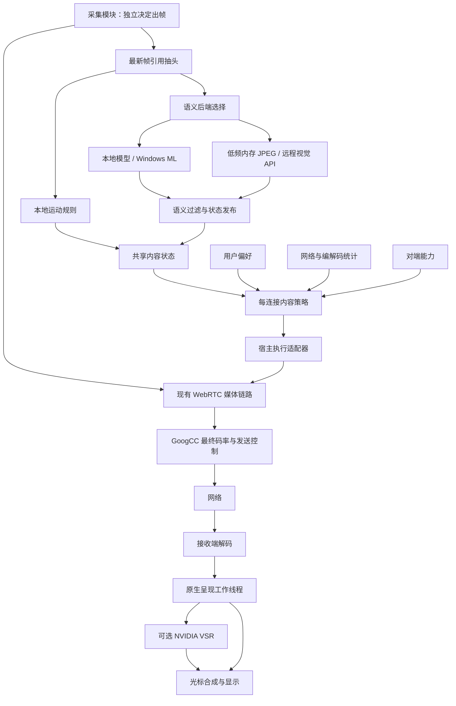

# RLink 内容感知串流与接收端超分完整方案

日期：2026-10-02  
状态：待用户审阅的设计基线；文中“建议初值”用于后续实验，不代表已验证效果。  
范围：细场景识别、码率与画质优先的每连接串流策略、本地/远程语义后端、接收端 NVIDIA VSR、组件解耦与验证。

## 1. 已确定的原则

1. GoogCC 负责网络容量估计、拥塞反馈、发送节奏和探测；AI 只识别内容，不预测带宽，不直接生成控制参数。
2. 码率与画质是核心约束。不能仅为了提高 FPS，让每帧画质下降。恢复帧率必须有新鲜预算和通过的质量证据；处理耗时只作诊断。
3. 所有场景支持用户最高 120 FPS 的请求；场景不能硬编码为最高 30 或 60 FPS。
4. 静态检测、变化抑制、心跳、采集调度、输入触发出帧全部由采集模块负责。内容策略不调整静态采集帧率，不创建另一套空闲调度。
5. 良好网络保持用户 R/F/B；仅在 GoogCC 明确拥塞与后续恢复周期内按场景适应，恢复最多回到用户规格。预算读数下降本身不触发降级。
6. 内容分析、策略计算、协议适配、GPU 增强相互解耦，其他应用可以复用组件。
7. 采集、编码、网络和 GUI 热路径不能等待推理或 API；独立组件不得通过额外拷贝、线程跳转或逐帧分配损失性能。
8. 首选本地 MobileNetV3 类模型，通过 Windows ML 推理；可选择用户配置的远程视觉 API。规则回退负责运动信息，不伪造语义分类。
9. 超分由接收端执行，首个后端采用 NVIDIA RTX Video VSR；设置中只有实际设备满足要求时才允许开启。
10. 本期不引入 CLIP、插帧、AI ROI、模型直接控制网络或画面内容触发工具调用。
11. 远控监控窗口保留用户选择的目标 FPS 和分辨率规格，不引入双维自动/手动菜单。用户目标 FPS 是场景自适应的最高允许帧率；策略只能在该值及以下选择发送 FPS，网络或场景变化不能反写用户选择。
12. 取消“保持自动/使用自定义”和高于/低于自动推荐的确认弹窗。显示用户请求、已生效的发送上限、实际解码 FPS、当前尺寸和受限原因；数据缺失时显示等待状态，不能将推荐值或默认档位冒充实测。
13. 分辨率不是所有场景的第一优先。视频、游戏等允许通过受限的小幅缩小尺寸维持当前/已验证目标 FPS 与压缩质量；文字、表格等优先保空间细节。禁止无需求地牺牲可持续尺寸来追求新的更高 FPS，也禁止无界反复缩小。
14. 自动分辨率不只使用 720p/1080p 几档。首版采用可配置的密集参考档位，在 720p～2160p 之间加入中间值，并保留源尺寸、当前尺寸与用户准确请求值；按源宽高比换算。任意比例搜索作为后续可选扩展，实际像素宽高必须为整数并满足后端对齐要求。

## 2. 当前实现与本方案的关系

以当前源码为准，不能把设计文档中的目标当作已实现功能。

2026-10-05 网络恢复补充：关闭内容感知时，画质包装的 B 使用修正前视频目标分配，拥塞期间冻结 A；k 范围现为 0.00～1.00、默认 0.50。短时恢复提示最多八秒/八个原生簇，健康预算每 2.5 秒窗口刷新。长期拥塞未恢复时，按当前稳定真实预算进行三秒冷却的单簇验证，首簇后清提示并交给原生成功续链；不反复探测过期高历史容量，不修改采集目标或用户上限。具体实现、测试边界及失败记录见[屏幕串流码率保护与 FPS 恢复问题记录](问题记录/2026-10-05-屏幕串流码率保护与FPS恢复问题记录.md)。此补充覆盖下方关于高 QP 持续抬高参考的旧记录。

| 项目 | 当前情况 | 本方案后续工作 |
|---|---|---|
| 通用内容分析组件 | 已有 core/runtime/remote 和宿主 adapters 分层 | 增加细场景、策略与统一状态契约 |
| 本地运动规则 | 已有观察链路 | 保持采集职责，补充可靠的活动窗口输入 |
| 远程视觉 API | 已有 OpenAI-compatible 请求、解析、运行时及真实帧观察接入 | 扩展场景契约、状态与能力验证 |
| 分类范围 | 原实验分类为 `text_ui`、`mixed_ui`、`video` | 统一为第 4 节细场景契约，删除旧格式兼容 |
| 设置与测试 | 已有 API 配置、密钥保护、测试、共享图像参数 | 增加策略开关、requested/effective 状态 |
| JPEG 编码 | 实际远控后台使用 TurboJPEG 直接压缩 I420 | 保持可替换编码后端及性能统计 |
| 视觉分析性能页 | 已显示缩放转换、JPEG 编码、大小、最近成功返回场景和置信度 | 增加结果年龄、请求状态、采纳状态 |
| 内容策略闭环 | 尚未完成 | 先 shadow 观察，再接参数执行 |
| 监控窗口目标 FPS | FPS 菜单为数值请求，策略输入已使用配置值作为上限 | 保留现有选择，增加受限状态和真实有效参数反馈，不新增自动模式菜单或推荐确认弹窗 |
| Windows ML 分类 | 尚未完成实际模型部署 | 推理后端、模型数据与评估 |
| NVIDIA VSR | SDK 文件已在 `third_party/vsr`，尚未完成运行链路 | 能力探测、设置门控、呈现线程接入 |

本文件作为本次策略决策的审阅入口。原 `docs/ai-content-aware-streaming-plan.md` 保留已有接口和实现背景；涉及场景、码率、120 FPS 和静态职责的冲突以本文件为设计基线。实施时同步两份文档。

## 3. 总体数据流与职责



### 3.1 采集与发送帧率边界

- 用户请求可以是 120 FPS；采集根据自身机制交付有效帧。
- 策略只改变某连接在采集之后的发送帧率上限和输出规格，不反向修改共享采集调度。
- 静态时采集仅交付少量帧，不意味着网络支持不了 120 FPS，也不能据此降低配置的发送上限。
- 实际采集暂时只有 30 FPS 时，配置上限仍可以是 120 FPS；没有补帧、重复帧或人工增加出帧。
- 只有持续活动窗口、网络反馈和处理负载才用于评估高帧率档位的可持续性。短时停顿不触发降级。

### 3.2 多人房间

同一个共享源只进行一次内容分析。每个观看者持有独立策略状态、网络预算、分辨率/FPS/码率决策。慢连接不能降低其他连接的规格，也不能通过内容策略降低全局采集帧率。

## 4. 场景分类契约

### 4.1 细场景集合

| 场景代码 | 中文 | 主要内容 |
|---|---|---|
| `code_terminal` | 代码 / 终端 | 编辑器、终端、控制台、日志 |
| `document` | 文档 / 阅读 | 文档、PDF、阅读页面、文字为主的幻灯片 |
| `spreadsheet` | 表格 / 报表 | 电子表格、密集表格、数据报表 |
| `web_app` | 网页 / 普通软件 | 网页、聊天、一般业务软件界面 |
| `photo_graphics` | 图片 / 图形编辑 | 照片、绘画、图片编辑、纹理预览 |
| `cad_diagram` | 工程图 / 图示 | CAD、流程图、电路图、线条为主的设计界面 |
| `video` | 视频播放 | 视频、直播等以播放画面为主体的内容 |
| `game_3d` | 游戏 / 实时三维 | 游戏、实时 3D 交互及仿真 |
| `mixed` | 混合内容 | 多种内容并存且无明确主导内容 |
| `unknown` | 内部未知状态 | 无法可靠识别或无有效结果，不接受为有效模型返回场景 |

细场景直接决定策略画像，例如 CAD 映射到“文字与细线优先”。分类响应不提供粗类字段，也不从粗类推测细场景。

### 4.2 场景与运动分开

语义描述内容，运动规则描述变化。代码高速滚动仍为代码，视频暂停仍为视频。大模型只输出场景及置信度，不负责确定帧率或静态状态。单张图无法可靠识别视频源帧率，禁止依据模型推测的 24/30/60 FPS 设置硬上限。

混合画面默认判断主要可见内容；置信不足时返回 mixed 并给出较低置信度。unknown 仅表示客户端无有效结果，不属于可接受的模型返回场景。不要引入大量难以标注或不能产生不同策略的类别。

### 4.3 统一分类响应契约

新契约示例：

```json
{
  "scene": "code_terminal",
  "confidence": 0.93
}
```

测试版尚未上线，分类响应只接受 `scene + confidence` 两个字段，不保留旧 `semantic + confidence` 契约。即使返回的 `semantic` 与 `scene` 相符，也作为额外字段拒绝。内部粗画像如需使用，由有效细场景确定性映射，不作为模型返回字段或回退解析入口。

解析器严格校验枚举与有限数值 `[0,1]`；处理已支持的 Markdown 包裹等返回格式，但不执行模型文本、链接或工具调用。未知场景不自动注册，也不直接进入控制。提示词、解析器、本地标签、调试页和测试一起更新。

### 4.4 返回、采纳与策略分开

保留三个独立值：

1. 最近成功返回结果：诊断使用，低置信度也显示。
2. 最近被采纳的语义：经过置信度、连续确认、有效期检查。
3. 当前策略画像：细场景映射结果；缺少细类时采用粗类或平衡回退。

远程过滤规则：置信度低于 0.70 不切换；置信度 ≥0.85 的新场景一次结果即可采用；0.70≤置信度<0.85 的新场景需要两次连续一致结果。粗类和细类采用相同确认规则。该规则统一适用于设置中的 0.5、1、2、5、10、20、30、60 秒间隔，5 秒仅为举例。当前请求完成后等待所选间隔再允许下一次请求，实际切换等待还包含采样和 API 响应耗时；失败时另有退避。本地模式建议三次确认。

远程场景在同一会话中保留最近确认结果，持续按请求间隔由大模型重新判断，结果年龄如实显示。静止、运动、滚动或大面积画面变化不使语义场景失效；只有稳定的新模型分类才替换当前场景。共享 generation 改变、后端切换、配置失效或关闭隐私授权时清空旧结果。

## 5. 码率体系：先明确每个数字的含义

| 名称 | 含义 | 谁决定 |
|---|---|---|
| `networkCapacityBps` | GoogCC 当前受约束的可用发送估计，不是线路物理上限 | WebRTC |
| `safeVideoBudgetBps` | 扣除同连接音频、必要开销和安全余量后的视频预算 | 宿主预算适配器 |
| `requiredVideoBitrateBps` | 候选规格满足场景画质门槛的估计需求 | 内容策略与校准模型 |
| `desiredVideoBitrateBps` | 希望提供给当前/待升级规格的编码预算 | 内容策略 |
| `senderMaxBitrateBps` | 当前视频流允许使用的最大编码码率 | 宿主执行适配器 |
| `peerConnectionMaxBitrateBps` | 整个连接允许的发送码率上限 | 既有渐进上限控制器 |
| `encoderTargetBitrateBps` | WebRTC 实际交给编码器的目标码率 | GoogCC / WebRTC 分配 |
| `actualEncodedBitrateBps` | 实际编码产出的窗口平均码率 | 测量 |
| `actualSentBitrateBps` | 实际发送的窗口平均码率，统计口径需标注 | 测量 |

策略所需码率不是网络承诺，设置 max bitrate 也不等于强制编码器按该数字工作。首版使用现有 sender/PeerConnection 上限和规格适配实现，不新增与 GoogCC 竞争的码率控制回路。

禁止将场景画质需求写入强制网络 `min_bitrate_bps`，禁止每次升级重置 `start_bitrate_bps` 来逼迫发送。已有启动探测逻辑继续独立管理。

### 5.1 预算计算

当前预算口径（2026-10-04）：

```text
safeVideoBudget = min(userVideoBitrateLimit, gccEffectiveTargetRate × 0.95)
```

`userVideoBitrateLimit` 始终按用户原始目标分辨率 × 用户目标 FPS × 设置中的视频 bpp 计算，bpp 默认 0.15，最高 100 Mbps。自适应降低实际分辨率或 FPS 不重新缩小这个总上限，不另设场景预算上限系数；场景需求曲线的系数只用于质量需求估计。实际候选发送额度仍不能超过当前安全视频预算。诊断同时展示用户 bpp、用户总上限和候选上限，避免把已降低的 RTP 配额误当成用户边界。

使用新鲜 GoogCC 输出中的有效目标发送率：若控制器通过 `cwnd_reduce_ratio` 以丢帧方式压缩窗口额度，则计入该缩减；普通直接降码率输出不重复缩减。该数值是当前可分配额度，不是物理线路上限。诊断 fallback 在尚未观察到控制器输出时可展示 `availableOutgoingBitrate`，但缺少新鲜控制器与传输反馈证据时不执行新的场景调整。不再二次扣除音频、其他视频或 DataChannel 采样流量，也不再次扣减连接参考上限。预算最多达到用户视频码率上限；PeerConnection 的 1.05 倍连接上限与 GoogCC 控制继续独立生效。95% 是策略分配额度，不是固定发送量，也不保证给其他业务保留固定份额。

容量缺失时保持已验证规格，禁止自动升级；encoder target 只作为参考，不能独自证明还有网络余量。实际发送码率更不能充当链路容量。

#### 5.1.1 FPS 与带宽探测上限解耦（2026-10-02 补充）

源码核查确认：界面“估计可用上行”直接显示 selected candidate pair 的 `available_outgoing_bitrate`，来自 GoogCC 当前目标发送率，并受应用设置的最大码率限制。当前 `ScreenStreamPolicy` 使用 `宽×高×用户目标FPS×用户视频系数` 限制 sender，PeerConnection 参考上限为视频上限的 1.05 倍；默认 0.15 时，1080p60 视频上限约 18.66 Mbps，1080p120 约 37.32 Mbps。提高 FPS 会放宽这个天花板，也可能带来更充分的探测，估计值上涨不能证明物理线路带宽随 FPS 改变。

自动执行前必须处理这个闭环：

- 连接参考上限由用户目标尺寸、目标 FPS 与视频上限系数决定，并保留 5% 余量；弱网策略临时降低有效 R/F 不改变用户参考上限。降低有效规格不能同步压死后续升级的探测空间。
- 当前 `safeVideoBudget` 仍以新鲜 GoogCC 反馈为依据；历史容量和较高的用户上限只用于决定是否值得探测，不直接承诺高码率发送。
- 探测优先使用 WebRTC 现有 ALR/带宽探测机制，在上限内逐步验证，结合 RTT、丢包和发送队列确认结果。不能强制网络最小码率、重置启动码率或制造多余采集帧来获得更漂亮的估计值。
- 低 FPS 或静止时发送量不足以证明网络变差，禁止按当前发送量将历史可行规格永久降级；同时也不能仅凭放宽应用上限就判定升级成功。
- 场景模型联合评价 R/F/B，FPS 改变不会查表强制一个固定目标码率。硬件名义 FPS 只是码控的每帧预算参数，由编码适配器独立同步，不负责估算网络容量。

这部分是后续自动执行的必需约束；当前已修复 NVENC 动态 FPS，并将视频流编码上限与连接参考上限分离。用户手动修改 FPS 时，视频上限按当前请求的像素率估算；连接参考跟随用户目标 FPS 并为视频上限的 1.05 倍，临时有效 FPS 不参与计算。已有网络 FPS 自适应只调整发送 FPS，不因临时降 FPS 再机械压低视频预算。自动分辨率执行接入时，还需保持探测空间与当前低规格候选独立。

实测反馈表明，仅将 sender 和 PeerConnection 的上限都固定在 120 FPS 预算，会让 CBR 编码器在 30 FPS 时也持续消耗三十几 Mbps。当前先使用规格对应的视频上限避免这类冗余；该公式不是场景画质需求的最终模型。启动 allocation pulse 保存并恢复各 encoding 的原视频上限，不能将较高的连接上限写回视频流。

当前 WebRTC 的 `ProbeController` 还将探测速率约束在 `min(连接上限, 2 × 总媒体分配上限)` 内。例如单路 1080p30 默认初始视频上限约 9.33 Mbps，连接参考为 12.44 Mbps，实际探测上限约 12.44 Mbps（未计音频）。参考连接上限以像素数×用户目标 FPS×用户填写的 bpp 计算；设置支持直接输入 0.03～0.50、最多两位小数，默认 0.20，最终限制在 4～100 Mbps。初始媒体 0.15 bpp 和启动参考 0.08 bpp 的结果也不得超过所填连接上限。不将连接上限作为必须达到的目标。分离两层上限尚不能实现完全独立的容量发现；后续自动升级需在有界试探与质量验证中处理此限制，不能把参考上限当作已测容量。

按 2026-10-03 的用户决定，连接参考上限随 **用户目标 FPS** 计算，不再固定参考 120 FPS。临时降低自适应发送 FPS 不反写该参考目标，保留弱网恢复空间。视频预算仍由当前规格和场景质量需求决定。`userTargetFps` 同时作为帧率上限：用户设置 60 FPS，自动发送只能选择不超过 60 FPS 的规格，仅在明确网络压力周期内按预算降低；处理能力只作诊断。实际编码目标仍由 GoogCC 分配，参考连接上限不是必须达到的码率。

采集配置表示最大采集 FPS，实际出帧可因静止抑帧、显示器或采集能力而低于它。单观看者可将该上限与用户 target 对齐，以避免无效采集；共享多观看者时，由宿主按活动连接最高需求决定采集上限，每连接的网络自适应限制自己的发送路径，不能由一个慢连接降低全局采集。编码器名义 FPS 跟随实际送入编码器的活动帧率，低频静止时保留原活动配置；它不决定应用总码率上限。

### 5.2 质量需求估计

当前 `ScreenStreamPolicy.cpp` 的经验计算是：

```text
maxBitrate             = clamp(width × height × requestedFps × 0.15, 4 Mbps, 100 Mbps)
startBitrate           = clamp(width × height × requestedFps × 0.08, 2 Mbps, maxBitrate)
networkProbeMaxBitrate = max(maxBitrate,
    clamp(width × height × referenceFps(默认120) × 0.15, 4 Mbps, 100 Mbps))
```

这是现有码率初始化与上限估算，不是已经验证的画质底线。本方案不直接把 startBitrate 当作候选可持续性的最终门槛。

新增版本化质量需求模型：

```text
requiredBitrate = width × height × activeTargetFps
                  × calibratedBpp(codec, encoder, sceneProfile, complexity)
                  + keyframeAndBurstAllowance
```

- 模型用于生成保守的候选需求区间，初期可基于现有经验值，必须标为“未校准”。
- coefficients 按编码器、编码格式、场景画像和复杂度配置，不能让 LLM 输出。
- QP 分布、真实画质评估和编码耗时用于校准与在线判据；不同编码器不共用一个硬编码 QP 阈值。
- 文本可读性、细线、色彩损失、运动失真分别验证；不能仅用 bits/pixel/frame 宣称画质已保证。
- FPS 倍增不机械要求码率翻倍；在首轮缺少证据时采用保守像素率估算，完成验证后允许使用校准后的需求曲线。

### 5.3 不可接受的“高 FPS、低画质”

升帧率必须同时满足：

1. 候选 requiredBitrate 在安全预算内，且有恢复余量。
2. 渐进上限控制器已允许候选使用足够预算，不能只提高 FPS。
3. 当前画质指标稳定，候选不降低场景画质门槛。
4. 编码、解码、呈现队列不持续积压。
5. 小步试用后复核实际画质；恶化时回退已验证档位。

同一内容状态下的恢复升级，不降低当前 desired/sender 码率预算以换取更高 FPS；最多恢复用户规格。若在网络压力周期内换场景且像素复杂度变化，允许重新估算，但必须给出诊断原因。

静态或内容简单造成实际码率降低是正常现象，不补空帧、不填充无用数据来满足仪表数字。网络真实拥塞时 GoogCC 降目标码率必须被接受；此时策略尽快降低规格，避免持续高规格低画质。

## 6. 场景画像与规格选择

### 6.1 三种首发画像

| 画像 | 场景 | 首要质量要求 | 网络压力周期内预算不足时 | 周期内预算恢复时 |
|---|---|---|---|---|
| 文字与细线优先 | 代码、文档、表格、CAD | 小字可读、边缘和细线完整 | 优先降低发送 FPS；再减少输出像素 | 优先恢复分辨率和画质预算；再恢复 FPS |
| 纹理与色彩优先 | 图片、绘画、图形编辑 | 纹理、色彩和压缩失真可控 | 优先降低发送 FPS；再减少输出像素 | 优先画质预算及分辨率；再恢复 FPS |
| 运动与交互保护 | 视频、游戏、实时三维 | 压缩质量、稳定 FPS 与低延迟 | 优先小幅缩小 R，保住当前/已验证 F 和质量预算；触及空间下限后再降 F | 恢复画质与受损规格，最多回到用户 FPS，不为冲峰值大幅降 R |
| 平衡回退 | 网页、混合、未知 | 可读性与运动均衡 | 按候选效用综合调整 | 综合恢复规格与画质 |

“优先”是候选排序，不是永久固定分辨率或 FPS。快速滚动的文字页面仍需考虑交互流畅度，不能只凭文字类别无条件压低发送 FPS。

### 6.2 密集档位与自动尺寸

用户补充允许用更密的档位覆盖 720p、1080p、2160p 之间的取舍。首版默认采用密集、有界候选，便于稳定控制和验证：

```text
720 → 810 → 900 → 990 → 1080 → 1170 → 1260
    → 1350 → 1440 → 1620 → 1800 → 1980 → 2160
```

上述是 16:9 参考高度，参考边界为 `16/9 × height` 与 `height`；这些值使 16:9 参考尺寸均为整数且满足偶数对齐。其他源按该边界用同一比例等比缩小，竖屏按方向换算，不独立拉伸宽高。例如 1080 档对 16:9 输出 1920×1080，对其他宽高比必须显示实际输出尺寸，不能把参考档名当作真实尺寸。

档位表可配置，保留源原始/用户允许最大尺寸、当前实际尺寸和手动准确请求尺寸，过滤超过上限的候选并去重。小于 720 参考边界的源不被上采样；更大源的原始尺寸也不因表止于 2160 被强制截断。

网络下降时优先选择相邻可持续尺寸，必要时可跳过不可行档；不要求 1080 直接跳 720。只有档位变化与预计收益通过迟滞才执行，不用小幅预算噪声驱动切换。显示自动括号时仍取真实解码尺寸，而非所选参考档名。

尺寸计算使用比例 `s`，范围由源、用户边界、最低可用细节和后端能力限定：

```text
scaledWidth  = sourceWidth  × s
scaledHeight = sourceHeight × s
outputSize   = alignToEncoder(scaledWidth, scaledHeight)
```

缩放比例可以是任意有限小数，宽高必须是整数像素。例如 2560×1440 源可输出 2048×1152、1856×1044 等非传统档位，不能只搜索 1920×1080 和 1280×720。

使用同一比例保持内容长宽比。对齐要求由 encoder/scale adapter 提供，常用现有路径要求偶数，但不能假定所有后端相同。由于整数和对齐可能产生微小比例误差，优先选择保持比例的邻近尺寸；严格比例需求时通过适当的内容 rect/补边表达，不能把图像独立横向和纵向拉伸。支持竖屏、超宽屏与非标准源尺寸。

可选任意比例扩展的尺寸生成与控制：

1. 把原始/用户允许最大尺寸作为清晰度目标，保留当前尺寸为稳定锚点。
2. 对当前或待验证 FPS，根据质量需求模型求解预算内最大的 `s`，通过有界二分或单调校准表查找。经验模型需要先构造可校验的单调保守包络，不能对非单调噪声直接二分。
3. 对计算边界、当前锚点及邻近比例生成少量合法尺寸，重新核对码率、对齐、负载和画像质量。
4. 网络变化时可以先生成新建议，不立即修改输出尺寸；仍须通过迟滞、收益门槛和驻留规则，避免每秒改变几像素造成编码器频繁重配置。
5. 实际变化必须达到配置的最小相对收益，确认后小步调整；严重拥塞允许及时降级。该收益门槛按实测确定，不用固定 720p 档位替代。

最低可用尺寸按源尺寸、场景细节与用户要求确定，不能统一设为 720p。极弱网络可以进入应急状态并明确质量受限。所有自动尺寸不超过源，不通过发送端上采样伪造细节。

首版自动使用上述密集参考表，720p、1080p、1440p 等也可保留为自定义菜单便捷预设。后续验证“任意比例生成器”时可替换参考表生成器，控制器、质量门槛、优先级和执行接口保持一致；不要求首版同时实现两种生成器。

### 6.3 FPS 候选

候选为用户准确请求值及其以下的 `120、100、90、80、60、45、30、20、15`，按会话与设备能力过滤、去重。例如请求 75 FPS 时，75 本身必须保留。

这些数值是算法搜索的初始候选，不是用户默认必须手工选择的档位，也不是算法本身。结合第 7.7 节按质量需求、延迟和负载联合选择；后续可根据设备支持增加邻近候选，不进行无界连续搜索。

全部场景均可达到 120 FPS。候选上限来自配置能力，不由短时 delivered FPS 直接替代。采集持续无法交付更多变化帧时，不为不存在的画面主动追求更多预算，但也不降低静态时的配置上限。

视频只有取得可靠的播放时间戳或帧率信息时才考虑内容帧率匹配；首版桌面截图无法提供该证据，因此不强制限制视频为 24/30/60 FPS。

### 6.4 用户与实际状态

保存三份状态：用户 requested、策略 desired、执行层 effective；实际测量值另列。自动调整不能覆写用户偏好。

用户选择的目标 FPS 和分辨率规格作为本连接的允许范围；场景策略在范围内联合调整 R/F/B。目标 FPS 是上限而非固定实际帧率。通用组件可保留其他宿主使用的固定维度请求能力，RLink 本期不增加双维 Auto/Manual 产品契约；完整请求与生效语义见第 12 节。

不自动提高用户上限、不超过源尺寸。良好网络保持用户 R/F/B，不按参考需求主动扩张预算；仅保留坏 QP 的有限码率修复，不追求填满 actual bitrate。

### 6.5 每个场景的优先级

优先级必须落实为代码里的参数和比较规则。“小字清晰”“低延迟”“色彩好”是验证目标，不能当作现有可写参数。本节明确控制量、观察量和场景配置。

#### 6.5.1 首版真正可写的控制量

| 符号 | 参数 | 当前宿主对应入口 | 控制边界 |
|---|---|---|---|
| R | 输出 `width/height` | sender `scale_resolution_down_to` | 决定传输像素尺寸，按比例和对齐选择 |
| B | `desiredVideoBitrateBps` 与 `senderMaxBitrateBps` | sender `max_bitrate_bps`，结合渐进连接总上限 | desired 为策略需求，写入的是允许上限；最终编码 target 仍由 WebRTC 分配 |
| F | `senderMaxFps` | sender `max_framerate` | 发送帧率上限，不是静态采集调度或强制实际 FPS |

首版闭环联合控制 R/B/F。编码器 preset、色彩格式、参考帧等不作为逐秒自动动作；现有后端虽有部分质量设置，跨编码器的运行时可写性与重配置成本尚未统一验证。

#### 6.5.2 观察量与约束参数

| 体验目标 | 实际对应 | 在算法中如何使用 | 不能声称的效果 |
|---|---|---|---|
| 压缩质量 | 可用的 `windowQp`/`latestFrameQp`，校准质量需求模型 | 与画像/编码器的 QP 目标区间、劣化门槛比较，决定是否增加 B 或拒绝升级 | QP 不是通用主观画质，也不是可任意直接设置的统一参数 |
| 文字/细线/空间细节 | R 相对源尺寸的保留比例，离线文字与细线验证 | 设定画像的目标比例、最低可用比例、缩小惩罚 | 不存在通用在线“文字清晰度”setter，保分辨率也不能保证无压缩损伤 |
| 色彩/纹理 | B 支撑的压缩质量 + R，离线纹理/颜色验证 | 配置更严格的质量需求/质量代理目标 | 不能靠增加 B 修复已有色度采样或色彩处理损失 |
| 编码负载 | 有效的 `windowEncodeTimeMs`、帧耗时分布、实际编码吞吐 | 诊断编码处理负载，不筛除场景候选或阻止网络恢复 | 异步流水编码不能仅按一次 CPU 调用耗时判断帧率能力 |
| 解码/呈现负载 | `decodeInputQueueWaitMs`、`decodeQueuedInputFrames`、`p95ReceiverPipelineMs` 等可用数据 | 接收反馈只作处理负载诊断，缺失不禁止场景执行 | 接收端已有统计不等于发送端已经能取得它们 |
| 流畅度/稳定性 | 实测编码/解码/呈现 FPS、drop/freeze 增量、呈现间隔 | 判断活动窗口内是否满足必要流畅度、是否允许提高 F | 上限 F 不等于实际 FPS，静态出帧少不是流畅度失败 |
| 交互延迟 | 可用队列、处理流水延迟；RTT 仅为网络参考 | 当前作为诊断，不以本地延迟阈值触发规格下降 | 不能通过一个“低延迟”参数保证端到端输入响应；未测量时不能伪造 |

所有指标使用 availability 标志；缺失 QP 时依赖离线模型，不把 QP=0 当作高质量。参数必须按编码器校准，不能给所有后端同一个 QP 阈值。

#### 6.5.3 可执行的每场景优先级表

所有行先满足网络安全、码率足以支撑最低质量、设备负载与必要活动流畅度这些共同硬约束。下表只决定有余量时先改善哪个控制维度，不代表其他维度可以跌破门槛。

| 场景 | 需要取舍时优先保留 | 首选可调整项 | 恢复/升级规则 |
|---|---|---|---|
| 代码 / 终端 | R、B 的质量需求，其次 F | 先降低 F；仍不足才降 R | 先保质量并恢复 R，再升 F |
| 文档 / 阅读 | R、B 的质量需求，其次 F | 先降低 F；静态窗口不参与降级 | 先保质量并恢复 R，再升 F |
| 表格 / 报表 | R、B 的质量需求，其次 F | 先降低 F；严格限制 R 损失 | 先保质量并恢复 R，再升 F |
| 网页 / 普通软件 | B 的质量需求与控件可读的 R，再 F | 先减少超出必要交互流畅度的 F；必要时小幅降 R | 先恢复可读性与质量，再提升 F |
| 图片 / 图形编辑 | B 的质量需求、R，其次 F | 先降 F，不先牺牲纹理质量 | B 达质量目标后恢复 R，再升 F |
| CAD / 图示 | R、B 的质量需求，其次 F | 先降 F；R 受细线/标注下限限制 | 先恢复空间细节，再升 F |
| 视频 | B 的质量需求、当前/已验证 F，其次 R | 允许小幅降 R；触及空间下限后再降 F | 修复质量并恢复受损规格，不靠大幅降 R 追新峰值 F |
| 游戏 / 实时三维 | 延迟约束下保 B 的质量需求与当前/已验证 F，再 R | 允许小幅降 R 维持 F；达到空间/幅度下限后再降 F | 恢复受损 R/F 后再试新高 F，禁止无界空间退化 |
| 混合内容 | 保守保 R/B 的质量需求，兼顾 F | 优先降低额外 F；可小幅降 R，主导内容明确时按对应画像 | 稳定后逐级恢复，避免分类跳动导致相反调整 |
| 未知 | 保留已验证 R/F 与保守质量需求 | 不因识别失败主动改规格，仅按真实资源约束回退 | 有证据后恢复，不作为最低质量画像 |

多个场景共享画像是正常的：现有首版只有三个主控制量，类别差异落在保护 R 还是 F、质量需求、空间下限、必要活动 FPS、延迟约束与切换惩罚。升级顺序与降级时保护顺序分别配置，不用一张“R 永远第一”的表覆盖所有场景。

R → B 的意思是，在码率已足够满足硬质量门槛的可行集合中优先恢复空间细节；执行提高 R 时，仍先开放和确认足够 B。若当前压缩质量已经不足，无论哪个场景，都先修复质量不足而不是继续升 R/F。

B → R 的意思是先提高当前尺寸的压缩质量到校准目标，再提升尺寸。B 达到质量目标后停止继续加预算，不将全网络预算用满当作目标。不存在无限追求 B 而让 R/F 永远无法升级的排序。

#### 6.5.4 已接入的场景配置与参考初值

```cpp
struct StreamSceneProfile {
    StreamProtection protection;    // 保空间或保当前 FPS
    StreamUpgradeOrder upgradeOrder;
    double minimumSpatialScale;
    double maximumSpatialReductionFromAnchor;
    double desiredSpatialScale;
    double seedBitsPerPixelPerFrame;
    unsigned minimumUsefulActiveFps;
    double maximumReferenceAverageQp;
    double maximumEncodeFrameBudgetRatio;
    double maximumDecodeFrameBudgetRatio;
    double maximumReceiverProcessingMs;
    uint64_t upgradeMinimumMs;
    uint64_t resolutionResidenceMs;
};
```

这些字段用于候选比较、参考质量检查及连续窗口确认；处理参数仅作诊断参考，不参与执行门控。按用户允许参考执行的决定，当前使用以下可调整经验初值；它们不是显卡测量表或感知质量标定，匹配实测模型的质量阈值优先。

| 场景 | 需求系数 bpp/frame | 参考平均 QP 上限 | 最低尺度 | 活动 FPS 目标 | 接收处理均值上限 |
|---|---:|---:|---:|---:|---:|
| 代码 / 终端 | 0.15 | 25 | 0.65 | 15 | 50 ms |
| 文档 / 阅读 | 0.145 | 26 | 0.65 | 15 | 65 ms |
| 表格 / 报表 | 0.16 | 25 | 0.75 | 15 | 50 ms |
| 网页 / 普通软件 | 0.15 | 28 | 0.60 | 20 | 45 ms |
| 图片 / 图形 | 0.18 | 24 | 0.65 | 15 | 65 ms |
| CAD / 图示 | 0.17 | 25 | 0.75 | 20 | 45 ms |
| 视频 | 0.14 | 30 | 0.60 | 24 | 45 ms |
| 游戏 / 实时三维 | 0.16 | 30 | 0.60 | 30 | 30 ms |
| 混合内容 | 0.16 | 27 | 0.65 | 20 | 45 ms |

参考需求仍为 `width × height × FPS × 场景系数 × 1.15`。共享的是编码器参考计算方式，场景配置不再只分图片/其他两组。编码/解码均值以当前帧周期的 80%、游戏 70% 作为诊断参考，不限制候选执行；处理统计仍不含呈现排队/P95。最低活动 FPS 不超过用户上限，在明确网络压力周期内预算不足时允许更低的应急结果并明确标记受限，不强制填充静态画面帧率。视频/游戏保当前 FPS 的尺寸下调仍受稳定锚点累计 10% 线性幅度约束。

当前真实 QP 不达标时，先以当前允许码率为基准请求增加 15% 的修复预算，严格受新鲜网络安全预算与用户视频上限限制；这是每次已确认修复的小步调整，不是持续探测或强行使用全部带宽。该恢复需求按候选像素率折算并与模型需求取较大值，原 B 不因缩小 R/F 机械降低。余量不足且明确网络压力周期已开启时，再按保护顺序降低 R/F。处理耗时不限制执行；缺失或偏高 QP 不阻止明确新鲜网络证据下的可行降级，但禁止升级。修复写入成功不表示质量已通过，等待切换后完整新窗口验证。场景或修复类型改变会清空待确认计数，保留稳定锚点。

决策顺序：先检查 B 的质量需求与必要活动 F；受限时，文本画像先调 F，运动画像可以先小幅调 R 来保当前/已验证 F。有余量时恢复质量与此前受损规格，再考虑新的 FPS 升级。严重队列/设备问题可以快速降级并记录原因。

初始没有已验证规格时，也先在源/用户目标 R 评估合理活动 F，再按真实预算求可持续 R，不用“质量最低合格即挑最高 F”从一开始牺牲清晰度。

#### 6.5.5 小幅降分辨率以维持 FPS 与质量

运动画像允许的典型动作：当前 1920×1080/120 FPS，在网络仍允许当前码率预算的情况下，画面复杂度增加导致压缩质量不足。可试用 1760×990/120 FPS，保留当前 desired/sender 码率预算，减少每帧像素负担，再检查质量、细节和延迟。

该例宽高约缩小 8.3%，像素数量约减少 16%；不是为了从 60 升到 120 而缩小，也不能声称分辨率损失没有影响。若文字或画面细节验证不通过，按画像回退或降低 F。

“不降码率”指不因主动缩小 R 就机械降低编码预算；实际 target/actual bitrate 仍可能由 GoogCC、画面复杂度及编码器改变。链路容量真实下降到原 B 以下时，不能坚持原数字强行发送；用新预算选择可行 R/F，以保护压缩质量而非承诺恒定码率。

小幅调整须受以下边界限制：

- `maximumSpatialReductionFromAnchor` 以本次降级过程开始前的稳定尺寸为锚点，累计计算，不能每秒再缩小一点最终掉到很低尺寸。
- 建议运动画像先验证最多约 10% 的线性尺度缩小；这是待用户调整与实测的初值，不是所有场景固定标准。密集档位与当前锚点共同生成候选。
- 保持相同宽高比，满足画像最低可用细节和后端对齐；自动 R 才能自行调整，手动 R 按自定义与安全回退语义处理。
- 反馈验证成功才维持；网络恢复时按迟滞恢复受损 R，不在较低尺寸永久追求峰值 FPS。

## 7. 每连接控制过程

### 7.1 输入

输入包含：源尺寸与采集能力、用户设置、已采纳场景及年龄、本地运动/活动窗口、GoogCC 容量、当前 target/sent bitrate、RTT/loss/队列、可选 QP、编码耗时、接收端能力与反馈、当前 effective 状态。

运动信息只帮助判断复杂度和有效评价窗口，不负责改写静态采集策略。数据缺失时标明 unavailable，不能把零解释成“无耗时/无丢包/无限余量”。

### 7.2 输出契约（设计示意）

```cpp
struct StreamDecision {
    unsigned width;
    unsigned height;
    unsigned senderMaxFps;
    std::uint64_t requiredVideoBitrateBps;
    std::uint64_t desiredVideoBitrateBps;
    std::uint64_t senderMaxBitrateBps;
    QualityProfile qualityProfile;
    bool qualityRequirementMet;
    bool receiverMayEnhance;
    DecisionReason reason;
};
```

质量画像表达目标和可行性；首版不承诺所有编码器都能直接设置统一 QP/quality 参数。具体编码器的可写能力通过 adapter 声明，不支持时通过码率/规格控制和测量反馈实现。

### 7.3 决策步骤

1. 校验 generation、状态年龄与统计窗口。
2. 规范化场景，选择质量画像。
3. 获取安全视频预算，生成能力范围内的候选。
4. 为候选估算 requiredBitrate，筛选预算可行组合；明确新鲜网络压力允许缺 QP 的规格降级，恢复升级仍要求质量证据通过。处理成本只作诊断。
5. 在可行候选中按第 6.5 节逐级比较场景优先级，不以 FPS 数字单独最大化；当前尺寸仍可持续时，不生成降低尺寸并提升 FPS 的自动升级动作。
6. 应用网络与内容两套独立迟滞规则。
7. 需要升级时先准备码率上限与余量，再逐级提高规格；需要降级时选择仍满足门槛的较低规格。
8. 记录 shadow/desired；执行器只应用变化并回读 effective。
9. 试用窗口复核画质、队列和实际性能，不通过则回退。

正常与应急降级的 FPS 均最多下降一个相邻候选档位，默认为 120、100、90、75、60、50、45、30、24、20、15；精确保留非标准用户值与当前值。每次应用后重新等待新鲜完整统计窗口、重新判断预算，网络中途恢复就停止下降，不预先执行一串降档动作。

正常候选全部不可行时，若具有新鲜 GoogCC 拥塞周期、已知场景及可用需求模型，允许 `emergency_network_reduction`：从严格不升 R/F、FPS 不低于相邻下一档的候选中按场景保护顺序选择。文字场景优先保持分辨率、降低一档 FPS；运动场景可以先在累计空间缩小限制内降低分辨率、保留 FPS。发送额度不超过实时预算，不直接跳到最低负载规格。`estimatedFeasible` 与质量达标仍如实为假，不以降低质量门槛伪造可行。已经处于允许的最低规格、空闲、未知场景、反馈过期或未进入拥塞周期时，不凭理论需求启动此路径。通常恢复要求候选需求、余量、QP 与恢复确认；恢复用户原规格另有第 12.2.2 节的明确基线恢复分支。两种路径均不得突破用户视频上限或实时预算。

### 7.4 建议初始时间参数

| 参数 | 建议初值 | 说明 |
|---|---:|---|
| 策略评估周期 | 1 秒 | 使用完整 stats 窗口，不逐帧决策 |
| 容量平滑系数 | 0.25 | 优先复用既有网络控制器配置 |
| 安全预算系数 | 0.95 | 直接取估计可用上行的 95%，受用户视频上限约束 |
| 一般降级确认 | 2 个有效样本 | 保留真实完整窗口与新鲜反馈前提 |
| 相邻降级间隔 | 1 秒 | 明确网络修复不受恢复分辨率驻留阻挡 |
| 升级确认 | 3 个有效样本且至少 2 秒 | 混合场景至少 3 秒；采集空闲不能凑作高 FPS 成功样本 |
| 升级预算余量 | 候选需求的 1.15 倍 | 在安全预算上判断 |
| 分辨率恢复驻留 | 3 秒 | 仅约束升分辨率，混合场景 4 秒；与稳定确认并行等待，不额外串行叠加 |
| 升级失败冷却 | 按新鲜证据重新确认 | 场景执行不额外叠加固定 10 秒；既有连接启动探测的失败冷却独立存在 |

2026-10-04 调整：同一目标 R/F 与修复类型保持一致，并且连续样本中的最低预算仍满足候选需求（升级含必要余量）时，预算波动或上涨超过 5% 不再重启确认计数，应用这些窗口中较低的额度。候选 R/F 改变、预算跌破需求、场景切换、证据过期或乱序仍不能复用旧确认。计时只减少应用层等待，GoogCC 预算本身尚未回升时不强行升级。空闲期间允许保留既有网络探测，但不能因低实际发送码率证明高 FPS 升级已成功。

`Normal`/`Underuse` 表示当前负载下队列稳定或回落，不代表限速解除；拥塞周期保留时诊断显示“当前负载已稳定，仍按受限预算运行”。恢复分别展示是否等待候选预算、连续确认窗口数、应用层剩余等待时间。GoogCC 自身 AIMD 增长与屏幕 ALR 探测周期独立存在，应用层计时缩短不保证物理带宽估计立即恢复；不为加快恢复无条件开放高探测流量。

发送帧率执行须尊重 WebRTC sink 的动态 `max_framerate_fps`，用户采集频率保持不变。`AdaptedVideoTrackSource::OnFrame` 仅广播，不能替代交付前的 adaptation；多连接共享采集时每个 sink 独立节流，不能用最高 sink 的 60 FPS 覆盖另一个 sink 的 20 FPS。节流只处理时间与更新矩形元数据，丢弃过的桌面更新须在下一交付帧覆盖；不因 FPS 下降回读或缩放 GPU 像素。FPS-only 更新可能不重建 encoder，故不能单靠 `InitEncode.maxFramerate` 或表示实测 cadence 的 `SetRates.framerate_fps` 作为动态硬上限。

2026-10-05 交付实现修正：每 sink 复用 WebRTC `FramerateController` 的稳定相位及半周期调度容差，不以只有 1 µs 容差的完整周期边界判断重复帧。否则平均 80 FPS 输入中每第三帧提前 200 µs 就会误降为 53.3 FPS。aggregate video adapter 保留空间约束，不再次按 broadcaster 的最小 FPS 对全部连接节流；每个 sink 分别执行自己的上限，零 FPS 仍不交付。动态目标变化、时间倒退与长暂停按原生规则更新相位，现有更新区域补偿、原生缓冲共享及约束转发继续有效。

### 7.5 执行时序与单一控制权

- 复用 `ProgressiveBitrateCeiling` 的渐进预算开放与冷却，不另造应用层探测流量。
- 内容感知开启时，只有场景策略可以改 effective R/F/B；编码器包装层透传 GCC 分配。关闭时先恢复用户原 RTP R/F/B 上限，随后由 WebRTC 原生 FrameDropper 与 cwnd 丢帧控制实际负载，不运行旧应用层 FPS 降档控制器，也不降低 RTP FPS 上限。采集始终按用户目标运行。
- 当前关闭模式：新鲜 GoogCC 延迟过载、拥塞窗口缩减或丢包证据触发编码器侧每帧画质保护。正常网络下合格非关键帧的实际字节提供参考，没有合格测量时使用启动参考；QP ≤35 用于学习，保护周期内连续高 QP 可提高参考，但 QP 不单独判弱网。2026-10-05 引入网络波动取舍系数 k（0.00～1.00、两位小数、默认 0.50）：保护周期内原始画质参考 A > 网络编码预算 B 时，C=A−(A−B)×k，C送入下游编码器SetRates。A≤B时直接使用B，不递归折扣C；零预算仍暂停。k越大越倾向保FPS，越小越倾向保每帧画质。该公式替代旧15FPS软参考限幅，不保证极低预算下的最小实际帧率。C按原用户帧率描述每帧成本，受用户视频上限限制；原生FrameDropper仍消费B并按实际编码字节丢帧，pacer与GoogCC不改。预算恢复后原生机制自然提高帧率，无额外应用层逐档等待。仅用户FPS/bpp变更或场景关闭恢复需更新codec缓存；修改k不重建编码器、不重置网络估计。
- k独立于视频bpp上限系数，在远程桌面设置保存并动态发布到所有当前direct/room连接；新连接继承最新值。统一包装层覆盖NVENC、AMD AMF、Intel QSV、Windows MF及软件H.264，不假设所有驱动相同的码控效果；实际更新仍遵循后端已有的合并与应用规则。诊断区分参考A、预算B、名义速率C及当前k。例A=24.88Mbps、B=6.89Mbps、k=0.20时C=21.282Mbps，此值不等于实际发送码率。
- 新机制仅用于可使用原生 FrameDropper 的单层 H.264 屏幕流；相机、多层编码、可信内置码控及禁用 FrameDropper 的 trial 透传原分配。每连接状态独立，切换、关闭和恢复事务清理保护状态。诊断分别展示网络预算、单帧画质参考、名义编码码率与实际发送统计。
- 降发送 FPS 不缩小用户视频上限与连接探测参考上限。预算是否回升由原生 GoogCC 反馈和探测决定；配套 WebRTC 屏幕共享默认启用 ALR 探测（默认间隔 5 秒），无需增加应用层探测流量或强制拉高 FPS。探测不是持续以用户上限发送，恢复耗时仍包含真实带宽发现过程。
- 采集目标 FPS 始终由用户选择与共享源配置决定；场景参数和 WebRTC 丢帧不修改采集调度。共享源按各 sink 的发送上限交付帧。
- 保持 `MAINTAIN_FRAMERATE_AND_RESOLUTION`；原生 FrameDropper 和 cwnd pushback 丢帧仍生效。`MAINTAIN_RESOLUTION` 会引入资源适应的 FPS 限制，不代表 GoogCC 严格按 QP 先降 FPS，当前不切换该偏好。
- 配置入口更新 requested；自动决策入口只更新 effective，不调用会重置用户配置/启动状态的路径。
- 升级顺序：允许提高码率上限 → 确认预算 → 改 FPS/分辨率 → 复核。
- 降级顺序：根据可持续预算确定较低规格 → 更新相匹配的上限。严重拥塞时 GoogCC 仍可先降目标。
- 多步参数更新可能部分失败，保留 revision 与最后一次有效配置；失败时恢复或维持一致的旧状态，诊断不能提前标记成功。
- `SetParameters` 与 `SetBitrate` 都在现有适当线程上执行；不重置 BWE，不改 pacing/probe 算法。
- PeerConnection 总上限覆盖同连接的媒体之和，不把视频预算直接当成全局总预算。

### 7.6 防止上限锁死恢复

当前 target bitrate 会受发送上限和内容需求影响。不能因为它很低就认定链路容量低，否则系统会停在低档位。

网络稳定时 GoogCC 保留既有探测与分配；内容策略只在已开启的拥塞与恢复周期内、证据充分后恢复规格，不为良好网络主动提高规格。用户提高配置上限时更新允许预算，但不重复重置启动估计。

### 7.7 算法升级：约束优化、反馈校准与轻量 MPC

每轮动态生成的候选只定义本轮可以评估的规格，不是固定分辨率梯级。更智能的部分在于：依据真实编码需求和反馈判断候选是否可行，按场景优先级比较体验指标，考虑切换成本与短期波动，然后持续校正需求模型。

建议采用分层方式：GoogCC 的快速网络闭环保持不变；内容策略低频计算规格；场景识别更低频更新画像。避免每层都同时调码率，不能让 LLM 逐次回答“现在设多少 Mbps”。

#### 7.7.1 可选算法与适用边界

| 算法 | 适用性 | 决定 |
|---|---|---|
| 固定场景表 + 迟滞 | 可解释，适合基线，但不能充分适应编码器差异 | 保留为回退与对照 |
| 约束效用优化 + 在线需求校准 | 可联合考虑码率、质量、FPS、分辨率和负载，资源有界 | 首个闭环实现 |
| 轻量鲁棒 MPC | 比较短期规格序列，考虑不确定性、队列和切换代价 | 第二阶段增强，达标后替换单步决策 |
| 强化学习 / 上下文 bandit | 需要可信反馈、代表性数据和安全探索，训练与验证成本更高 | 暂不作为上线主控制器 |

MPC 视频自适应研究使用滚动优化；Pensieve 使用强化学习选择视频分片码率。本方案只借鉴优化框架，不能直接移植点播播放器的长缓冲目标，也不能将论文收益比例套到远控。[MPC 原始论文](https://www.contrib.andrew.cmu.edu/~vsekar/assets/pdf/sigcomm15_mpcdash.pdf)、[Pensieve 项目与论文](https://web.mit.edu/pensieve/)

#### 7.7.2 先过滤再评分

对候选动作 `a = (width, height, senderMaxFps, desiredBitrate)`，先执行硬约束过滤：

- 满足用户所选目标 FPS、分辨率范围，以及源/会话/编码器/接收端能力限制。
- 满足安全网络预算、码率需求上界、场景质量门槛、延迟/队列和设备负载门槛。
- 升 FPS 不降低场景画质标准；不改静态采集机制。
- 当前规格可持续时，禁止仅为新的更高 FPS 降 R；仅明确网络压力周期内按场景保护顺序允许受限的小幅降 R，处理负载和压缩质量不足不单独触发规格下降，不能通过拉高 F 人为制造预算不足。

在可行集合中先按第 6.5 节做分层比较：较高优先级未达到目标时，不能让低优先级收益覆盖其损失。每层配置饱和目标与测量容差，达到目标后再考虑下一层，避免不可测的微小差异导致低层目标永远无法提升。

只有较高优先级近似等价的候选，才使用归一化综合评分处理稳定性、负载与切换代价：

```text
U(a) = wQuality(scene) × normalizedQuality(a)
     + wDetail(scene)  × normalizedSpatialDetail(a)
     + wMotion(scene, motion) × normalizedMotionUtility(a)
     - wLatency × predictedLatency(a)
     - wLoad × predictedProcessingCost(a)
     - wSwitch × switchingCost(previous, a)
```

各项先归一化，权重版本化；综合得分不能推翻场景的保护顺序、累计缩小幅度或“不得为了新峰值 FPS 主动牺牲可持续尺寸”的约束。画质作为硬门槛，不能通过给 FPS 极高权重换掉门槛。码率是满足画质的资源，不是越高越好的奖励；对不提高质量的冗余码率不加分。

`normalizedQuality` 首版来自校准表/可取得的 QP 与复杂度代理，不宣称等于逐帧主观画质。缺少质量观测时保守估算；候选分数相近时保留现状、避免频繁切换。

#### 7.7.3 在线更新质量需求

离线校准建立编码器/画像的初始质量需求区间，在线只更新有限参数，例如需求系数、编码成本和预测误差。采用有界 EMA 或带遗忘因子的轻量拟合，限制每次更新幅度；不新增神经网络运行依赖。

- 只使用活跃、规格稳定、码率未被明显饥饿限制的有效窗口；静态、低 actual bitrate、关键帧突发、刚切档和缺失统计不能混成低需求证据。
- 无 QP/质量反馈时，不能仅凭输出码率较低认定画质需求更低。
- 决策使用需求区间上界，误差增大时收紧候选；避免算法对自己不断降低的码率产生自我强化。
- 更新按场景画像和编码器隔离，不跨设备无条件复用。

#### 7.7.4 轻量鲁棒 MPC 的具体范围

建议周期 1 秒，滚动长度 3 个控制周期。未来预算来自 GoogCC 当前估计及近期统计的不确定性区间；使用不变、保守下降等有界情景，不引入 AI 带宽预测器，也不把未来容量当成承诺。

根据测得的编码/发送队列估算低延迟成本；队列状态可以使用如下概念模型，但实际实现必须核对网络统计与视频码率的层级口径：

```text
nextQueueBytes = max(0, queueBytes
                      + (predictedVideoRate - safeVideoBudget) × dt / 8)
```

优化短期累计效用和队列/切换代价，仅执行第一个动作；下一周期重新计算。不能靠未来可能恢复的带宽掩盖当前不满足的硬质量/网络门槛，不积累播放器式长缓冲。

每轮依据动态尺度边界、当前尺寸与邻近尺寸生成动作；先剔除质量、处理成本和带宽上均被其他候选支配的动作，只保留可行边界与相邻规格。建议动作池最多 12 个、搜索长度 3、beam width 8，固定内存与循环边界，不引入通用求解器。保留最低风险回退动作。单步和 MPC 都执行第 6.5 节场景保护顺序、累计缩小限制与主动升级约束，MPC 不得借助中间步骤绕过。

这些是建议实现上限。目标是单次策略计算 P95 不超过 1 ms/连接，在目标设备上测量；超时、模型失效、统计缺失或能力改变时退回已验证的单步控制器。MPC 必须通过同轨迹 A/B 证明画质、延迟或切换稳定性有收益，才能成为默认。

#### 7.7.5 能力不足与优化失败

若所有候选均不满足约束，明确标记 `quality_limited` 或 `resource_limited`，优先维持低延迟和可用性；不能宣称优化求解保证了不存在的质量。

WebRTC 已有质量/负载适配机制，可用于理解与采集反馈，但接入前要核对本项目已选的 degradation preference 及编码器支持，继续保持单一 sender 参数仲裁点。当前显式保留帧率和分辨率的路径不能仅通过文档假定默认 QP scaler 已启用。[WebRTC 视频适配文档](https://webrtc.googlesource.com/src/%2Bshow/164b3b3fced2186ff4f9e97ce6373d189481cd1b/video/g3doc/adaptation.md)

#### 7.7.6 自动建议与可行范围

控制器分别输出：

- `recommended`：综合场景、网络和设备的最佳体验建议。
- `effective`：已由执行层确认生效的规格。
- `feasibleFrontier`：保持质量门槛可行的规格组合，而非一对互相独立的最大值。
- `recommendationConfidence`、采样时间、原因和状态 revision。

1080p/120 和 1440p/60 可能各自可行，但 1440p/120 不可行。UI 不能把两个单项最大值拼成一个“网络最高规格”。推荐 1080p/60 也不意味着 1440p/30 一定超出网络能力。

## 8. 典型行为示例

以下码率是解释决策顺序的假设输入，不是推荐阈值。

### 8.1 游戏：不能无预算升到 120 FPS

当前 1080p/60，假设已验证画质需求 18 Mbps；候选 1080p/120 需求 32 Mbps。安全预算只有 24 Mbps 时保持当前档位，不把同样甚至更低的目标码率摊给 120 FPS。安全预算稳定达到候选需求及余量、编码器可承受后才试用 120 FPS。

试用后若 QP/画质显著恶化，即使 FPS 达到 120，也判定升级失败并回退。当前 1080p/60 可持续时，不选择 720p/120 来追求更高帧率。已在 1080p/120 稳定运行后，若质量或资源受限，游戏画像允许小幅调 R 保 F；超过累计缩小限制后再调 F。文本画像仍优先调 F。分辨率调整不要求直接跳到 720p。

### 8.2 文档：有余量先恢复清晰度

用户允许 1440p/120，当前受限为 1080p/60。优先在有足够预算时恢复 1440p 和文字质量；之后再提高发送 FPS。快速滚动时结合运动证据选择可行档位。采集静态时保持原有变化抑制，不主动把 sender 上限改成 1/15/30 FPS。

### 8.3 真实拥塞

GoogCC 预算明显下降：立即接受其目标码率变化，再尽快撤销高规格，优先选择仍能维持画像质量的档位。不能保证弱网络仍同时满足原分辨率、120 FPS 与原画质。

### 8.4 静态低码率

编码/发送实际码率下降，而采集呈空闲、无队列积压，不进行画质不足判定，不为填满码率制造帧。画面恢复变化后，用新活动窗口重新评估。

## 9. 本地模型与远程 API

### 9.1 本地模式

- 模型基线为 MobileNetV3-Small 类轻量 ONNX 分类器，Windows ML 提供运行时；首版优先 CPU 执行，避免与编码/呈现争用 GPU。
- 现成 ImageNet 权重不能直接可靠识别上述屏幕类别，需要标注数据并微调；这是模型工作，不是只接推理 API 即完成。
- 先支持粗类基线，再扩展细场景；模型元数据明确标签、归一化、版本和输入尺寸。
- 预处理与推理在独立持久工作线程，mailbox 容量为 1，初始化一次 session。
- GPU 缩小后回读小图属于计划优化路径；不得在未验证前宣称已有 native texture 零回读实现。
- 后端加载或推理失败：发布 unknown，保留本地运动规则，策略使用平衡/已验证回退。
- 具体 Windows ML 包版本、操作系统和部署文件在接入时验证并固定；本文件不提前把旧文档版本当作已可用依赖。

### 9.2 远程模式

- 用户配置 Base URL、模型、密钥；OpenAI-compatible 指的是接口协议兼容，还必须验证该模型确实支持图像输入。提供商名字不构成视觉能力保证。
- 默认请求间隔 1 秒，可选 0.5、1、2、5、10、20、30、60 秒；不因共享达到 120 FPS 而增加请求频率。请求串行执行，实际间隔还受响应耗时和失败退避影响；画面变化不清空稳定分类，也不绕过请求限频。
- 默认缩略图最长边 1280，JPEG 质量 60；设置中的尺寸与质量同时影响连接测试、截图测试及实际远控。
- 该 JPEG 参数只用于分析图，不影响传输视频的分辨率或编码器质量。
- 实际远控后台缩放/转换后通过 TurboJPEG 压缩 I420；图像、JPEG 和请求内容只驻留内存，用完释放，不写截图文件。
- 采集线程仅交付引用，后台处理；容量为 1，不积压图像。取消、超时、过期结果和 generation 校验必须完整。
- 密钥使用 Windows DPAPI，配置文件与日志不记录明文；换电脑需重新配置密钥。
- API 超时、失败、限流采用现有退避和熔断。过期语义退回 unknown，不阻塞远控，不擅自切到另一个上传服务。
- 本地/远程模式由用户选择，默认不同时运行两套语义推理。

### 9.3 调试信息

视觉分析页面保留已实现的缩放转换耗时、JPEG 编码耗时、大小 KB、最近成功场景与置信度。后续补充：

- 当前请求状态、请求耗时、最近错误代码。
- 最近成功结果时间与年龄；失败时保留旧结果但明确“本次失败/旧结果”。
- API 返回场景、过滤后采纳场景、当前质量画像。
- 细场景/粗类、模型/契约版本、被拒绝或未采纳原因。

另外增加策略诊断页：网络容量、安全预算、required/desired/sender max、encoder target、encoded/sent 实际码率、requested/desired/effective 规格、队列/耗时/QP 可用性、升级阶段、回退原因和对端超分状态。

## 10. 接收端 NVIDIA VSR

### 10.1 位置与线程

使用 `third_party/vsr` 内 RTX Video SDK 对应的 DX11 VSR 接口。实际 SDK、驱动、运行库和部署许可在接入时按随 SDK 文档验证。

```text
解码 NV12 native texture
    → 同设备 D3D11 VideoProcessor 转 RGBA
    → NVIDIA VSR 输出显示目标尺寸的 RGBA
    → 光标合成
    → swap chain
```

VSR 初始化、调用和释放在现有 `RemoteDesktopCanvas::NativePresentationLoop()` 的呈现工作线程执行，不能放到 GUI、解码回调或采集线程。保持最新帧 mailbox，不另建共享 immediate context 的竞争线程；按 SDK 要求串行化 NGX 调用。

### 10.2 设置与能力门控

设置中提供“接收端 NVIDIA RTX 视频超分”，默认关闭。只有 GPU/驱动、NGX runtime、DX11 device 和能力查询实际通过时才可开启；设备品牌检测不足以认定支持。

设置页显示不支持原因；会话开始在真实解码/呈现设备再次探测。requested 开启但运行时不满足时，effective 关闭并显示原因。

### 10.3 120 FPS 与性能预算

超分不得以“默认只能 60 FPS”为理由降低整个会话上限。120 FPS 的帧周期约 8.33 ms，需要使用 GPU 时间和队列反馈评估；单看 CPU 调用返回时间不能证明 GPU 已完成。

建议超分 GPU P95 开销超过呈现帧预算 50%、持续积压或连续失败时旁路并冷却。此为待校准初值。若超分影响流畅度，优先旁路超分，保留正常解码显示。

### 10.4 与发送策略关系

- 对端声明支持、开启和能力上限，发送端才能把“可增强”作为候选附加信息。
- VSR 是增强选项，不是降低码率/分辨率的自动理由，更不能豁免发送端质量门槛。
- 文字和 CAD 优先保留传输细节；不能承诺超分恢复已丢失小字。
- 网络充足时仍优先发送真实更高分辨率。
- 首版软件解码路径旁路，避免额外 CPU 上传；不支持设备走现有显示链路。
- device reset、尺寸变化和停止会话时释放/rebuild 资源，连续失败及时回退。

## 11. 可复用组件与性能契约

| 层 | 职责 | 依赖边界 |
|---|---|---|
| core | 场景类型、状态、质量需求模型、纯策略 | C++20；不依赖 Qt/WebRTC/D3D11 |
| runtime | 最新帧调度、过滤、生命周期 | 可注入时钟/执行器，固定有界资源 |
| remote | 请求生命周期、退避、协议接口 | HTTP/密钥/日志接口，不绑定 Qt |
| backends | OpenAI-compatible、Windows ML、TurboJPEG、NVIDIA VSR | 每个后端独立依赖和可选构建 |
| RLink adapters | WebRTC 帧、Qt Network、DPAPI、stats、sender 参数 | 将宿主类型转换到组件契约 |

### 11.1 热路径要求

- 关闭功能时不启动语义线程、不加载模型/增强库、不读密钥、不发请求。
- 抽头只传递帧引用，无整帧复制、无逐帧网络操作、无无限队列。
- 策略按 stats 周期执行，低频结果复制；不在每帧生成动态字符串或持有跨线程长锁。
- VSR 使用同一设备、纹理池和现有呈现线程，不引入组件化特有的 readback、跨设备共享或额外格式往返。
- 模型预处理、JPEG、网络请求分别测量，复用可复用缓冲；关闭后及时取消并释放。

### 11.2 “组件化无性能损耗”的验证

使用相同帧、模型、设备、编码器、线程、优化级别，对内嵌参考实现与组件化实现做同机 A/B。要求组件边界没有额外媒体拷贝、GPU pass、工作线程、排队和逐帧分配，且 CPU/GPU 耗时、端到端 P95 延迟差异不超出测量噪声。

不能通过压低 FPS 或减少质量来掩盖开销。未完成基准前仅声明设计目标，不能宣称已经保证零损耗。总功能开销与“组件边界新增开销”分别报告。

## 12. 用户目标 FPS 与场景自适应（2026-10-02 收敛）

本轮按第 6.5.4 节接入逐场景参数和真实质量修复；诊断区分未知场景与模型状态。当前本地规则不提供细场景分类，完整按场景执行需有效稳定的远程 API 分类；Windows ML 后端仍待接入。视频上限为 `pixels × 用户目标FPS × 用户填写的bpp`，bpp 范围 0.03～0.50、最多两位小数、默认 0.15，仅保留 100 Mbps 技术上界，没有固定最低码率。连接参考上限为视频上限的 1.05 倍；1080p30/60/120 的默认视频上限分别为 9.33/18.66/37.32 Mbps。GoogCC 控制实际发送目标，场景模块不额外主动探测。

本节按用户最新决定替代此前的双维自动/自定义菜单方案。保留场景自适应本身，不新增独立“自动 FPS”选择、默认双自动或推荐确认弹窗。

### 12.1 用户请求是自适应范围

- 保留当前 FPS 数值菜单及已保存的用户偏好，具体可选值按源、会话和双方能力过滤，不另设自动模式默认值。
- 用户选择 30 FPS 时，发送候选均不超过 30；选择 60 时不超过 60；选择 120 时才允许最高 120。网络良好只能恢复到用户上限，不能自动突破。
- 分辨率选择给出本连接允许的尺寸范围；场景策略仍可按源宽高比、质量需求和密集候选选择范围内的实际尺寸。
- 用户 FPS 表示优先希望达到的上限，不保证始终收到该帧率。仅在明确网络压力周期内按场景与预算降低发送规格；处理负载只作诊断，恢复升级仍需通过的质量证据。
- 模块关闭或失效时保留可用的普通串流与网络安全适配，不要求用户启用 AI 或上传图像。

### 12.2 场景、预算与探测联动

**2026-10-02 行为修正（优先于此前仅用参考需求筛选的描述）**：本功能只在真实网络压力下按场景分配 R/F/B。静止、运动、滚动和 changed-area 比例只属于采集活动，不清空或切换语义场景。当前采用场景由大模型返回并经过稳定性过滤；同一会话保留最近确认的分类，低置信度、请求失败或等待下一次返回不改成 unknown。新会话、源重建、配置失效和隐私关闭仍清空旧分类；结果年龄如实显示。置信度 ≥0.85 的新场景一次结果即可采用；0.70～0.85 的不同分类须连续两次确认；低于 0.70 保留原场景。

降低 R/F 的网络资格由 GoogCC 已计算的明确拥塞状态授权：新鲜延迟检测 `overuse`，或新鲜控制器输出 `cwnd_reduce_ratio > 0`，任一即可开启本连接的拥塞与恢复周期。原 `qualityLimitationReason == bandwidth` 必需门槛及掉帧、坏 QP、丢包超过 2% 的触发组合已移除；该 bandwidth 字段描述视频适配器的规格限制，不是 GoogCC 的拥塞判断。参考 bpp 需求大于预算、带宽数值低、目标码率下降、静止转运动、QP 偏高和 RTT/丢包测量值均不单独开启周期。实际执行仍需新鲜控制器输出与传输反馈、有效预算、尺寸匹配的完整采样窗口、稳定场景、连续候选确认和分辨率驻留。无网络压力时保持用户规格；坏 QP 的有限码率修复也不得越过已确认预算与用户视频上限。

诊断页显示“保留规格 / 未确认网络压力”或“受限候选”，只有实际 RTP 写入成功才显示已应用。后台执行器缺失时，诊断 fallback 不伪造网络压力或仅按参考曲线发布降低 R/F 的建议。本轮需双机复核 IDE 滚动不跳场景、良好网络保持规格、限速后的场景取舍与恢复；合成统计/真实 RTP 事务自测不能替代该运行验证。

QP 是实时压缩质量反馈，不是网络触发条件或可以强制锁住的常量。场景候选按预算与质量要求取舍 R/F/B，不要求先等 QP 超标、实际掉帧或画面变糊才确认网络压力。没有 GoogCC 明确拥塞证据时，高 QP 不授权 R/F 降级。参考阈值仍是启发式代理，不能承诺固定感知画质。高置信度新场景须先等待实际 API 返回；所有请求间隔使用相同分类规则，采样等待约 0～所选间隔加处理/响应时间。

#### 12.2.1 GoogCC 只读观测与恢复周期（2026-10-04）

宿主通过 GoogCC 控制器的委托包装读取 `TargetTransferRate`，通过现有 RTC 事件日志回调读取延迟检测器状态；事件保留在内存，不创建诊断日志文件，不处理或复制画面。每个 PeerConnection 独立保存输出、传输反馈、延迟状态及路由 revision，换路由/重建连接作废旧证据。所有回调仍原样交给 GoogCC，返回的发送目标、pacer 配置和探测请求也原样交给 WebRTC，不修改拥塞算法、不增加主动探测。独立 `GoogCcNetworkPressure` 核心只读取归一化状态，固定大小、无堆分配，不依赖 Qt/WebRTC。

| 观测信息 | 用法 |
|---|---|
| 延迟 `overuse` | 在延迟与传输反馈新鲜时，作为直接拥塞依据 |
| `cwnd_reduce_ratio > 0` | 在控制器与反馈新鲜时，作为窗口负载缩减依据；0 不证明无拥塞 |
| `target_rate` | GoogCC 当前发送预算；另显示缩减后的有效预算，数值低不单独判弱网 |
| `normal` / `underuse` | 延迟稳定/队列回落；不是带宽已恢复的证明 |
| RTT、loss ratio、ALR | 测量参考，不加本地 RTT/丢包阈值；ALR 表示应用发送需求不足，不代表弱网 |
| LossBasedState、RTT backoff 原因 | 当前公共输出未直接暴露，本轮未单独接入，不冒充已覆盖 |

控制器输出、packet transport feedback 与延迟状态分别计时，正常进程 tick 不更新真实反馈年龄；默认 3 秒新鲜度用于防止陈旧证据执行，不是网络好坏阈值。反馈过期时保留本轮恢复上下文，但停止新的场景调整，显示等待反馈。

拥塞被 GoogCC 降速消除后，即使延迟返回 `normal`，本轮周期仍保留。典型情况是网络降到 3 Mbps 后排队稳定，但预算尚不足以恢复用户 1080p60；策略继续按预算与第 6.5.3 节优先级适应。只有宿主确认实际 R/F 已恢复用户规格（或本轮未发生 R/F 降级），并且新鲜 `normal`、零窗口缩减稳定达到默认 5 秒后，才结束周期。不得用一个 `normal` 结果立即恢复原规格，也不以候选建议冒充实际恢复。所有恢复仍受需求余量、驻留、真实参数成功及用户 R/F/B 上限约束。

诊断增加默认展开的“GoogCC 网络判断”卡，分别显示适应状态、本轮明确拥塞依据、延迟状态、窗口缩减比例、GCC 预算/缩减后预算和反馈新鲜度；RTT、丢包、ALR 放入可折叠“网络测量参考”。良好网络、过期证据、低预算 normal 恢复周期和尚无控制器证据必须明确区分，只有 RTP 写入成功才显示实际应用。

#### 12.2.2 原规格实际验证的恢复需求

理论参考曲线可能高于用户视频上限，而用户原规格已经在真实运行中达到 FPS 和画质要求。参考模式因此单独记录“原规格实测恢复需求”：同一场景、路由及用户 R/F 下，主动运动窗口中平均 QP 达标，编码与发送均达到用户 FPS 的 90%，连续至少 3 个完整统计窗且持续至少 2 秒，才记录这些合格窗口中实际 RTP 采样窗码率的最大值。媒体 `targetBitrate` 是分配额度，不代表实际发送成本，不进入该需求值。静止心跳、缺失 QP 和不完整窗口不作为验证。

该值仅供同一参考模式恢复到用户原 R/F 时替代较高的理论参考需求，不改变中间候选需求，不覆盖匹配的已标定模型，也不作为弱网触发依据。这条实测需求路径仍要求新鲜预算能承受该需求、QP 达标、连续 3 窗/至少 2 秒的稳定确认（混合场景 3 秒，空间恢复驻留见第 7.4 节）及 RTP 写入成功；场景、路由或用户规格变化使记录失效。诊断单独展示数值或“等待运行验证”，不能将合成 preview 值视为真机标定。

**2026-10-04 用户原规格恢复修正**：新增独立的 `user_specification_restore` 路径。宿主观察到新鲜 GoogCC Normal/Underuse、零 cwnd 缩减且已有拥塞恢复周期，安全视频预算达到用户原视频上限的 95%，已知场景和活动窗口有效时，允许恢复原用户分辨率与目标 FPS。这不是追求更高规格，不能被高于用户上限的参考曲线或当前坏 QP 永久挡住。发送额度取 `min(安全预算, 用户原视频上限)`，仍确认 3 个窗口与 2 秒稳定时间，空间恢复驻留与确认并行等待。质量达标、需求模型标定及理论可行性保持真实结果，允许显示“恢复原规格，参考画质仍待验证”。手动锁定、过期证据和代次保护继续生效；恢复后重新测量，不能宣称画质已达标。关闭内容感知直接恢复用户原 R/F/B 参数，不走此自动恢复确认。

已恢复原规格后，同一新鲜、无新拥塞且预算接近用户上限的窗口保持用户 R/F，不因为参考曲线过高或坏 QP 立刻重新降档；只有新的拥塞证据或预算下降才重新评价。原生 WebRTC 拥塞丢帧始终有效，不保证恢复 RTP 上限后实际发送立即达到目标 FPS。本次核心/压力/真实 sender 参数回归分别 157/47/160 项通过；实际 localhost GoogCC 反馈观察通过。双机 NetLimiter 下降与恢复速度、画质及体验 A/B 仍待实测，日志与证据口径见 `docs/ai-content-aware-streaming-plan.md` 的最新实施记录。

联合控制器以用户允许范围、稳定场景、画质需求和新鲜 GoogCC 预算选择 R/F/B；处理耗时仅作诊断。文本优先保护空间细节；运动在画像累计幅度内可小幅降 R 保当前 F 和压缩质量；不得为了新 FPS 峰值牺牲可持续尺寸。

当前按用户目标 FPS 估算的视频上限只是未标定初值。后续同一 FPS 的复杂场景可以需要更多码率，不把低 FPS 的固定公式当作永久画质上限，也不因临时降低发送 FPS 机械降低视频预算。

候选画质或升级需求超过当前预算且没有明显拥塞时，才值得验证更高容量；已有预算够用时不为提高带宽读数额外向上探测。探测达到候选需求后停止继续向上探，失败后退避；出现拥塞时服从 GoogCC 并选择较低需求的组合。请求额外探测必须有频率和累计字节预算，保留 WebRTC 必要的启动/恢复机制。此需求驱动探测控制尚未实现，较高连接参考上限也不是已测容量。

最终设置仅保留“视频码率上限系数”，范围 0.03～0.50、最多两位小数，默认 0.15。视频上限 V = 用户目标输出宽 × 高 × 用户目标 FPS × 系数（技术上界 100 Mbps），取消固定 4 Mbps 下限与独立固定 0.15 媒体系数。连接参考上限内部为 1.05 × V（技术上界 105 Mbps），不是文件或远程粘贴的固定预留带宽；实际媒体与数据通道争用仍需服从网络反馈。启动 prior 仍按 0.08 bpp 计算，但取消 2 Mbps 下限并裁到 V；动态修改不重装启动 prior。发送端按回车或移开焦点确认输入后，在下一次 RTC 统计完成时更新现有直连与房间屏幕 sender/连接限制，通常约 1 秒，无需重启连接或采集。已有场景、用户目标 FPS 与当前弱网 R/F 分配保留，预算变化后的旧统计证据失效。场景码率修复不得超过用户 V。设置左侧显示视频上限与屏幕 RTP 实测 MB/s，没有会话时标记 1080p60 示例。1080p60 默认 V 约 18.66 Mbps（2.33 MB/s），连接参考上限约 19.60 Mbps；0.03 时 V 约 3.73 Mbps（0.47 MB/s），连接约 3.92 Mbps。需求驱动的额外有界探测仍待实现。

### 12.3 采集与发送分离

- 单观看者的采集配置上限跟随用户请求，并按实际能力限制；策略在该范围内改变发送 FPS，不将每次发送决策直接写回采集配置。
- 多观看者共享同一源时，采集按各活动观看者配置请求的最高 FPS 仲裁；慢连接只改变自己的发送路径。
- 实际采集仍可因静止抑帧、心跳、显示内容与采集能力而低于配置上限。内容策略不新建静态调度，不制造补帧。
- 用户主动更改目标 FPS 或观看者加入/离开时，宿主更新采集请求仲裁。先前讨论的按稳定策略 FPS 联动降低采集的额外调度不纳入本期。
- 采集上限高于当前发送 FPS 会有多采集开销，需测量，不宣称零浪费；组件边界不得增加逐帧拷贝或等待。

### 12.4 显示与提示

监控窗口保留“目标帧率 60 FPS”一类用户选择显示。统计或状态提示分别展示：用户目标、执行器已确认的发送 FPS 上限、实际接收解码 FPS、实际解码尺寸、视频编码上限和受限原因。

实测 FPS 用完整有效窗口内的解码帧数增量计算，可显示一位小数；不以发送上限、策略建议或用户请求替代实测。静态约 1 FPS 只反映采集事实，不反写用户目标或判定为网络只能支持 1 FPS。等待首帧、样本不足、统计过期或断线时明确显示状态。

删除先前计划的“保持自动（推荐）/使用自定义”、高于或低于自动推荐的确认，以及由此产生的额外自动建议快照。网络受限使用非模态说明；用户改值仍遵守实际源和设备能力校验，不声称用户确认可以突破安全预算。

### 12.5 协议与单一控制权

继续以现有数值 FPS、分辨率规格请求及 sequence/generation 表达用户选择，本期不新增 frameRateMode/resolutionMode 或默认双自动契约。用户请求与策略生效参数分别保存：策略下调或 ACK 不能覆盖用户目标。

反馈按需补充 requested/effective R/F、视频预算、可行性、原因与 revision。低频、有界发送；旧 generation/sequence 的反馈不得修改当前显示。真实解码统计与生效 ACK 分开。

统一 sender 参数仲裁负责既有网络 FPS 安全适配与场景 R/F/B 决策，不让两个控制器独立争写参数。当前通用策略的 maximumFrameRate 接收宿主已限制能力后的用户配置值；通用组件的可选固定维度接口可供其他宿主使用，不等于本产品增加自动/手动菜单。

当前多人房间仍存在独立会话能力上限，包括 kMultiMemberMaximumScreenFrameRate = 60。不得绕过它，也不能将房间能力限制误报为场景限制；是否放宽需单独验证。

### 12.6 设置与验收

普通设置保留内容感知开关、识别后端、远程 API 参数、图像参数、隐私同意、测试和接收端超分门控。独立组件的普通未标定 seed 仍只观察；RLink 按用户要求默认允许有明确标识的 H.264 参考模型，在真实 QP 证据、网络预算和连续窗口确认均满足时执行（处理耗时仅诊断）。实测模型匹配时优先，不把诊断建议显示为已经生效。

验收覆盖：

- 用户选择 30/60/120 及非标准值时，所有发送决策均在其上限内；网络恢复、场景改变和旧反馈不能突破或改写该上限。
- 不新增自动 FPS 菜单和推荐确认弹窗；已有用户偏好保持有效，目标与实际值清晰区分。
- 实测静态、数据缺失、断线、请求失败、参数部分写入失败和 generation 切换不产生假的 effective 状态。
- 场景变化按质量保护顺序调整 R/F/B，需求不足不额外探测，缺少质量或负载证据不自动升级。
- 临时发送 FPS 调整不调用采集 FPS 设置；多人共享取配置请求最高值，慢连接不影响其他观看者。
- 用户主动更改 FPS 的采集/发送请求及执行 ACK 一致，受限原因可见；硬件码控和真实双机流量分别验证。

## 13. 分阶段落地

以下按日期保留当时的实现与验收记录，不改写历史测试结果。当前网络授权、缺 QP 降级与处理仅诊断的规则以第 12.2 节为准。

**2026-10-02 执行链接入记录**：后台每次 WebRTC 统计完成后按连接调用有状态策略，执行不依赖诊断页。用户范围、实际 RTP 参数与候选分别保存；合格且连续确认的 R/F/B 使用一个 RTP 参数事务写入，成功后才确认策略状态。普通未标定 seed 和缺失画质/接收负载证据仍禁止执行，不把测试夹具模型注册为生产模型。真实 QP/编码统计和接收处理反馈已接线，按下述参考模式可执行，实际需求/画质标定与双机验证仍待完成；需求驱动额外探测仍未实现。

**2026-10-02 参考模式收敛**：不用等待每种显卡实测。独立 `H264ReferenceQualityContext` 支持 FFmpeg NVENC/QSV/AMF/libx264 与 OpenH264，采用同一场景像素率曲线并加 15% 余量，QP 平均门槛按第 6.5.4 节逐场景配置（24～30）可调整。参考曲线是产品初值，不是跨厂商测量表，不伪造 AMD/Intel 相对效率。默认无对应实测模型时 RLink 允许参考执行，受内容感知开关、用户 FPS/尺寸、GoogCC 安全预算、完整真实 QP/编码/接收窗口、迟滞和驻留限制；独立组件须显式开启 `allowReferenceModel`。匹配实测模型优先，其质量不达标不能通过参考绕过；未知后端/非 H.264/缺失指标保留网络安全回退。诊断单独显示参考状态，`modelCalibrated` 保持 false。实测模式要求标定 QP 边界，参考模式只采用启发式阈值，两者均不承诺逐帧感知质量。

本次参考模式验证：参考模型 100 项、策略 73 项、诊断 11 项通过；真实 RTP 回归用 QSV/AMF 合成统计验证参考执行、真实指标门控、用户上限、关闭恢复及实测优先，不把合成标签当作对应硬件验证。联合上限检查覆盖九场景×30/60/120 FPS，避免参考需求余量与网络余量叠加后旧连接上限错误排除用户规格。正式客户端构建和隐藏窗口主题自测通过；本机未验证 AMD/Intel 真实编码效果，双机弱网/画质与性能 A/B 尚未完成。

**2026-10-02 证据链接入记录**：编码器缺失 QP 时使用有界 H.264 头部解析，保留原生 QP；窗口统计只有在真实计数完整且存在新帧时可用。每观看连接约每秒通过无序、零重传 telemetry 回传解码/丢帧计数、尺寸和处理耗时均值，消息最大 272 字节，不含屏幕图片。身份、分享 generation、最后成功应用的偏好及序号均校验，超过 3 秒的反馈不可用于执行；FPS/规格切换后等待完整新窗口。暂停恢复保留单调序号，失败偏好保留已应用契约并回滚临时采集 FPS。

需求标定组件 `CalibratedStreamQualityModel` 独立于 Qt/WebRTC，最多 128 条带视觉验证和证据标识的测量；按实际 codec/encoder/profile、场景和长宽比查询已测规格的保守覆盖，不外推。可由宿主注册不可变模型，目前正式应用没有实际标定表。实测模式的 QP 门槛只能来自同一标定，参考模式使用另行明确标记的启发式门槛，均非逐帧感知质量保证；接收时延仍为 WebRTC 均值，不包含渲染排队/P95。新增真实 NVENC QP、元数据协议、模型及双端视频反馈自测，验证证据链可运行，不把测试合成标定用于实际远控。

原网络 FPS 控制器仅在内容感知关闭时调度；开启时由场景执行器分配规格，两者不得同时写入。用户改请求、停共享、源尺寸/模型/共享 generation 变化时旧候选作废；统计 callback 携带请求 epoch，旧回调不操作新请求。关闭策略先恢复用户原尺寸、目标 FPS 和码率上限，再由网络 FPS 控制器消费新的预算窗口；开启时清除旧网络 FPS 上限，等待场景策略的新证据。停止发送同一事务恢复用户 R/F/B，避免再次开启继承旧场景配置。统计执行采用非阻塞发送参数锁，忙时等待下个窗口，避免与用户操作的 signaling proxy 互锁。真正写入成功但上下文已变的事务不确认旧决策，记录实际参数并安排恢复。

真实 libwebrtc 发送器回归测试 `ContentAwareStreamExecutionSelfTest` 通过，覆盖默认门槛、连续/重复窗口、文本保尺寸降 FPS、运动小幅降尺寸保 FPS、用户上限、关闭/换代/停止后重开、过期 revision/generation/epoch、底层 `SetParameters` 拒绝和参数锁竞争；扩展测试使用测试专用标定表、QP/编码窗口及接收反馈，验证完整证据才能执行真实 RTP。真实 NVENC 10 帧均取得 QP 并进入统计；反馈协议 61 项、标定模型 42 项（含偶数尺寸对齐）、偏好反馈契约 42 项检查通过，真实双会话视频解码及 telemetry 反馈管线通过。策略核心 57 项、诊断适配器 11 项、正式客户端 Release 构建及 Qt 隐藏窗口启动/主题自测通过。测试没有真实远端网络或编码画质评价，不能代替双机验收。调试页将“候选建议”和“已应用 RTP 参数”分别显示，并给出指标可用性、执行门槛和错误原因；未上报耗时不显示为零。

**2026-10-01 实施记录**：细场景契约、稳定性过滤与诊断显示已接入，旧分类格式已删除；纯 C++20 单步候选策略和迟滞接口已实现，默认未标定模型仅允许 shadow。RLink 诊断页按连接显示影子建议，尚不执行 sender/采集设置。核心用固定数组，候选表可配置，最多 20 个尺寸 × 14 个 FPS；候选确认核对 R/F/desired bitrate/sender max bitrate，执行资格要求质量标定及真实画质、处理能力证据。首次安全下调允许较快确认，之后普通分辨率变化遵守驻留时间；当前未实现严重拥塞绕过驻留的执行分支。第 3 步的真实编码器标定和第 4 步闭环仍待完成，不将影子估算当作画质保证。

本轮已通过 MSVC Release 客户端构建、核心 57 项检查（含 420 组边界组合）、影子诊断 10 项检查、协议/worker/回环 API 适配器自测，以及 Windows 隐藏窗口主题往返自测。`examples/content_aware_policy` 的无 Qt/WebRTC 示例构建运行通过。实际双机弱网、编码器画质标定、组件化前后性能 A/B 和新诊断页在不同 DPI 的人工检查尚未完成。

1. **方案审阅**：用户调整类别、质量原则、映射和默认值；此阶段只改文档。
2. **细场景观察**：统一契约/类型/解析/显示为细场景，删除旧格式兼容；继续不改实际串流参数。
3. **需求校准与 shadow 策略**：采集不同编码器、场景、分辨率和最高 120 FPS 的数据；实现硬质量约束下的单步联合优化，输出候选、码率需求和原因。
4. **用户目标范围内的场景闭环**：合并既有网络 FPS 仲裁与场景 R/F/B 决策，接需求驱动的有界探测、有效规格和受限原因反馈；保留现有数值选择，不新增自动模式菜单或推荐弹窗。先限定单连接，具备开关与回滚。
5. **多人/异常联调**：不同网络观看者、丢包、统计缺失、切换共享、参数失败、画面静态和恢复。
6. **本地模型**：完成数据、模型、Windows ML 后端与回退，再比较本地/远程分类一致性。
7. **接收端增强**：Null 后端、能力协议、设置门控，然后接 NVIDIA VSR 并测试 120 FPS 旁路保护。
8. **组件复用交付**：独立示例、install/export、按后端依赖部署、同机 A/B 基准与发布验证。

完成单步优化闭环基线后，新增轻量鲁棒 MPC 和在线模型校正实验。保持相同质量约束，对照队列延迟、切换频率和恢复时间；没有验证收益时继续用单步控制器，不为算法名称替换稳定实现。

每个阶段说明编译、自测、真实远控验证各自结果。当前远程 API 链路构建/适配器自测通过，不代表策略闭环和真实硬件增强已经验证。

## 14. 验证与验收

### 14.1 必须覆盖的行为

- 所有场景在足够预算和设备能力下可达到用户配置的 120 FPS；不会被语义硬限制为 60。
- 不足以支撑质量的 120 FPS 升级被拒绝，即使网络还能发送更多帧。
- 当前规格可持续时，不为新峰值 FPS 主动降低分辨率；资源/质量受限时，运动画像能按累计幅度上限小幅调 R 保当前 F，文本画像优先调 F。两种行为不能被加权得分或 MPC 中间动作绕过。
- 自动分辨率覆盖密集参考档及源/用户准确尺寸，保持源内容宽高比并正确对齐；不只受 720p/1080p 几档限制，也不因每秒预算小波动频繁重配置。任意比例扩展单独验收。
- 网络良好时能逐级恢复，不被低 target bitrate 或旧上限永久锁住。
- 文字保清晰度、运动保流畅度的取舍与诊断原因一致。
- 内容策略完全不改静态采集、心跳和变化抑制；静态低 actual bitrate 不触发错误降级。
- 每连接独立，慢观看者不影响快观看者。
- 模型/API 返回失败、未知类别、低置信度、旧 generation、不合法 JSON 均安全回退。
- 部分参数写入失败不产生假的 effective 状态。
- VSR 不支持、超时、GPU 积压和 device reset 均正常旁路。
- 用户目标范围、采集分离和状态显示满足第 12.6 节，不引入已取消的自动模式菜单或推荐确认。
- 优化器资源有界、超时能回退；在线校正不把静态低码率学习成低质量需求，MPC 不使用未来数据泄漏。

### 14.2 基准与画质评价

同编码器、同画面序列、同网络回放比较：关闭功能基线、只有分类观察、闭环策略、闭环加超分。

记录采集交付/编码/发送/呈现 FPS、各口径码率、网络估计、RTT/loss、队列、端到端 P50/P95、可用 QP、编码和超分耗时、CPU/GPU/内存、参数切换次数与稳定时间。

文本使用可读性/OCR 与细线测试；图像使用纹理和颜色评价；运动使用失真、丢帧和延迟。离线客观指标与主观评估结合，不能仅靠 FPS 或 average bitrate 判定体验提高。

关键验收：主动升 FPS 后，质量指标不突破画像阈值；失败必须回退。网络受限无法满足阈值时，诊断明确 quality_limited，不能宣称仍满足质量保证。

## 15. 待用户调整项

| 决策项 | 本方案建议 |
|---|---|
| 细场景集合 | 9 个有效场景 + 内部 unknown，只接受 scene/confidence 响应 |
| 智能控制算法 | 先约束效用优化与需求校准，再评估轻量鲁棒 MPC；保留规则回退 |
| 监控窗口选择 | 保留现有 FPS 与分辨率选择；用户值作为场景自适应允许范围，目标与实测分开显示 |
| 用户目标 FPS | 不超过用户请求；场景在允许范围内选择发送 FPS，网络恢复不突破上限 |
| 推荐确认弹窗 | 本期取消；网络与画质受限以非模态状态说明 |
| 采集 FPS | 由用户请求和多人最高请求仲裁，场景发送 FPS 不直接修改采集配置 |
| 是否增加更多子类 | 只有产生不同质量策略且有标注依据时增加 |
| FPS 原则 | 支持 120，无语义固定上限，静态采集独立 |
| 质量原则 | 质量门槛优先，码率先满足候选需求再升规格 |
| 文本降级顺序 | 优先降低发送 FPS，再降低分辨率 |
| 每场景优先级 | 第 6.5 节独立配置升级顺序与降级保护顺序，文本保 R，运动保 B 的质量需求与当前 F |
| 运动降级顺序 | 允许受限小幅降 R 保当前/已验证 F 与质量，达到空间/累计幅度下限后再降 F，不为新峰值 F 大幅降 R |
| 自动分辨率 | 首版采用第 6.2 节密集参考表，保留源/用户准确尺寸；保持宽高比与对齐，任意比例搜索后续可选 |
| 最低可用尺寸 | 按源、场景细节和用户要求配置，极弱网络单列应急，不统一设为 720p |
| 码率公开设置 | 建议提供用户最大允许码率；不开放强制网络最低码率 |
| 质量需求参数 | 先用现有经验模型作种子，再按编码器/画像校准 |
| 网络恢复参数 | 先采用第 7.4 节建议初值，实验后调整 |
| VSR 角色 | 可选接收增强，不用来掩盖发送画质不足 |
| 实施顺序 | 先细场景观察和 shadow，再闭环、本地模型、VSR |

## 16. 当前源码依据

- `src/media_intelligence/core/ContentState.h`、`SemanticClassification.h`：现有三类语义及运动分离。
- `src/media_intelligence/backends/openai_compatible/OpenAiCompatibleVisionProtocol.cpp`：严格 scene/confidence 响应契约。
- `src/apps/remote/adapters/VisionApiFrameAnalyzer.cpp`：帧接入、缩略图、结果过滤与失效。
- `src/core/ScreenStreamPolicy.cpp`：现有码率经验计算及 100 Mbps 产品上限。
- `src/core/ScreenNetworkPolicy.h`：渐进码率上限与每连接发送 FPS 状态。
- `src/webrtc/LibWebRtcSession.VideoSlots.cpp`、`LibWebRtcSession.StatsClose.cpp`：参数执行、启动与渐进控制。
- `src/apps/controller/pages/SettingsPage.ContentAwareness.cpp`：内容感知与 API 图像设置。
- `src/apps/controller/pages/DiagnosticsPage.Workspace.cpp`、`ControllerMainWindow.Diagnostics.cpp`：视觉分析诊断。
- `src/apps/controller/RemoteSessionWindow.Ui.cpp`、`RemoteSessionWindow.SessionActions.cpp`、`RemoteSessionWindow.SessionState.cpp`：现有监控窗口分辨率/FPS 菜单、请求及状态回显。
- `src/protocol/ScreenShareControlProtocol.h`：Automatic 分辨率枚举、数值帧率请求、applied 消息及会话能力上限。
- `docs/ai-content-aware-streaming-plan.md`：既有总体实现方案与接收端 VSR 接入设计。

### 16.1 本轮验证（2026-10-04）

实际接入补充：本 SDK 要求 `WebRTC-Bwe-InjectedCongestionController=Enabled` 才采用注入控制器工厂；Runtime 通过局部 field-trial overlay 开启这一门，其余环境和实验项保持原值，不修改上游源码或 `webrtc.lib`。保留真实 overuse/cwnd 缩减事件时间，防止统计刷新前恢复 normal 而漏掉拥塞；新鲜事件只消费一次，路由重置清空，历史事件不替代新鲜反馈。

新增 `GoogCcLiveTransportSelfTest` 已通过：正式 Runtime、本机 ICE/DTLS/H.264 RTP 连接实际产生控制器预算和传输反馈，未连接会话隔离正常；输入只有生成的图像帧，没有伪造控制器状态或网络统计。此前测试夹具绕过了生产工厂注入开关，无法发现预算/反馈全空问题；本测试用于防止再次遗漏。日志为 `build/gcc-live-transport-test.log`。

GoogCC 只读桥接、独立网络压力策略、宿主诊断和真实 RTP 执行回归均通过，Release RLinkAPP 已构建。测试覆盖满 FPS、QP 正常且没有 bandwidth 标签时的明确拥塞降级，低预算 normal 周期保持，反馈过期暂停新调整，路由重置及原规格实测需求驱动的恢复。控制器输出、pacing、probe、ECN 原样透传，反馈向量保持原存储、没有额外拷贝，并发快照检查通过。Qt 主题往返和深浅色合成诊断截图检查通过。日志索引见 `docs/ai-content-aware-streaming-plan.md` 当前进度。

真实 sender 参数回归使用合成网络/分类/接收反馈，不能证明双机弱网体验；双机 NetLimiter 限速/恢复、实际流量及同机 A/B 性能仍待测量。当前只明确接入延迟 overuse 与窗口缩减，内部 LossBasedState、RTT backoff 原因未单独暴露；RTT、丢包、ALR 是诊断参考，不额外设置本地弱网阈值。

## 17. 算法参考与使用边界

- [Yin 等，A Control-Theoretic Approach for Dynamic Adaptive Video Streaming over HTTP，SIGCOMM 2015](https://www.contrib.andrew.cmu.edu/~vsekar/assets/pdf/sigcomm15_mpcdash.pdf)：参考滚动优化及切换代价思想；该研究面向 HTTP 分片，本方案是远控约束下的设计改造，非直接复现。
- [Mao 等，Neural Adaptive Video Streaming with Pensieve，SIGCOMM 2017](https://web.mit.edu/pensieve/)：参考学习型 ABR 的研究路径；本期没有训练或部署其策略模型。
- [WebRTC Video Adaptation 官方文档](https://webrtc.googlesource.com/src/%2Bshow/164b3b3fced2186ff4f9e97ce6373d189481cd1b/video/g3doc/adaptation.md)：参考 QP、编码负载与 degradation preference 的适配关系；落地以本仓库实际链接的 WebRTC 版本与配置为准。

上述来源支持算法背景，不证明本方案在 RLink 上已优于现有控制器。效果由第 14 节的远控 A/B 验证决定。

2026-10-04 执行门控修正（覆盖此前处理证据前提）：场景策略仅在用户选择的分辨率、目标 FPS 和视频码率上限内工作；确认网络压力后按场景降低 R/F 并分配 B，恢复最多回到用户规格。编码/解码/接收处理耗时、80% 帧时间参考和模型 processingFeasible 仅作诊断，不再筛除候选、不再要求处理反馈完整、不单独触发规格下降或阻止网络恢复。质量证据、有效预算、统计新鲜度、generation/sequence、活动状态、连续窗口确认和用户范围仍约束执行。网络正常时不会因处理偏高而改变 R/F/B；坏 QP 的有限码率修复保留。诊断卡明确标记“处理耗时参考（不参与执行门控）”，偏高或缺失不等于执行失败。

本轮验证：Release RLinkAPP 编译成功；ContentAwareStreamPolicySelfTest 和 ContentAwareStreamExecutionSelfTest 退出码均为 0，覆盖耗时缺失/超出帧时间参考时的真实 RTP 弱网降级、健康网络保持用户规格，以及恢复候选不超过用户 R/F/B 上限。Qt 主题往返自测通过。证据为 `build/weaknet-processing-policy.log`、`weaknet-processing-rtp.log`、`weaknet-processing-theme.log`；RTP 测试使用合成网络统计，真实双机弱网体验尚未验证。
