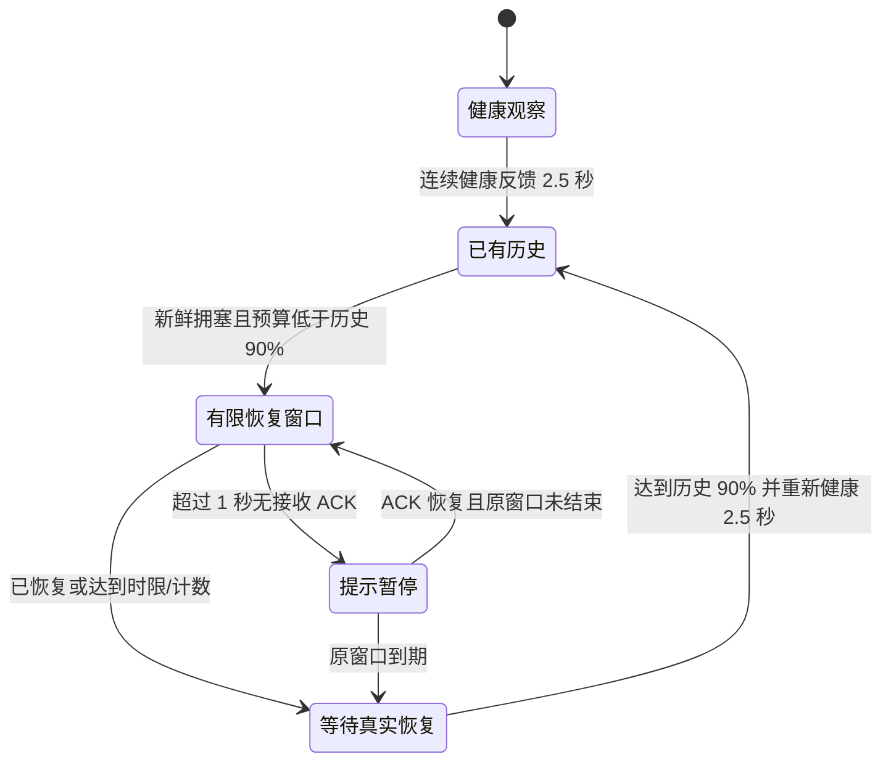
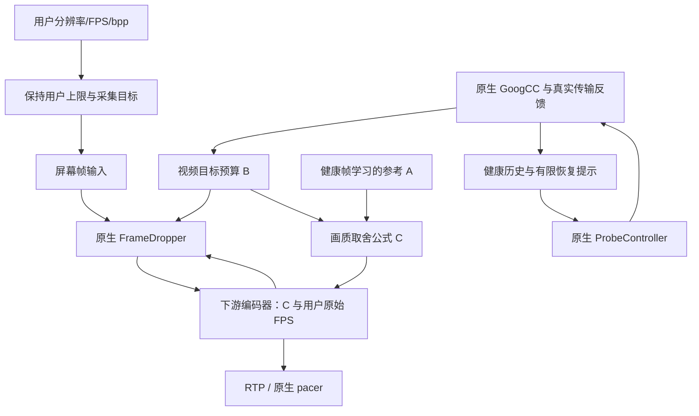

# 屏幕串流码率保护与 FPS 恢复问题记录

记录日期：2026-10-05。本文记录本轮从应用层 FPS 降档，到原生丢帧画质保护，再到短时网络波动恢复的排查与修复。实现以当前工作区源码为准；早期尝试不代表最终行为。

## 1. 最终目标与当前结果

用户希望在带宽不足时优先减少发送帧数、尽量保住单帧清晰度，并用一个参数控制码率与 FPS 的取舍；网络恢复后，应自动回到用户目标 FPS，不需要再次点击目标 FPS。

当前关闭内容感知、启用屏幕画质保护时：

- 采集仍按用户目标 FPS 调度，网络波动不修改采集目标。
- 保留用户配置的 RTP FPS 上限、视频码率上限和连接参考上限。
- GoogCC 决定真实网络预算，原生 FrameDropper 按实际编码字节控制临时丢帧，pacer 继续控制发送节奏。
- RLink 只调整送入编码器的名义码率，控制单帧质量与实际发送 FPS 的取舍，不另建 FPS 降档控制器。
- 恢复时没有“每档等待 5 秒”的应用层限制；对于已有健康容量记录的短时波动，增加有时限的原生恢复探测提示。

真实 UDP 回归已验证长期限速后可自动恢复，无需重新选择 FPS；但五秒性能验收尚未全部通过。最新首簇清提示与默认 k=0.50 的 NVENC 1080p/80 用例，完整 24.883 Mbps 基线下限速 15 秒，解除后预算 2.9 秒、FPS 3.501 秒恢复，末段稳定 80；两秒波动用例 FPS 5.4 秒，仍超过五秒。不同运行的健康预算和拥塞反馈不同，不能由此推断限速越久恢复越快，也不能将两项修改的收益单独归因。中间版本及未达标记录保留在第 5.5 节，最新对照见第 6.0 节，测试判据见第 8 节。

本轮恢复修复没有修改 `E:/webrtc_src/src` 的上游源码，也没有重编 WebRTC 库。修改发生在 RLink 的采集源、编码器包装层、GoogCC 包装层、诊断和测试代码中，使用当前 WebRTC 已有接口。

## 2. 用户观察到的问题

| 现场现象 | 定位结论 | 最终处理 |
| --- | --- | --- |
| 限速后实际发送 FPS 降低，解除限速却长时间回不到用户目标 | 原应用层降低了发送 FPS 上限，恢复又受档位等待及历史状态约束 | 关闭内容感知时改由原生临时丢帧，不降低用户发送上限 |
| 目标 80 FPS，DXGI 采集调用/交付约 80 FPS，但源输出和编码约 53 FPS；网络预算已接近上限 | 完整帧周期节流把正常调度抖动误判成超频 | 使用原生稳定相位、有抖动容差的节流；每个 sink 独立限帧 |
| 网络编码预算 B 可能只有估计上行或视频分配的一半 | 混淆了视频目标分配和 EncoderBitrateAdjuster 的编码修正值 | 画质保护公式改用修正前的视频目标分配；分别显示这些值 |
| 画质保护后 QP 升高，FPS 恢复目标越等越高 | 将主动允许的质量损失误当成需要不断提高 A 的证据 | 拥塞保护期间冻结 A；健康后才继续学习 |
| 仅限速 1～2 秒，解除后 BWE 和视频预算仍恢复很慢 | 降低媒体负载后，重新验证链路容量可能慢；只修编码器不能解决容量发现 | 用真实健康历史邀请原生 ProbeController 有限重试 |
| 限速造成短暂无 ACK，恢复辅助随之失效 | 将短暂缺少反馈等同于应清空整个历史和恢复状态 | 暂停提示，保留未过期历史、原截止时间和已耗次数 |
| 再点击一次目标 FPS 后似乎立即恢复 | 历史实现中的规格重配置或节流相位重置可能掩盖根因 | 回归中禁止点击 FPS、重置 BWE 或重装启动码率 |

现场截图中的不同问题不能用同一个原因解释。例如，预算已经足够时的 80→53 FPS 是送帧节流问题；解除限速后预算仍低，则需要继续检查网络容量发现和编码分配。

## 3. 各种码率的含义

### 3.1 用户配置的两个上限

视频码率上限的基础计算为：

```text
视频上限 V = 用户宽度 × 用户高度 × 用户目标 FPS × 用户 bpp
连接参考上限 = V × 1.05
```

这里的宽高使用根据源屏幕、用户分辨率限制和长宽比解析出的用户规格，不按临时丢帧后的实际 FPS 重新计算。代码还会处理偶数尺寸、整数取整；当前视频上限最高为 100 Mbps。已移除原来应用策略的 4 Mbps 下限；这不代表移除了 WebRTC 内部所有最小码率约束。

视频 bpp 设置范围为 0.03～0.50、默认 0.15。1080p/80 FPS、bpp=0.15 的视频上限为 24.8832 Mbps，连接参考上限为 26.12736 Mbps。

这两个数都是限制值，不是强制发送速率。5% 也不是独立调度器对文件传输作出的保留带宽保证。实际发送量受画面复杂度、编码、拥塞控制、协议开销和其他传输影响。

### 3.2 A、B、C 以及诊断中的其他值

| 名称 | 来源 | 用途 |
| --- | --- | --- |
| 估计可用上行 | PeerConnection 的 `availableOutgoingBitrate` 等连接级统计 | 观察整条连接的可用发送容量，不能直接等同于一个视频流的编码预算 |
| GoogCC 发送目标 / 窗口缩减后预算 | 原生网络控制器输出 | 反映连接级拥塞控制及拥塞窗口 pushback |
| B：视频目标预算 | 适用画质保护路径中，`RateControlParameters.target_bitrate` 的总和，受用户视频上限约束 | 与原生 FrameDropper 使用的修正前目标分配一致，是取舍公式的真实预算输入 |
| WebRTC 编码修正值 | `RateControlParameters.bitrate` | EncoderBitrateAdjuster 对编码器利用率/超调作出的修正，单独用于诊断；原生旁路仍保留它 |
| 视频带宽分配 | `RateControlParameters.bandwidth_allocation` | 原生分配信息，用于观察；不能在 B=0 时用它替代 B、重新启用视频 |
| A：单帧画质参考 | 健康合格帧的字节消耗，按用户原始 FPS 折算；未获得样本时使用启动参考 | 描述期望的每帧质量成本，受用户视频上限约束 |
| C：编码器名义速率 | 根据 A、B、取舍系数 k 计算 | 下游编码器 `SetRates` 的输入；不等于实际 RTP 发送码率 |
| 采样窗码率 | 窗口内实际发送字节统计 | 观察真实媒体消耗；还需区分统计是否包含 RTP 开销、重传等 |

连接级估计、单流视频分配、编码器修正和实际发送有不同统计范围及时间窗口。音频/其他分配、开销、pushback 及编码器修正都可能形成差异。因此修复目标是消除错误的重复扣减，而不是强制 B 等于估计可用上行。

### 3.3 网络波动画质取舍系数

k 范围为 0.00～1.00、最多两位小数，最新默认 0.50；已保存的自定义值保留。它与用户 bpp 是两个独立参数。拥塞保护时 A>B>0，k=0 得到 C=A，k=1 得到 C=B；B=0 仍暂停，不因 k=0 继续编码。

已取得新鲜 GoogCC 拥塞证据并进入保护周期、且 A>B 时：

```text
C = A - (A - B) × k
```

例如 A=24.88 Mbps、B=6.89 Mbps、k=0.20：

```text
C = 24.88 - (24.88 - 6.89) × 0.20
  = 21.282 Mbps
```

编码器按用户原始 FPS 理解 C，从而尽量维持每帧质量；原生 FrameDropper 仍按 B 及实际编码字节临时丢帧。实际发送不被允许直接提高到 C。

- k 越大，编码器承担的预算不足份额越大，更倾向保 FPS。
- k 越小，更倾向保单帧清晰度，可能牺牲更多实际发送 FPS。
- 未保护、A≤B 时，使用 B；B=0 时仍暂停。
- A 是未折扣的参考，不得把前一轮 C 再当成 A，避免递归折扣。
- 系数保存后发布到各连接，后续送帧时应用，不需要重连或重置带宽估计。

20% 表示分担“名义码率与预算之间的差额”，不表示主观画质恰好损失 20%，也不承诺实际 FPS 或 QP 按线性比例变化。

## 4. 根因与具体修复

### 4.1 移除关闭内容感知时的应用层 FPS 降档与慢恢复

旧控制器直接降低 RTP `max_framerate`，然后按档位逐步恢复。旧参考曲线、平滑历史及每档等待会使网络已经恢复时仍受旧上限限制；若媒体/探测上限又依赖当前降低后的 FPS，容量发现也受到影响。

最终关闭内容感知的画质保护路径不再使用这套 FPS 梯级。保留用户原始目标和上限，让原生丢帧决定实际编码负载。采集目标、用户 FPS 上限和实际发送 FPS 是不同的量：采集目标不因拥塞而变化，发送 FPS 可以临时下降。

恢复时不再等 20→30→45→60 等应用层档位逐一确认。B 恢复、原生丢帧负载状态回落后，即可重新接受更多输入帧。

### 4.2 修复 80 FPS 调度抖动导致的约 53 FPS

80 FPS 的理想帧周期是 12.5 ms。旧节流以完整周期判断是否接受下一帧；即使只提前约 0.2 ms，也可能被判为超频而丢弃。某些调度模式下，正常 80 FPS 输入会周期性误丢约三分之一的帧，形成约 53.3 FPS 输出。

`WindowsDesktopCaptureSource::FrameRateSinkProxy` 改用 WebRTC 原生 `FramerateController` 的稳定相位和半周期容差。每个观看连接仍保留独立 FPS 限制；限制变化或时间戳倒退时重置节流状态。

聚合 video adapter 不再重复实施 FPS 节流，空间约束继续保留。发生丢帧后修正下一帧的更新区域/重复帧元数据，避免局部更新被丢掉后出现画面遗漏。此修改不改变采集调度频率，也不新增图像像素拷贝。

验证包含 30/60/80/100/120 FPS、独立低 FPS sink 和动态改目标；真实 DXGI 的 80 FPS 调度与 sink 输出约 80.05 FPS。libwebrtc 静态桌面的低交付 FPS 还可能来自原有静态抑制，不能与这次误节流混为一谈。

### 4.3 消除 EncoderBitrateAdjuster 的重复扣减

原生链路先得到视频目标分配，再通过 `EncoderBitrateAdjuster` 修正下游编码器码率。原生 FrameDropper 使用目标分配；修正后的 `bitrate` 可能因利用率/超调历史降至目标的约一半。

旧包装层将修正值当作 B。画质保护主动提高单帧成本后，调整器历史可能进一步降低修正值；包装层再次使用这个较低值计算 C，形成额外反馈，拖慢恢复。

当前适用画质保护时：

```cpp
B = min(rawRates.target_bitrate.get_sum_bps(), userVideoCap);
```

编码修正值与 `bandwidth_allocation` 只单独显示；C 只写入包装层下游的 `bitrate`，编码器名义 FPS 使用用户目标。原生 FrameDropper、网络预算及 pacer 不被改写。

旁路仍按原生规则传递修正后的 `bitrate` 和原始 FPS。这不是全局禁用 EncoderBitrateAdjuster。对于确实持续超调的硬件驱动，仍需根据实际编码字节验证其行为，不能仅凭两个预算值不同就认定异常。

### 4.4 冻结拥塞期间的 A，避免恢复目标不断升高

之前高 QP 可能推动参考 A 周期性增加；但公式本身允许编码器承担一部分质量损失，高 QP 不一定说明需要提高 A。继续提高 A 会使网络恢复时追赶一个不断移动的目标。

现在保护期间不学习编码帧、不因高 QP 抬高 A。健康阶段只从非关键帧、有效 QP 且 QP≤35 的帧学习，累计至少八个合格样本，按平均帧字节和用户原始 FPS 折算。

没有新鲜压力且 B 已覆盖“之前健康预算与 A 中较小值”的 98% 时，立即退出保护；不要求恢复到比实际单帧需求更高的历史分配，也不加 FPS 档位等待。

### 4.5 零预算与编码器回调处理

旧代码用数值 0 表示“没有待应用更新”，容易遗漏真正的 `SetRates(0)`，留下此前的非零编码状态。新增独立 `rawRatesDirty_` 标志，零目标也会实际应用，且不使用其他分配值替代零目标。

下游 `SetRates` 等可能同步触发回调的操作在包装层互斥锁外执行，避免重入死锁。单纯网络预算/k 更新不需要重启编码器；用户真实改目标或模式切换所需的配置更新另行处理，使用当前分配，不重装旧启动码率。

## 5. 短时网络波动的恢复探测

### 5.1 为什么还需要处理网络容量发现

只给编码器注入 8→2→8 Mbps 可以验证 B 已恢复后 FPS 是否快速恢复，却不能证明真实 GoogCC 能及时重新发现容量。

真实 RTP/传输反馈测试曾复现：只限速约 1.5 秒，恢复正常容量后，BWE 仍低于原预算超过 15 秒。无条件打开原生 RapidRecovery 实验也未解决：探测可能发生在限速尚未解除时，失败后缺乏及时再次验证。

因此最终增加的是有限的历史容量提示，不直接设高 B，不点击 FPS，不重置 BWE，也不靠持续填充流量维持高带宽估计。

### 5.2 历史依据与状态规则

`ScreenRecoveryProbePolicy` 每个连接独立保存状态，仅在有效主屏正在发送时启用。

| 规则 | 当前值/行为 |
| --- | --- |
| 健康容量记录 | 连续健康实际反馈至少 2.5 秒；取稳定窗口中的保守预算，向下限制到用户视频上限 |
| 健康要求 | 新鲜延迟观测、Normal/Underuse、窗口缩减<1%、丢包<2%，且有真实接收 ACK |
| 历史有效期 | 30 秒 |
| 触发条件 | 最近 1.5 秒有原生延迟过载/窗口 pushback 事件，当前有效 GoogCC 预算严格低于健康历史的 90% |
| 恢复过程窗口 | 最多 8 秒，提示清除/重试不延长这个截止时间 |
| 输出计数 | 原恢复过程内累计输出至少八个原生探测簇后不再邀请；包括无有限提示时的原生续链，原先四簇可能过早耗尽成功续链 |
| 单次提示清除 | 首个原生探测簇输出后立即清除有限 upper，原生续链至少静默一秒才可在原窗口重新邀请 |
| 恢复过程结束 | 真实预算恢复至历史的 90%，或窗口/次数到期 |
| ACK 暂停 | 超过 1 秒无真实接收反馈，暂停提示；保留历史、原截止时间及计数 |
| ACK 回来 | 未过期时恢复同一窗口；不延长窗口，不重新给次数 |
| 持续弱网 | 不反复启动旧高容量提示；长期扩展仅按当前实测预算邀请单簇验证，见第 5.5 节 |
| 清理 | 停止主屏、路由变化、用户目标 FPS/视频上限变化时清理相应恢复上下文 |

丢包报告本身不能代替真实收到数据包的 ACK；实现单独跟踪实际接收反馈时间。



历史过期、主屏停止、路由/目标变化会清理上下文，图中省略这些公共清理路径。

### 5.3 如何交给原生 GoogCC

包装层通过原生 `OnNetworkStateEstimate` 传入：

```text
link_capacity_lower = 0
link_capacity_upper = 已验证的历史健康预算
```

清理提示时将 upper 恢复为正无穷。该接口保留原生探测和保守容量约束；提示没有给高发送率下限，也不直接生成新的目标码率或 pacing 更新。目标增长仍须通过真实反馈验证。

有效有限提示期间，原生网络状态探测配置为：

```text
est_lower_than_network_ratio:0.95
est_lower_than_network_interval:1s
network_state_interval:1s
network_state_probe_duration:15ms
network_state_min_probe_delta:2ms
network_state_scale:2
```

每秒是原生检查/邀请探测的间隔，不是强制每秒发探测，也不是 FPS 恢复必须等待一秒。原生仍检查丢包受限、高 RTT、延迟增长及连接上限；原生允许的丢包恢复阶段保留 1.5 倍规则，其他阶段保留其对应倍率和媒体分配限制。

没有有限提示时，正无穷 upper 不满足新增网络状态探测入口，不会形成常驻每秒探测。原有 ALR 探测机制保留。

八个簇是短时额外提示的停止阈值，不是所有原生探测的硬性总次数上限：同一次回调可能输出多个簇，真实计数可以超过八；已经在途的探测和成功反馈触发的原生续链，清提示后仍可能继续，受原生规则及用户连接上限约束。

探测仍会消耗额外流量。当前用短探测、8 秒窗口、输出计数及禁止持续弱网反复重启高历史提示限制额外流量；长期单簇维护见第 5.5 节。不承诺任何网络下固定的额外 KB 数。

### 5.4 中间失败与最终修正

| 尝试 | 发现 | 最终调整 |
| --- | --- | --- |
| 仅修编码器/注入预算测试 | 编码器恢复快，但真实 BWE 仍可能超过 15 秒 | 增加实际 UDP 限速与原生反馈回归 |
| 无条件原生 RapidRecovery | 在仍限速时的探测失败，真实恢复仍慢 | 移除该无条件实验，使用有限历史提示 |
| 较大的预算下降阈值 | 约 18% 的轻度过载已经压低 FPS，但未触发提示 | 改为严格低于已验证历史的 90% |
| 只用 lower-than-estimate 入口、0.85 比率 | 等待 DelayBasedLimited 状态，丢包恢复阶段可能空等约三秒 | 配合 0.95 和有限提示下的通用网络状态入口，守卫仍交给原生 |
| 真实测试固定要求必须丢包 | GoogCC 及时限流时可以拥塞但没有丢包 | 验证真实排队、限速吞吐、预算下降及反馈，丢包不是必要条件 |
| 对照 FPS 未明显下降，却用其极短 FPS 计时比较 | 一秒采样窗的高残余 FPS 不代表预算已恢复 | 同时看预算和 FPS，保留五秒绝对门槛及最终稳态要求 |
| 高容量 shaper 仍用固定小 burst | 宿主调度抖动可能使正常 40 Mbps 链路也被测试工具误限速 | burst 使用约 5 ms 链路容量、最小 3 KB；全高清帧在计时前准备 |

这些修改分别属于产品根因修复和测试条件纠正。最终真实回归没有通过伪造 BWE、点击 FPS 或放宽五秒门槛获得通过。

### 5.5 长期限速后的恢复扩展

最新回归同时修正了两项影响：全高清测试的健康阶段应从开始就配置为标注的 40 Mbps，而非沿用 relay 默认 20 Mbps；全码率恢复时，四簇计数可能过早清提示，改为八簇且仍受八秒时限约束。健康历史不再永久保留早期最小值，而是每个 2.5 秒窗口重新验证，避免逐步增长的真实容量被漏记。健康基线、五秒恢复验收和最终稳态检查不放宽。限速统计另计入健康链路已序列化、仍在传播途中的最多五毫秒 burst，不将这部分字节误判为长期超速。

用户反馈长期限速也能正常恢复，但希望保证快速恢复。本轮先扩展回归到 15/30 秒，而不是直接延长高历史提示窗口。原实现的真实 NVENC 15 秒限速用例失败：解除后又观察 15 秒，预算仍未达到恢复阈值，末三秒约 24 FPS。说明“某些情况下能恢复”不能保证恢复速度。

现在短时高历史窗口结束、真实拥塞仍未恢复时，进入低预算维护：

1. 仅保留本连接真实拥塞造成的未恢复状态和恢复目标；普通低流量、静态画面或理论 bpp 需求不能启动它。
2. 有真实接收 ACK、健康延迟/丢包/窗口状态，当前预算稳定至少 2.5 秒，并且距离任何原生探测簇至少三秒，才邀请一次维护验证。
3. 提示 upper 取当前稳定实测预算的两倍，裁到用户视频上限；lower 仍为零。原生首次探测通常为当前预算的两倍，原生守卫及丢包恢复倍率仍生效，不跳到原高容量。
4. 首个原生探测簇输出后立即清提示，避免低 upper 阻碍成功反馈触发的原生指数续链；所有原生探测输出原样返回。没有输出时提示最多两秒，之后冷却并重新等待条件。
5. 三秒冷却从提示结束及最近原生簇分别约束；原生 ALR 或成功续链正在工作时，维护提示让路。
6. 高历史容量的三十秒有效期保持；过期后只保留本地“尚未恢复”的判据，维护 upper 必须来自当前 ACK 预算。停止、路由/用户目标变化清理全部相关状态；真实恢复到目标的 90% 后停止维护。

持续弱网因此有少量周期性探测成本，但每次围绕当前低预算、短探测和单簇清理，不持续发送原高容量填充。首次探测的成功反馈可能引发原生连续探测，所以单簇约束指维护邀请，不能当作所有原生续链的硬次数限制。

诊断名称改为“网络恢复探测”，预算文案改为“提示预算上界”：长期提示中的两倍当前预算是待验证的上界，不能叫“已验证预算”。现有诊断字段名为兼容工作区接口仍保留 `recoveryProbeHistoricalBudgetBps`。

中间版本的真实 NVENC 1080p/80、1.6 Mbps（约 200 KB/s）限速回归如下。此时健康阶段仍使用 relay 默认 20 Mbps、恢复阶段为 40 Mbps，不能当作最终完整 24.88 Mbps 基线的结果：

| 限速时长 | 原机制 | 扩展后预算恢复 | 扩展后 FPS 恢复判据 | 末段 FPS |
| --- | --- | --- | --- | --- |
| 15 秒 | 解除后观察 15 秒仍未恢复，末段约 24 FPS | 2.9 秒 | 3.4 秒 | 80.0 |
| 30 秒 | 未作旧机制同长度对照 | 1.901 秒 | 2.4 秒 | 80.0 |

证据：`build/long-outage-before-nvenc-15s.log`、`build/long-outage-maintenance-nvenc-15s.log`、`build/long-outage-maintenance-nvenc-30s.log`。恢复判据仍为连续三个 100 ms 点达到健康基线 90%，另验证尾部稳定帧率；没有点击 FPS、伪造预算或放宽五秒验收线。

最终版本从暖机开始配置 40 Mbps 链路，保持一秒原生网络提示检查、八秒/八簇短窗口及长期低预算维护。实际稳定预算仍由 GoogCC 测量，不能把配置的物理链路容量当作已经验证的网络预算：

| NVENC 限速时长 | 健康预算 B | BWE / B 恢复 | FPS 恢复判据 | 末段 FPS | 五秒性能检查 |
| --- | --- | --- | --- | --- | --- |
| 15 秒 | 24.883 Mbps | 5.600 / 5.600 秒 | 6.101 秒 | 80.0 | 未通过 |
| 30 秒 | 6.767 Mbps | 3.500 / 3.500 秒 | 4.301 秒 | 80.0 | 通过 |

证据：`build/long-outage-release-nvenc-15s.log`、`build/long-outage-release-nvenc-30s.log`。15 秒用例只有五秒性能检查失败，实际恢复、用户采集/规格保持、公式、真实限速与稳态检查通过。30 秒运行虽然健康 FPS 为 78、达到暖机要求，但预算基线较低；其 3.5 秒预算恢复只相对于该次基线，随后日志记录预算升至 24.883 Mbps，FPS 稳定 80。不能将两次数字作为相同起点的性能对照。

完整基线的两秒短限速回归也出现 BWE/B 5.1 秒、FPS 5.301 秒的五秒性能失败（`build/long-outage-refreshed-nvenc-2s.log`）。尝试将有限提示检查缩短到 0.5 秒没有改善：短限速 FPS 6.4 秒、15 秒限速 FPS 6.101 秒，故撤回至一秒（`build/long-outage-final-500ms-nvenc-2s.log`、`build/long-outage-final-500ms-nvenc-15s.log`）。不以放宽验收、伪造预算或绕过原生拥塞保护使测试通过。

本轮最终两次 NVENC 运行开启原生 INFO 日志，均实际记录 `Not sending probe in bandwidth limited state. 1`。对应本机 SDK 的 `BandwidthLimitedCause::kLossLimitedBwe=1`，确认至少部分探测邀请被原生丢包预算状态拒绝；其后记录成功探测及原生续链，预算和 FPS 恢复。日志没有给出每次守卫拒绝相对于解除限速的精确计时，因此不能把全部六秒等待都归因于这一项。证据为上述同名 `-native.log`；源码定位是 SDK 的 `probe_controller.h` 枚举和 `probe_controller.cc::InitiateProbing`，未修改 SDK。

最终软件 libx264 640×360/120 用例，正常链路 20 Mbps、健康预算 8.017 Mbps，持续限速 15 秒后，BWE、B、FPS 恢复判据均为 3.6 秒，末段 120 FPS，全部检查通过。限速阶段实际通过约 2.862 MB/15 秒，约 191 KB/s；采集共交付 6000 帧、用户目标和 k 保持，无需重新点击 FPS。证据：`build/long-outage-release-x264-15s.log`。

纯状态回归另覆盖持续六十秒低预算、维护间隔与次数、历史过期、无 ACK 暂停、正常低流量不触发、停止清理和原生探测优先。它不能替代真实六十秒网络运行。

## 6. 当前数据流与模式边界

### 6.0 与原生恢复速度的进一步核查

原生恢复不只依赖约五秒 ALR 探测：正常传输反馈驱动 AIMD 增速，成功探测可立即更新预算并继续指数探测。从延迟过载退出还可能请求恢复探测，但依赖原生 ALR/近期退出 ALR 或相应实验条件；丢包状态、RTT 和延迟守卫仍可拒绝。源码对应 SDK `aimd_rate_control.cc::ChangeBitrate`、`goog_cc_network_control.cc::OnTransportPacketsFeedback` 和 `probe_controller.cc::SetEstimatedBitrate/RequestProbe`。

本轮确认我们此前的额外历史提示有副作用：有限 `link_capacity_upper=H` 存在时，原生成功续链还要求测量预算不超过 `H × further_probe_threshold`，该阈值默认 0.7。我们原先等到 H 的 90% 才清除提示，导致 70%～90% 区间不能立即续链，改走定时探测或 AIMD。这是应用包装引入的限制，不应归咎于原生 GoogCC。

现在短时单次邀请也在首簇后立即清有限 upper，给原生成功续链让路；连续原生簇刷新一秒静默计时，期间不重新装提示。失败且原生探测静默至少一秒后，才可在原八秒/八簇过程内重新邀请；ACK 暂停不延长期限或重计次数。长期维护的首簇清除与三秒冷却保持。

原生 `ProbeController` 回归实际复现：有限 H=8 Mbps 时，测得 6 Mbps（75%）即被续链阈值挡住；清提示后同一 6 Mbps 成功结果可立即输出下一簇，裁到 10 Mbps 用户连接上限。证据：`build/native-chain-policy-test.log`；该证据使用真实原生控制器，不是手写模拟的倍率结果。

额外补充 `--short-outage=native --raw-gcc` 参考模式：运行时初始化同时关闭 RLink 恢复邀请和追加的网络状态探测 field trials，保留 SDK 默认值与只读遥测。原生参考不启用编码器侧 C 混合；编码器、用户 bpp 上限、ICE/DTLS/TWCC、采集源、队列与物理容量仍与 RLink 回归共用。因此它是同媒体路径的原生 GoogCC 控制对照，不是整个未经修改的 WebRTC 产品。`--short-outage=native` 单独使用仍包含恢复辅助，不应混淆。参考配置透传/复制、真实接收反馈和原生输出不变、零恢复邀请的回归见 `build/native-gcc-reference-policy-test.log`。

还需区分 FPS 恢复和画质恢复。我们的 C>B 取舍保留较大单帧，预算不足时原生丢帧更多；原生编码直接降单帧码量，可以在较低预算先恢复较高 FPS。固定单帧成本的近似关系为 `发送 FPS ≈ 用户 FPS × B/C`，实际编码帧大小、关键帧及原生滤波会影响它，不能当作 FPS 控制公式。新默认 k=0.50 比原 0.20 更倾向保 FPS，已有用户配置保留。原生 FrameDropper 本身还有漏桶与丢帧比例滤波记忆，不保证预算上升的同一瞬间就满帧。

本轮首簇清除和默认 k=0.50 的实际 NVENC 回归：

| 模式 / 限速时长 | 健康预算 | BWE / 编码预算恢复 | FPS 恢复 | 末段 FPS | 五秒验收 |
| --- | --- | --- | --- | --- | --- |
| 原生编码 + RLink 恢复辅助 / 2 秒 | BWE 16.639 Mbps，修正编码预算 14.044 Mbps | 4.900 / 6.900 秒 | 5.600 秒 | 80.0 | 未通过 |
| 画质保护 k=0.50 + 恢复辅助 / 2 秒 | BWE 26.127 Mbps，B 24.883 Mbps | 5.700 / 5.700 秒 | 5.400 秒 | 80.0 | 未通过 |
| 画质保护 k=0.50 + 恢复辅助 / 15 秒 | BWE 26.127 Mbps，B 24.883 Mbps | 2.900 / 2.900 秒 | 3.501 秒 | 80.0 | 通过 |
| 原生 GoogCC 参考，无额外恢复辅助 / 2 秒 | BWE 16.985 Mbps，修正编码预算 14.376 Mbps | 解除后观察 15 秒均未达到判据 | 未达到 | 24.2 | 未通过 |

证据：`build/native-chain-default-half-nvenc-2s.log`、`build/native-chain-default-half-nvenc-15s.log`、`build/raw-gcc-reference-nvenc-2s.log`，原生日志为同名 `-native.log`。两秒双模式的相对检查通过，但绝对五秒检查都失败，不宣称整体测试全通过。参考模式追加恢复邀请次数/过程次数始终为零，真实恢复段仍按慢速增量提高预算。这说明同媒体路径的原生 GoogCC 并非一定更快，但不能据此否定用户旧版本的现场观感：真实桌面、编码负载、驱动、此前参数及拥塞反馈仍可能不同。

软件 libx264 的原生参考对照另行通过：640×360/120 FPS、健康链路 20 Mbps、视频上限约 8.018 Mbps，实际限速约 200 KB/s 两秒后，BWE 1.400 秒、修正编码预算 4.401 秒、FPS 2.001 秒恢复，末段 120 FPS，零 RLink 恢复邀请；健康基线 BWE 8.419 Mbps、修正编码预算 7.987 Mbps。证据：`build/raw-gcc-reference-x264-2s.log`。这确认原生路径可以先恢复 FPS、后恢复码率预算；不能由上述不同分辨率、负载及反馈的用例归因为 NVENC 必然比软件慢，也不能将单次结果当作任意网络的时延保证。

用户要求提交并量化差距后的软件补测未作为有效对照：`build/committed-default-half-x264-2s.log` 的保护模式虽然记录 BWE/B 1.8 秒、FPS 1.3 秒及末段 120.2 FPS，但全程采集仅 4305/4440 帧，低于原 98% 采集调度验收，整体失败；中间还出现预算/FPS 再次回落，首次恢复时刻不能代表从此持续恢复。随后 `build/committed-raw-gcc-x264-2s.log` 的原生对照暖机仅 63.8 FPS，采集 2488/4440 帧，末段 64.1 FPS，未达到 120 FPS 健康基线。其 0.208 秒“恢复”仅相对于这个不合格低基线，不代表恢复用户目标；预算恢复约 14 秒及五秒检查也失败。因此不能将两次补测相减，也不由此判定应用比原生快或慢。尚缺合格同基线的重复成对数据，无法给出一般性的“慢多少秒/百分比”。

本轮构建与核心/界面检查：`build/native-gcc-reference-build.log`、`build/native-gcc-reference-policy-test.log`、`build/native-chain-default-half-quality-test.log`、`build/native-chain-default-half-execution-test.log`、`build/native-chain-default-half-settings-test.log` 通过。多连接系数回归更新旧端点钳制预期，实际验证默认 0.50、0 与 0.99 可独立应用，RTP 上限、连接上限及网络估计 epoch 不变。默认变更不覆盖已有用户配置，参考模式只影响显式 `Initialize(false)` 的首轮初始化；生产 `Initialize()` 仍启用恢复辅助。



编码完成的实际字节反馈给原生丢帧器。图中的 C 与 B 是不同控制输入，不能将 C 直接拿来替代网络预算。

本轮画质包装适用于符合条件的主屏单层编码；相机、多层、可信内置码控和原生丢帧禁用等路径保持旁路。

**内容感知开启时，由场景策略负责自己的有效分辨率/FPS/码率决策，这条原生画质取舍包装会让出控制权。** 不能声称开启内容感知后也同时叠加 k 公式。有限网络恢复辅助与该模式开关独立，发送有效主屏时仍可使用，但不覆盖场景策略的规格选择。本文“取消应用层 FPS 档位等待”指关闭内容感知的画质保护路径，不代表删除所有场景自适应确认机制。

共同编码包装可覆盖 OpenH264、FFmpeg/libx264、NVENC、AMD AMF、Intel QSV、Windows Media Foundation H.264；实际本轮设备运行验证覆盖 libx264 和 NVENC。接口路径共用不等于各硬件驱动行为已全部实测。

## 7. 主要源码变更位置

| 文件 | 职责 |
| --- | --- |
| `src/platform/win/WindowsDesktopCaptureSource.cpp/.h` | 每 sink 原生容差节流，消除聚合重复节流，维护局部更新元数据 |
| `src/core/ScreenFrameQualityPolicy.h` | A 学习/冻结、k 公式、立即退出保护；无图像分配，不自行丢帧 |
| `src/webrtc/WindowsPreferredVideoEncoderFactory.cpp` | 修正 B 来源，下游应用 C/原始 FPS，零预算 dirty 标志和安全回调 |
| `src/core/ScreenRecoveryProbePolicy.h` | 健康历史、触发/到期/计数、ACK 暂停状态 |
| `src/webrtc/GoogCcTelemetry.cpp/.h` | 与原生网络控制器连接，记录真实接收反馈，传递历史提示，配置原生探测入口 |
| `src/webrtc/LibWebRtcSession.StatsClose.cpp` | 发布用户目标、动态 k、模式控制及主屏恢复辅助启停 |
| `src/core/SessionDiagnostics.h`、`src/webrtc/PeerConnectionStatsCollector.cpp` | 传递预算与恢复状态诊断 |
| `src/apps/controller/ControllerMainWindow.Diagnostics.cpp` | 分别展示 A/B/C、编码修正和原生恢复提示 |
| `src/testing/ScreenFrameQualitySelfTest.cpp` | 公式、旁路、零预算、真实 Adjuster/FrameDropper 耦合、实际编码器回归 |
| `src/testing/GoogCcTelemetrySelfTest.cpp` | 状态/回调、原生 ProbeController 虚拟时间、探测守卫与清理回归 |
| `src/testing/GoogCcLiveTransportSelfTest.cpp` | 真实双 PeerConnection、UDP 排队限速及解除后的端到端恢复计时 |

关联方案：[内容感知串流与超分完整方案](../内容感知串流与超分完整方案.md)、[当前实现与测试进度](../../docs/ai-content-aware-streaming-plan.md)。

上游语义核对位置：`E:/webrtc_src/src/video/video_stream_encoder.cc` 的分配/丢帧逻辑、`E:/webrtc_src/src/video/encoder_bitrate_adjuster.cc`、`E:/webrtc_src/src/modules/congestion_controller/goog_cc/probe_controller.cc`、`E:/webrtc_src/src/modules/remote_bitrate_estimator/aimd_rate_control.cc`。这些是本机 SDK 参考路径，不属于本轮修改文件。

## 8. 已完成的验证与证据

### 8.1 真实网络回归（早期短时记录）

测试使用两个真实 PeerConnection，经过 ICE、DTLS、H.264 RTP/RTCP、TWCC 和 localhost UDP relay；限速器改变实际包传输，不注入目标码率。弱网限制为 1.6 Mbps，约 200 KB/s，有排队延迟；先健康运行，再限速 1/2 秒，最后恢复正常链路。

默认软件场景是 640×360/120 FPS、libx264 ultrafast，视频上限约 8.02 Mbps；NVENC 是 1920×1080/80 FPS、p4、bpp=0.15，视频上限 24.8832 Mbps。此节 NVENC 早期记录的健康阶段实际为默认 20 Mbps，恢复阶段为 40 Mbps；第 5.5 节已纠正测试夹具，并记录从暖机开始 40 Mbps 的最终结果及未达标项。

**计时从解除限速开始。** BWE、预算和 FPS 各自连续三个 100 ms 统计点达到健康基线的 90%，记为对应恢复时间；另外要求末三秒平均 FPS 至少为用户目标的 95%。采样窗 FPS 本身约一秒，因此恢复时间不是逐帧无延迟测量，也不是这些秒数内必然精确满帧的承诺。

| 画质保护用例 | 限速时长 | BWE 恢复 | B 恢复 | FPS 恢复判据 | 末段实际 FPS |
| --- | --- | --- | --- | --- | --- |
| libx264 360p/120 | 1 秒 | 1.8 秒 | 1.8 秒 | 0.2 秒* | 120.0 |
| libx264 360p/120 | 2 秒 | 1.7 秒 | 1.7 秒 | 2.0 秒 | 120.0 |
| NVENC 1080p/80 | 2 秒 | 4.3 秒 | 4.3 秒 | 4.8 秒 | 80.0 |

*一秒软件用例中，采样窗 FPS 没有深度跌破恢复阈值，0.2 秒不能解读为网络容量已在 0.2 秒恢复；预算实际恢复约 1.8 秒。

两秒软件用例另含关闭画质包装的“原生编码对照”：BWE 约 2.0 秒、编码修正预算约 4.4 秒、FPS 约 2.201 秒恢复，末段 120 FPS。该对照共用本轮有限网络恢复辅助，**不是完全未经 RLink 包装/配置的原始 WebRTC 基线**。

测试还要求真实弱网吞吐/排队与反馈、估计下降、用户规格及采集目标保持、k=0.20 公式确实运行、实际请求编码后端正确，以及所有恢复时间不超过五秒。本轮结果不能单独证明主观清晰度达到某个等级；画质取舍还需真实桌面内容观察。

早期短时日志：

- `build/short-outage-generic-probe-x264-1s.log`
- `build/short-outage-generic-probe-x264-2s.log`
- `build/short-outage-generic-probe-nvenc-1080p80-2s.log`

### 8.2 编码器、原生探测与界面回归

| 验证 | 覆盖内容 | 证据日志 |
| --- | --- | --- |
| 画质核心/真实 Adjuster 耦合 | k=0.05/0.20/0.50、目标/修正预算区分、零预算暂停；真实 Adjuster 历史仍低时能恢复到原始 FPS | `build/short-outage-quality-core-retest.log` |
| 实际 NVENC 与 libx264 | 注入 8→2→8 Mbps 验证编码/原生 FrameDropper；恢复首秒约 113/114 FPS，随后 120；动态参数及模式切换 | `build/short-outage-nvenc-test.log`、`build/short-outage-x264-test.log` |
| 真实 ProbeController 虚拟时间 | 无提示无常驻一秒探测；原生丢包/RTT/延迟守卫；1.5 倍规则；清提示后续链受上限限制，失败不无限重试 | `build/short-outage-final-probe-unit.log` |
| 真实源/RTP 与执行切换 | 用户目标保留、模式切换及实际执行回归 | `build/short-outage-final-rtp-test.log` |
| 调度抖动 | 正常帧率与独立 sink、动态限帧、真实 DXGI 80 FPS | `build/fps-jitter-final-test.log`、`build/fps-jitter-native80-test.log` |
| 主程序构建与诊断 | Release 主程序及诊断界面检查通过 | `build/short-outage-final-client-build.log`、`build/short-outage-diagnostics-ui.log` |
| 主程序实际隐藏启动 | 设置各页布局、动态容量刷新、主题检查通过，进程正常退出 | `build/short-outage-main-startup-stdout.log` |

长期扩展时的核心回归：`build/long-outage-final-policy-test.log` 和 `build/long-outage-final-coefficient-test.log` 通过，覆盖六十秒维护状态、真实原生探测守卫、逐窗更新健康历史，以及 k=0.05/0.20/0.50/0.80 的公式与动态编码应用。该阶段的实际主程序设置回归 `build/long-outage-settings-test.log` 验证的是此前 0.05～0.80 范围、两位小数、默认 0.20、保存/重载/实时提交及布局截图；原视频 bpp 0.03～0.50 不变。该阶段 Release 构建见 `build/long-outage-release-build.log`；新的 0.00～1.00 范围单独验证。

最终深色诊断界面回归 `build/long-outage-diagnostics-ui.log` 为 `RESULT 0 failures`。独立测试首次使用 offscreen 时缺少插件搜索目录，补充现有 Qt SDK 的 `QT_QPA_PLATFORM_PLUGIN_PATH` 后运行通过；没有安装或替换 Qt 依赖。

系数扩大至 0.00～1.00 后，Release 主程序与对应策略测试构建通过（`build/quality-coefficient-zero-one-build.log`）。核心测试 `build/quality-coefficient-zero-one-core-test.log` 通过：k=0 的 C=A、k=1 的 C=B、两个端点在 B=0 时暂停，以及下一帧动态应用而不重启编码器/修改原始 FPS。主程序隐藏启动测试 `build/quality-coefficient-zero-one-settings-test.log` 通过：允许 0/1 及两位小数、拒绝负数/超过 1/额外小数位、端点保存重载、实时提交及设置布局截图。默认值仍为 0.20，未调整网络恢复探测逻辑。

注入预算的编码器回归与真实网络回归是两类证据，不相互替代。当前更新产物为 `x64/Release/RLinkAPP.exe`；本轮没有提交或推送。

日志在本机构建目录，可能不会随源码分发；如以后归档实验或提交变更，需要额外保存对应日志。

## 9. 诊断界面如何判断剩余问题

现在分别显示“视频目标预算 B”“单帧画质参考 A”“编码器名义速率 C”“WebRTC 编码修正值”“视频带宽分配”，连接级显示“网络恢复探测”的提示预算上界、提示状态、本轮原生簇计数与累计触发次数。

实际观察顺序：

1. 先看采集目标与交付 FPS，确认源端没有低于用户目标的异常节流；静态重复抑制另行判断。
2. 再看实际编码/RTP FPS，不能把用户发送上限当成当前 FPS。
3. 看 BWE、GoogCC 目标/窗口预算和 B 是否仍低。若仍低，主要是网络容量尚未重新验证。
4. 若 B 已恢复而 FPS 仍低，检查 C、原生丢帧负载、编码完成耗时及真实源输出；不能只盯 BWE。
5. 若编码修正值仍低而 B 已足够，确认是否正处于适用画质路径；旁路与画质路径含义不同。
6. 看恢复提示是否有健康历史、真实 ACK、是否已到次数/时限。没有历史的新连接、持续弱网和高 RTT/丢包受限不能强行走高容量恢复。

延迟状态 Normal 只表示队列趋势稳定，不代表容量已经恢复。持续 200 KB/s 限速下，GoogCC 降低负载后可以 Normal，但预算仍低；保持低发送负载是正确行为。

## 10. 未完成的设备运行验证

- 双机 NetLimiter 的实际远端呈现、不同路由/RTT/丢包情况下的恢复，还需对应环境验证；本机 UDP 排队限速不是双机现场实测。
- AMD AMF、Intel QSV、Media Foundation 的真实驱动码控和恢复未在对应设备运行。它们共用包装接口，但驱动可能合并码率更新或有不同超调行为。
- 当前真实测试覆盖短时 1～2 秒以及 15/30 秒限速后解除。最终完整基线的部分 NVENC 用例已确认超过五秒，尚未达到全部性能验收；长期断流、路由切换及其它 RTT/丢包组合也不能保证五秒内恢复。这些场景仍受真实反馈和原生守卫约束。
- C 是名义输入，主观清晰度、实际单帧字节、QP 与 FPS 应结合真实桌面观察；本轮通过不能替代全部画质评价。

若后续发现某编码器在预算已足够时持续达不到目标，需比较实际非关键帧字节×用户 FPS 与提交的 C，排除启动、关键帧和重配置过渡后，再判断真实码控偏差。不能用总发送流量或修正值与 B 的差异直接反推编码器超调。
